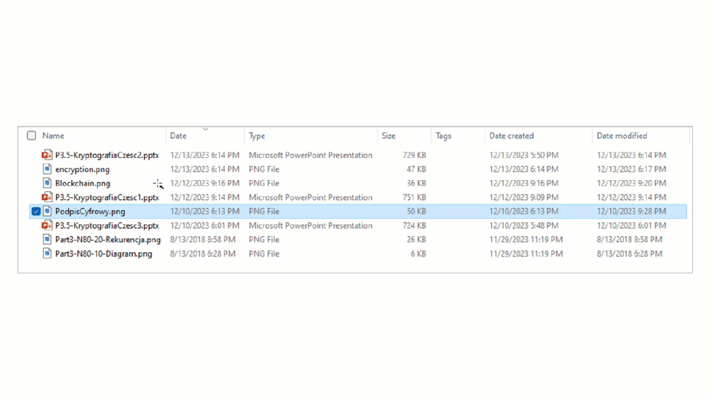
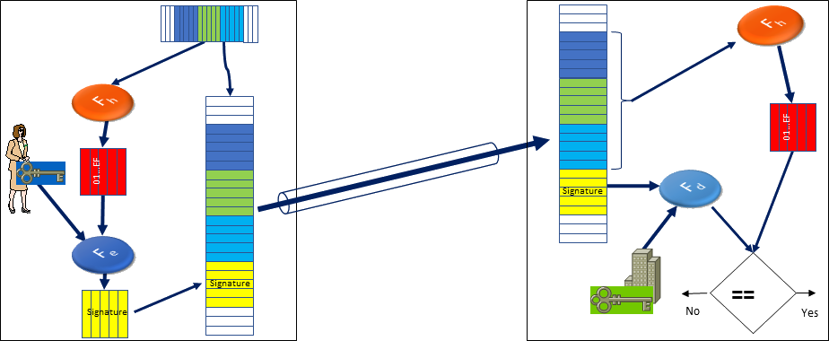

<!--
//____________________________________________________________________________________________________________________________________
//
//  Copyright (C) 2024, Mariusz Postol LODZ POLAND.
//
//  To be in touch join the community by pressing the `Watch` button and get started commenting using the discussion panel at
//
//  https://github.com/mpostol/TP/discussions/182
//
//  by introducing yourself and telling us what you do with this community.
//_____________________________________________________________________________________________________________________________________
-->

# Implementation Examples

## Key words

Bitstream, File, File System, XML, XSLT, HTML, XmlSerializer, Save file, Transformation, Saving text files, Local File Systems, Open and read file, XML Schema, Common File Format, Data Access, Serialization, Validation, Visualization

## Streaming Data Preface

The external data is recognized as the data we must pull or push from outside of a boundary of the process hosting the computer program. In general, the external data may be grouped as follows:

- **streaming** - bitstreams managed using content of files, or network payload
- **structural** - data fetched/pushed from/to external database management systems using queries
- **graphical** - data rendered on Graphical User Interface (GUI)

This section collects descriptions of examples explaining the usage of the **streaming** data.

## File and Stream Concepts

### Operating System Context

Using the file explorer let's get details about the `.Media` folder containing files used in the examples:



We have different files there, but similar descriptive data, i.e. metadata, are defined for all of them. Among these data, `Name`, `Date`, `Type`, `Size`, `Data created`, and much other information that may be useful, but the most important thing is, of course, the content of the file.

After double-clicking on the selected file (for example `PodpisCyfrowy.png`) an image will appear.



Here we may ask a question - how to describe this behavior? Well, a program was launched. This program must have been written by a programmer. The program opens the file as input data formatted as a bitstream, so the programmer had to know the syntax and semantics rules that were used in this file. The data contained in the file makes it possible to show the content graphically on the computer screen. This is the first example of graphical representation, but we will return to this topic later.

<!--
👎 I have files of different types here, which would indicate that they are data for different programs. But for example, if we click on this file twice, we will receive information from the operating system that it does not know what program it is associated with. What program can open this file? But I have a program here that can open any file. This program, like the previous one, opens this file, reads its contents, and displays its contents on the screen using hexadecimal code. This means that a file is actually a composite, a sequence of bytes. Since each byte is a sequence of bits, we can conclude that the content of each file is a sequence of bits.
-->

### Program Context

Using a code snippet located in the [FileExample][FileExample] class differences between file and stream may be explained from a program point of view. We can learn from this example that the `File` is a static class that represents the available file system and provides typical operations against this file system. The content of the file is formatted as a bitstream and represented by the abstract `Stream` class. It is an abstract class that represents basic operations on a data stream (on the bitstream), which allows mapping the behavior of various media that can be used to store or transmit data as the bitstream. From this perspective, it can be proved, that file content is always a bitstream (a stream of bytes).

#### File Class

Let's try the [FileExample][FileExample] class. This class is referred to by the [FileStreamUnitTest][FileStreamUnitTest] unit test. After executing the test, we can notice that the test finishes with success. But let's try to replace this caption `Today is` with the Polish translation `dziś jest` and let's execute the test again. Unfortunately, the result points out that the test hasn't passed. It may mean that the behavior of our program is different from before because we introduced Polish letters. The main reason for this problem is that I used an encoding that doesn't contain Polish letters. Precisely, a represented set of characters doesn't contain Polish letters. If we apply an encoding that supports Polish letters the test is green - it means that it passed. This means that the file's content corresponds to the stream of characters containing the national letters. Hence, it can be concluded that the bitstream becomes text after applying directly or indirectly an encoding. The set of valid characters in the stream depends on the selected encoding.

Let us examine the behavior of files using the mentioned previously [FileExample][FileExample] class, which contains the `CreateTextFile` method. The main responsibility of this method is to save a text consisting label 'Today is' and the current date to a file. To accomplish this requirement a file is needed. The word `File` appears at the very beginning of the method.

``` csharp
      File.Delete(name);
```

The F12 key will take us to the definition. From the definition, it can be learned that this class is static. So there are no instances of it, we cannot create objects of this class. It is just an organization container. So this class cannot represent an individual file. It can only represent all files. It provides operations related to files, where I used one of them and this operation deletes the file whose name was passed by a parameter.

Another interesting thing in this example is the [Open][Open] operation. The question is why to perform the open operation on a file, and what this operation would be used for. We want to save the text, but we perform open operations. Here the answer is provided by a parameter called `FileAccess`. It is an enumeration type providing all options that can be used. I selected the write operation because I want to write to this file. Well, this operation is fundamental to the use of files that we will use later, because it causes the file that is being created or opened, if it exists, to become a critical section. What does it mean? This means that no other processes can operate on this file after we have opened it. So if this file were to be used or shared by multiple applications, a lock placed by the operating system will prevent this and only allow one process to write to the file. This can have crucial consequences in a situation where for example we use a file in a hospital in which patient data is saved and is used in various places by doctors. To gain access to data at the reception, where further names are added. After someone opens the file for writing - as in this example - no one else can use the file.

So what's important to emphasize here is that the `File` class does not represent a file. The class represents a file system. It contains operations that we can perform on any file that is available to the computer.

The `Open` operation available in the `File` class creates an object (instance) of the `Stream` class, as follows:

``` CSharp
      using (Stream _stream = File.Open(name, FileMode.OpenOrCreate, FileAccess.Write))
      {
        FileContent = String.Format(CultureInfo.InvariantCulture, "Today is {0}", DateTime.Now);
        byte[] _content = Encoding.ASCII.GetBytes(FileContent);
        _stream.Write(_content, 0, _content.Length);
      }

```

Use the `Go to definition` menu entry to visit the definition of the `Stream` class. Let me stress that it is an abstract class. It means that it can represent not only files but can also represent other resources. It is an abstract class and thanks to its various implementations we can ensure the polymorphic behavior of various objects it represents. In simpler terms, if this class represents a file in the file system, these operations will be performed by the operating system on behalf of a file system, if this class represents, for example, a computer network and operations related to a computer network, then again we will have to deal with the operations that are performed, but this time not on resources related to the file system but on resources related to the computer network. If this class represents an object that is in memory, its behavior will also be completely different than the two previously mentioned ones. We will come back to this topic by discussing various examples in which the `Stream` class responsibility has been overwritten, and inherited by classes that represent different behaviors, i.e. polymorphic behaviors of various resources that we can use to store and manage data.

The next line does not add much to the considerations regarding the use of files to store data processed by the program. This line is where the final formatting of the string of characters to be saved takes place. The only interesting point is the possibility of choosing the syntax that will be used to write the date text form. This syntax varies and is dependent on locale selection. I chose a variant that is independent of the computer locale selection in the operating system settings.

In the next lines of the program, we write to the file.

``` CSharp
        _stream.Write(_content, 0, _content.Length);
```

The file is represented by the `Stream` type, and to write data to it first, we must prepare it. It means that a bitstream must be generated based on the text to be written to the file content.

#### Stream class

We must be aware of how the data can be prepared. Let's look at the definition of the `Stream` type. Analyzing members that may be used to write to a variable of `Stream` type we see that all `Write' operations have parameters of type a sequence of bytes. So in this case, and in all other cases where we will use a stream to represent other data types, the data will always be formatted as the bitstream.

<!-- 
👎 Since a stream of characters must be specially prepared in some way to be saved in a file, there must be a relationship between the stream of characters, i.e. text, and the binary content of the file. Let me remind you that at the very beginning, it was stated that any program is also a text. Let's look at this example, which starts with these two characters. If we open this file in a program that allows us to analyze the content at the binary level, we will see that this file does not start with "\\" as is presented on the screen. These first two characters appear in the content but later, and this file does not start with these characters. This, among other things, indicates that there is some kind of ambiguity between the text that is displayed on the computer screen, i.e. here the first two characters, and the content of the file, the binary file. We say that this relationship between the text and the bitstream is `Encoding`. We have different standards for converting bits to characters and characters to bits. One of them is the ASCII standard. A widely known standard that contains definitions - a table that tells how to represent binary characters. The table is finished, therefore the number of characters is strictly defined.
-->

The last thing remains to be explained, namely the close operation, which we perform on the stream. Since the open operation appeared at the beginning, in contrast, the closing operation must appear at the end. It is again fundamentally important because it closes the file, which means that the critical section is no longer needed. So, from now on, others will also be able to use this file - they will be able to open this file. Therefore, it should appear immediately after finishing working with this file. It means that we will not be going to perform further operations on this file within the program. The question is what will happen when, for example, an exception occurs in the program between opening a file and closing it. The throw statement breaks the sequence of statements to be executed.  As a result, the `Close` operation will never be executed. Using modern execution environments forces this file will be closed by the environment at some point. However, this will not happen immediately and we should use different operations here, a different approach, and take advantage of the fact that `Stream` implements the IDisposable interface, which allows the use of the `using` statement. The `using` statement causes the dispose operation to be executed against the `stream` variable as the last method invocation before exiting the using visibility scope. If the stream or block of statements that is part of the using operation is interrupted, the `Dispose` operation will also be executed. Thanks to this, we can ensure that the file will be closed immediately when the next program statements no longer have access to the `stream` variable because it goes out of the visibility range.

### XML-based Presentation

Using bitstreams (file content) we must face a problem with how to make bitstreams human readable. First answer we know from the examples above, namely the bitstream must be compliant with a well-known application. Unfortunately, this answer is not always applicable. Therefore we should consider another answer, namely human-readable representation should be close to natural language. Of course, we have no measure here and therefore it is difficult to say whether a bitstream is close enough to natural language to be comprehensible. The first requirement for humans to understand the stream is that it has to be formatted as text. To recognize bitstream as the text directly or indirectly an encoding must be associated. An example of how to associate directly an encoding with the bitstream is the following XML code snippet:

```xml
<?xml version="1.0" encoding="utf-8"?>
```

The next requirement, common for both humans and computers, is a bitstream association with the comprehensive syntax rules. To make the rules comprehensive for humans the bitstream should have been formatted as a text. Finally, semantic rules should be associated with the bitstream that allows to assigning of meaning to bitstreams.

The [ReadWRiteTest][ReadWRiteTest] sample code demonstrates how to save working data in a file containing an XML document, which next can be directly presented in other applications, like MS Word editor or Internet Explorer. In this concept, it is assumed that the bitstream formatted as XML is transformed using a stylesheet before being presented. An XML stylesheet is a set of rules or instructions for transforming the structure and presentation of XML documents. It defines how the data in an XML file should be formatted. It is the simplest way to detach a custom document content from its formatting to be presented as graphical data provided that the original document is compliant with the XML specification.

After implementation of the [IStylesheetNameProvider][IStylesheetNameProvider] interface by the [Catalog][Catalog] class we can convey information about the default stylesheet that may be used to create an output XML file. Thanks to the implementation of the mentioned interface information about the stylesheet (`XSLT` file) is added to the XML document and can be used by any generic application to open the file and translate the content, for example [catalog.example.xml][catalogexamplexml]:

``` XML
<?xml-stylesheet type="text/xsl" href="catalog.xslt"?>
```

This XML declaration defines an additional document that is a stylesheet document and it contains a detailed description that allows to convert the source XML document into other text-based document. If we open the source document by clicking on it, we will open a web browser and the source file will be displayed in a graphical form that can be much easier to understand by people who are not familiar with XML technology. If we look at the source of this document using the browser context menu, we can see that it is simply the earliest XML document. This document that we originally had just got transformed thanks to browser transformation. So browsers have a built-in mechanism to convert an XML file to any other text file, in this case, it is an HTML file based on a defined XML stylesheet document.

### XML-based Validation

If we are talking about exchanging data between different applications or between an application and a human, the issue of bitstream correctness arises. This issue should be considered on two independent levels. The first one is the correctness of the bitstream as a certain stream of signs, i.e. when the syntax rules are met. The second one is determined by the possibility of assigning information to these sequences and therefore assigning meaning to a bitstream.

To better understand these issues, let's look at them in the context of an example [catalog.example.xml][catalogexamplexml]. The following discussion is scoped to the XML format but the presented approach should be recognized as a universal one.

The XML (Extensible Markup Language) is a language that defines syntax rules. For example, in the mentioned above XML text after replacing the closing name of the `CD` element (by `CD1` instead of `CD` for example) we get an XML syntax error. Syntax error means that the file is not compliant with the XML standard and should not be used anymore. But after replacing the name of the opening markup of the element with the same `CD1` name then this file is correct in the context of the XML syntax. However, it is difficult to imagine that two subsequent elements will have different names but will represent the same information. So at this point, we can say that this file is compliant with the XML standard, with the XML syntax. However, it does not represent the semantics we would expect.

Adding these attributes causes it to refer to the XML schema.

```xml
<Catalog xmlns:xsi="http://www.w3.org/2001/XMLSchema-instance" 
         xmlns:xsd="http://www.w3.org/2001/XMLSchema" 
         xmlns="http://Viculu34.org/Catalog.xsd"
         >
  <!-- catalog.example.xml content here -->
</Catalog>

```

The XML Schema allows to define additional syntax rules that will be used to check XML text against these rules. The syntax rules for the XML file must be met in a valid XML document. Hence, we can say that without the XML schema, it is just XML text. After adding schema we can define how to construct the document that is to be verified using this additional schema document. After attaching the rules described in the schema, we can therefore verify the document and assume that if the document does not comply with the schema, it means that it is not valid and should be rejected instead of being used for further processing. Thanks to this, we can ensure that documents transferred between individual applications will be verified from the point of view of their syntax rules, which should be derived from the document semantics.

### XML-based Classes Generation

If we are talking about communication between different remote applications, we must consider a scenario in which these applications are written in different programming languages or by different people. In this case, the problem arises of how to create types in other development environments that will represent the same information. Since we recognized the schema as a good idea to validate XML documents, i.e. XML texts, and check whether the XML text is the XML document we expect, then maybe we should turn the issue upside down and generate types in selected programming language based on XML schema.

Let's try to see how this goal can be achieved using an example. To generate classes in CSharp, I have prepared a script [GoCS.cmd][GoCS] that uses the XSD command line application (this program is available in the Visual Studio environment).

``` CSharp
xsd.exe Catalog.xsd /N:TP.DataStreams.Instrumentation /c
```

This program is used to generate the classes that we previously created manually. The classes are generated automatically based on the `Catalog.xsd` schema. We should get the result in the file created manually previously.

As the result of executing the mentioned above script [GoCS.cmd][GoCS] the [Catalog class][Catalog.cs] is generated. A consequence of generating a new program text is that all previous modifications are overwritten - a new text is generated without caring about what was there before. Hence, it is time to recall our considerations regarding partial definitions. This is an example where we could confirm that this concept is necessary when dealing with auto-generated code because it creates new content ignoring any modifications made to this file. That's why the following message at the top of the generated file warns not to change this file.

```txt
// <auto-generated>
//     This code was generated by a tool.
...
//     Changes to this file may cause incorrect behavior and will be lost if the code is regenerated.
// </auto-generated>
```

In conclusion, thanks to the application of the XML schema, XML documents can be verified against additional syntax rules, and appropriate definitions in various languages may be generated, ensuring data conversion between various technologies and different programming platforms.

## Attributes

### Introduction

Attribute or annotation is a concept used in various programming languages. It is used to add metadata, comments, and supplementary information to program text. It helps enhance code readability, and document functionality and provides details for tools or compilers. Many languages may implement attributes in their own way, but the fundamental idea of associating extra information with code entities is common across many programming languages - mainly the differences refer to syntax, hence the meaning expressed as the semantics rules are almost the same.

Apart from the definition of an attribute, it also must be possible to associate attributes with a selected language construct. This association usually is realized as a syntax constraint. For example, an attribute is added as a prefix or a decoration of a target construct.

So the question is what is an attribute? The general answer is that it is a language construct. A programming language construct refers to a syntactical element or feature within a programming language. The constructs provide the building blocks for implementing algorithms for various problems in software development.

To avoid meaningless explanations and get straight to the point, further explanations must be investigated in the context of program snippets prepared using the selected programming language that will be used to provide a comprehensive explanation of the syntax and semantics of the attribute definition and use. A description of the code snippets is available in this document. The examples show that attributes have broader applicability than just serialization and deserialization. However, the attribute concept is well suited to address selected issues related to the serialization/deserialization processes.

In the selected language any attribute definition is a class derived from the `System.Attribute` class. Hence, the programming language must also provide means to instantiate this class in the context of a selected construct to which additional data has been associated using attributes. By design, the reflection mechanisms must be used to instantiate attributes at run-time.

Depending on the development environment, attributes are crucial in controlling how objects are serialized and deserialized. They allow to provide instructions for the serialization process. The attributes help customize the serialization process to meet specific requirements. Often dedicated attributes are added to the serialization frameworks to allow the addition of expected by the specific implementation control information. Using this framework, the exposed attributes may be associated with custom definitions.

### Profiling Development Environment

Let's start by creating a very simple [AttributedClass][AttributedClass] example used as a starting point for the discussion on attributes. It has only one method but its functionality is not important in the context of the discussion. The method creates an object and returns it. Imagine, that after some time, we conclude that this method is not perfectly correct anymore and we want to avoid referencing it. We know it is used in many places in the program, so to preserve backward compatibility we cannot simply remove it from the program text to avoid triggering a bunch of errors. Hence, we must keep in place this definition, but we should associate additional information with code in a declarative way. This additional information should prevent it from being used in the program any further. This way we try to fix an issue by preventing referencing of inadequate code instead of replacing it. In other words, there will be no further references to it in new programs.

We may use the `Obsolete` attribute for this purpose. To observe this attribute and the effects it causes, let's open a test window and add a test method. In the test method, we simply call the method that we previously marked with the `Obsolete` attribute and we see that the compiler now reports a warning. It is also available in the error list. Therefore, this is a clear signal that we should not use this method because it is no longer valid.

This warning should make us use some other alternative solutions. Of course, we could use a regular comment instead. Unfortunately, this will cause us to lose the warning to avoid using this method in newly created program fragments. Based on this, we can conclude that a comment is a very good tool for **communicating with the reader** of the program text - after all, any program is a text. On the other hand, attributes are a concept to implement **communication with the compiler**. And as we will see next, not only with the compiler.

The F12 key takes us to the definition and we see that the attribute is a class that is derived from the [Attribute][system.attribute] class. Now we can formulate a key question; whether we can define our attributes, which we may use to associate additional information with code in a declarative way to be used at run-time.

### Attribute Definition

To create a custom attribute I have created an additional [CustomAttribute][CustomAttribute] class. As before, it inherits from the [System.Attribute][system.attribute] base class. The main goal of it is to provide additional information related to the program content. Therefore, to define it, we need to specify the following things:

- what additional information do we want to convey using it
- how the information is to be represented using types
- how to restrict the location of attribute usage

The first two tasks - related to the selection of information that is to be conveyed using an attribute can be achieved by choosing how this information is to be represented (data type selection) and adding appropriate properties (value holders) that will convey this data. In this example, it is the `Description` property, which is of the `string` type. This way some descriptions expressed in natural language may be added to the target construct. Notice that also a constructor is added here, which is responsible for initializing this description when the attribute is instantiated.

The next task of how to restrict attribute usage may be accomplished by associating an existing, dedicated attribute with a definition of a new attribute class. It is a message to the compiler. In other words, we use an existing attribute to define a new one. The [AttributeUsage][AttributeUsage] attribute is predefined by the built-in definitions of the C# programming language that allows expressing where adding a new attribute makes sense.

And here's a crucial note about terminology. I have used the term attribute for both

- to name a class that is derived from the [System.Attribute][system.attribute] base class
- as an identifier that is used elsewhere and surrounded between square brackets

Maybe it sounds puzzling but it is a typical recurring reference to the joint terms.

Let's examine the features of the newly created [CustomAttribute][CustomAttribute] class using the [CustomAttributeTest][CustomAttributeTest] test method. It just instantiates an object of this class traditionally using the `new` operator and then compares the value of the embedded property value with an expected one. This way we can prove that this class behaves like any other regular class.

Keeping in mind that the newly created attribute is a class, let's try to use it to add additional information to the previously defined [AttributedClass][AttributedClass] class. So a linguistic construct appears, where between square brackets we will have the name of the class and additional data that we want to be associated with this class. Since this is additional data, we call it metadata; in other words, data describing data. Since in this case, the data being described is a linguistic construct, there is the text of the program - the program becomes data. The question is how this metadata may be used throughout the processing process, hence at run-time. Let's see this with an example of a unit test where we try to recover the associated data.

From this example, we see that it can also be associated with actual parameters placed between round brackets. In other words, it looks like a method call, doesn't it? Moreover, because the name is the same as the class name it looks like a constructor call. Unfortunately, the detailed discussion of these linguistic constructs syntax is beyond the scope of the article. To possibly fill in a gap in this respect, I recommend the C# language user manual. To make the discursion generic, from now on, we will only focus on the semantics, i.e. on the meaning, of these entries.

### Attribute Use Based Directly on Type Definition

So let's add a test method [AttributedClassTypeTest][AttributedClassTypeTest] in a test class, in which the code will refer to [AttributedClass][AttributedClass] that has been associated with an attribute. To refer to the type the [typeof][typeof] keyword is applied. As a result of using  [typeof][typeof] an object of the [Type][system.type]  type is instantiated for the selected type. An object created this way contains details of the source type definition. And here we encounter reflection for the first time. Reflection, which means that we can create objects in the program that represent selected linguistic constructs. In this case, `_objectType` is a variable of the [Type][system.type] type that will contain a reference to the object representing the [AttributedClass][AttributedClass] class definition. Notice that to avoid code cloning the main test functionality is gathered in the [GoTest][GoTest] method. Then, from this object, we can read all attributes related to the selected type using the `GetCustomAttributes` instance method. Additionally, in this case, it is specified that we are only interested in attributes of the selected type. We can then determine that there is returned an array with exactly one element in it. This element is of the [CustomAttribute][CustomAttribute] type, i.e. the type we associated with the class as a class attribute.

Therefore, we can return to the discussion about semantics, i.e. the meaning of the notation between square brackets. We see that the `GetCustomAttributes` method creates objects. Objects that are associated with selected language construct, in this case, [AttributedClass][AttributedClass]. It looks the same as if we used the `new` keyword to create an object of the [CustomAttribute][CustomAttribute] class. After creating the object it can be used as if it had been created using the `new` keyword.

So, once again, back to the nutshell of the topic. We can ask what role this linguistic construct plays - where the class name is placed between square brackets. This class has to be an attribute, i.e. a class identifier that is derived from the [System.Attribute][system.attribute] class. We see that the main purpose of this construct is to describe the instantiation of an object, and therefore answers the question of how to create an object and populate it with the state values. This way we can conclude that it is equivalent to the constructor call, which is typically placed after the `new` operator. Here it plays the same role except that it is not part of the expression in the assignment statement. Hence it has to provide all values for the constructor and initial parameter for the members of the attribute class.

The [AttributedClass][AttributedClass] class is preceded by the [CustomAttribute][CustomAttribute]. In the unit test, we have the [AttributedClassTypeTest][AttributedClassTypeTest] test method, which proves how to retrieve features of the definitions of this type by creating an instance of the [Type][system.type] type. The main testing stuff has been aggregated in the [GoTest][GoTest] method to reuse this functionality and avoid code cloning. This example shows that we can recover type features that are provided in the form of attributes. Additionally, we can perform operations on attributes (instances of classes derived from the [System.Attribute][system.attribute] base type) that are created as a result of the `GetCustomAttributes` operation. In this approach, the identifier of the type definition is directly used. In this code snippet, the [typeof][typeof] is an operator, which is used to instantiate an object that represents metadata of a type, utilizing the identifier of an attribute type definition. The argument to the [typeof][typeof] operator must be the name of a type definition.

### Attribute Use Based Indirectly on Type Instance

In the above example [AttributedClassTypeTest][AttributedClassTypeTest] there is a weak point. Unfortunately, talking about serialization/deserialization we have to implement appropriate algorithms avoiding direct reference to the type definitions because we have to assume that the definition is invisible, hence we cannot use the keyword `typeof`. In general, we must assume that the type is defined later, and it doesn't matter if it is defined milliseconds, or years later. Let's try to imagine a scenario in which we have to deal at run-time with objects whose types we do not know.

To prepare an example that resembles the above scenario, I have added the [Siyova16][Siyova16] class with all identifiers created randomly by a password generator to stress that we should avoid using them as members of a type definition. The main idea of creating a random definition is to give the impression and stress that there is no need to refer directly to them while implementing the required functionality. To create a generic solution the reality is that we need to be prepared for a situation where referencing identifiers directly is impossible. The reflection can be applied to both cases, so we can investigate it using a simplified case.

To continue building an example in which we will show how to operate on objects of unknown types, I have defined the [ObjectFactory][ObjectFactory] class. The main task of this class is to create objects of pseudo-random type. Precisely, the objects are only of different types, but they have one thing in common, namely, they are preceded by the same [CustomAttribute][CustomAttribute] attribute. The [AttributedClassInstanceTest][AttributedClassInstanceTest] test shows that it is possible to detect this feature without referring to identifiers associated with the object type. For this purpose, it mimics the creation of objects of various types using the dedicated [ObjectFactory][ObjectFactory] class. Regardless of the object type, the same [GoTest][GoTest] test method is performed, which checks the presence of the selected attribute. For this purpose, an enumeration type is defined in this class, in which the values are also randomly generated. It is worth stressing that there is no direct relationship between the enum identifier and the identifier of the instantiated type.

The [ObjectFactory][ObjectFactory] method is responsible for creating objects of various types. Because it creates objects of different not related to each other types, the return value must be of the `object` type, which allows returning objects of any type. Therefore, after calling [ObjectFactory][ObjectFactory] we don't know the type of the returned instance. Hiding the type of the created objects is intended to mimic operation on unknown types. Of course, this is just a simulation for this particular example to make the example as simple as possible. I want to emphasize that the tests are solely used to demonstrate certain features and the possibility of using reflection for serialization/deserialization.

To show how to operate on objects without referring directly to their type definitions we have to recover the features of types from their instances. To follow up, check out the example from the [AttributedClassInstanceTest][AttributedClassInstanceTest] test method. Once again, the test method instantiates a variety of types having the same feature and executes a test against this feature.

How to recover the features of a type referring directly to this type we already know. This can be done by creating a [Type][system.type] instance for the selected type definition using the [typeof][typeof] keyword and an identifier of this definition. In the case of an object for which the type is not known for some reason, the `GetType` instance method inherited from the [Object][Object] type comes in handy. Let me remind you that this operation is inherited from the [Object][Object] base class. It is the ultimate base class of all .NET classes; it is the root of the type hierarchy. So in our case, reflection starts when an instance of [Type][system.type] is created using the `GetType` method. It should be emphasized here that based on this example, we can conclude that reflection is related even to the [Object][Object] base type.

### Summary

To make a summary of the discussion above, regardless of whether we have a type definition visible or we need to bother with recovering the type description from an instance instead, the common point in the process of further processing and converting the state of objects to bitstreams form and vice versa is to create an instance of the [System.Type][system.type] abstract type, which holds a detailed description of the type in concern. Because it is abstract we cannot create this instance directly and have to use the [typeof][typeof] keyword or employ the `GetType` instance method. Going right to the point, since in both cases we can reach a common point, we can have the same test method [GoTest][GoTest] to avoid text cloning.

## Reflection

### Preface

Reflection is the next very useful approach that may be employed to support serialization and deserialization implementation. We can only touch on the subject of reflection, i.e. we just enter a world in which definitions in the source program become data and are processed like process data. In other words, reflection in software engineering refers to the ability of a program to examine and modify its structure and behavior during runtime. Due to the complexity of this topic, we have to limit the discussion to only selected topics useful in the context of serialization. Hence, don't expect deep knowledge related to this topic. Reflection is commonly used for tasks like recovery metadata about types, classes instantiation, method invocation, and recovering data wrapped by objects at run-time.

So, our task is to answer the question of how to make it autonomous and automate this serialization and deserialization process. Because we have to do it in a way that allows us to avoid repetitive work. It means the mentioned functionality must be implemented in advance when we do not know the types yet. We want to offer a generic library that will be used against various types, i.e. against custom types that the user will define according to requirements of the application in concern. The only thing we can rely on and reuse is the built-in types of a selected programming language because they are immutable.

If we need to deal with custom types, which we do not know in advance typically the following solutions may be applied. First is dynamic programming when types are created during program execution and will reflect the needs related to the data processing algorithm at run-time. The next one is the independent conversion of member values based on built-in custom functionality in new types defined at compile time. Finally, we may consider applying reflection, where type definitions created at compile time become data for the program that can be the subject of recovery metadata and reading/assigning objects state values at run-time.

Dynamic programming is not promising and should be avoided because it is an error-prone run-time approach. Independent conversion is a design-time approach and must be considered as a serialization/deserialization method. However, it still needs custom serialization/deserialization functionality to be embedded in new type definitions, and therefore cannot be recognized as an autonomous solution. More in this respect you can get by checking out appropriate examples described in this document. Reflection allows to write the program so that the type features are recoverable and become data for the program. Reflection allows for avoiding custom implementation of the serialization and deserialization functionality. Hence, it will be described in more detail.

The language we have selected is based on the concept of types. It is strongly typed. However, it is not the only one that uses type compatibility to check the correctness of the program at design time. However, the transition from the object-oriented world to the streaming world requires generic actions, consisting of creating generalized mechanisms for operating on data without referring to concrete type definitions. I mean the serialization/deserialization functionality must be generic without referring to type definitions, because the types may be unknown at this time.

We want the data transformation process between object graphs and bitstreams process to be mutually unambiguous, repeatable, and autonomous. Data transformation from graph of objects form to stream form requires reading the state of these objects and the relationships between them. The reverse transformation, i.e. converting a bitstream into an object graph, requires the installation of appropriate types contributing to the graph and populating them with recovered values obtained during deserialization from the bitstream.

The state of an object is the minimum set of values that is necessary to recreate an equivalent object. In the case of conversion from a stream to an object form, first of all, we must be able to create objects by instantiating types. If the types are instantiated, the values that have been saved as the object's state must be assigned to the internal members that are part of this object against its type. This also applies to those value holders that store information about relationships between objects, i.e. references.

### Example

To prepare this example, let's use the [Siyova16][Siyova16] class that has a random name and several properties defined. All the members names are also random. The main goal of using a random definition is to explain how to deal with invisible types.

In the test project, the `ReflectionUnitTest` test class includes the [AttachedPropertyTest][AttachedPropertyTest] test method, which contains a program fragment showing how to use such a mechanism for managing a property value of an object without having to refer to its type definition. However, it should be emphasized that to implement this functionality we need to know only the name of the property and its type. This requirement must be fulfilled because the language is strongly typed. The [AttachedProperty\<TypeParameter\>][AttachedProperty] class, which is the implementation holder of the reading and writing operations, is implemented in a separate library project. So obviously the library class won't be able to refer to this type because it doesn't know it - it is invisible for many reasons. We will analyze this class based on the example of the [AttachedProperty\<TypeParameter\>][AttachedProperty] class. The example class [Siyova16][Siyova16] serves as a simulation of any type.

In the [AttachedPropertyTest][AttachedPropertyTest] method I need to create a target object of type [Siyova16][Siyova16] that is to be controlled. It is worth emphasizing that creating the target object is redundant here because, in a real scenario, we should assume that the object is already created elsewhere. In the next step, a surrogate object as a wrapper of the target object is created. The surrogate object functionality is to enable reading and writing to the selected property from the target object without referring to the type of the target object. The expected behavior of the wrapper class is that the `Value` property can be assigned to and read from. These values are transferred transparently to and from the target object that is passed to it as an actual parameter of the constructor.

The functionality enabling the possibility to get access to a selected property of a target class has been implemented as a generic library class named [AttachedProperty\<TypeParameter\>][AttachedProperty]. To get more about the generic type concept check out the course or section titled [Programming in Practice - Information Computation; Udemy course, 2023][udemyPiPIC] . The library class uses a simple constructor which takes two parameters that are responsible for initializing the data members of the new object. The first parameter is used to pass references to the target object that is to be wrapped by this class. The second argument is used to pass the name of the property that is to be managed using an instance of this class. The first step of the constructor is to save the reference to the target object in the local variable. This reference will be used later. It is worth stressing that this way we cannot refer to the type of the target object. Because the target type of the object in concern is invisible reflection is engaged and the `GetType` method is used to recover the required features of the target object. The recovered description of the target object type is conveyed by a new instance of the [Type][system.type] type. Thanks to this object, in the next step we can obtain information about the property we want to write and read. This description is saved in the next local variable. The last step will be to create an intermediary property that, thanks to the previously obtained information about the target property, will allow transferring values to/from this property.

## See Also

- [References](./../../../REFERENCES.md#references)
- [XSL\(T\) Languages][XSLW3C]
- [Serialization in .NET][STLZTN]
- [XML Schema Definition Tool (Xsd.exe)][XSD]

[XSLW3C]: https://www.w3schools.com/xml/xsl_languages.asp
[XSD]: http://msdn.microsoft.com/library/x6c1kb0s.aspx
[STLZTN]: http://msdn.microsoft.com/library/7ay27kt9.aspx
[system.type]: https://learn.microsoft.com/dotnet/api/system.type
[system.attribute]: https://learn.microsoft.com/dotnet/api/system.attribute
[AttributeUsage]: https://learn.microsoft.com/dotnet/api/system.attributeusageattribute
[Object]: https://learn.microsoft.com/dotnet/api/system.object

[udemyPiPIC]: https://www.udemy.com/course/information-computation/?referralCode=9003E3EF42419C6E6B21

[FileExample]: FileAndStream/FileExample.cs#L19-L30
[AttachedProperty]: Reflection/AttachedProperty.cs#L17-L46
[AttributedClass]: Reflection/AttributedClass.cs#L17-L24
[CustomAttribute]: Reflection/AttributedClass.cs#L27
[IStylesheetNameProvider]: Serialization/IStylesheetNameProvider.cs#L17-L23
[Open]: FileAndStream/FileExample.cs#L24-L29

[AttributedClassInstanceTest]: ../DataStreams.UnitTest/ReflectionUnitTest.cs#L46-L55
[AttachedPropertyTest]: ../DataStreams.UnitTest/ReflectionUnitTest.cs#L57-L68
[ObjectFactory]: ../DataStreams.UnitTest/ReflectionUnitTest.cs#L81-L101
[AttributedClassTypeTest]: ../DataStreams.UnitTest/ReflectionUnitTest.cs#L39-L43
[Siyova16]: ../DataStreams.UnitTest/ReflectionUnitTest.cs#L73-L79
[typeof]: ../DataStreams.UnitTest/ReflectionUnitTest.cs#L41
[CustomAttributeTest]: ../DataStreams.UnitTest/ReflectionUnitTest.cs#L24-L29
[GoTest]: ../DataStreams.UnitTest/ReflectionUnitTest.cs#L103
[Catalog]: ../DataStreams.UnitTest/Instrumentation/Catalog.xsd.cs#L21-L55
[Catalog.cs]: ../DataStreams.UnitTest/Instrumentation/Catalog.cs#L18-L120
[ReadWRiteTest]: ../DataStreams.UnitTest/SerializationUnitTest.cs#L42-L57
[GoCS]: ../DataStreams.UnitTest/Instrumentation/GoCS.cmd#L1-L2
[catalogexamplexml]: ../DataStreams.UnitTest/Instrumentation/catalog.example.xml#L1-L23
[FileStreamUnitTest]: ../DataStreams.UnitTest/FileStreamUnitTest.cs#L19-L33
