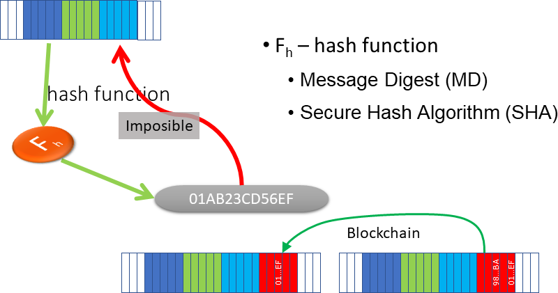
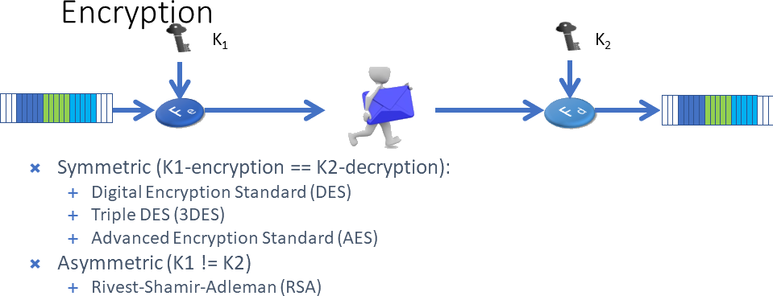

<!--
//____________________________________________________________________________________________________________________________________
//
// Copyright (C) 2024, Mariusz Postol LODZ POLAND.
//
// To be in touch join the community by pressing the `Watch` button and get started commenting using the discussion panel at
//
// https://github.com/mpostol/TP/discussions/182
//
// by introducing yourself and telling us what you do with this community.
//_____________________________________________________________________________________________________________________________________
-->

# Bitstream Cybersecurity

## Introduction

In the context of the cybersecurity of bitstreams implementation let me remind you of the following requirements we have:

1. The first one is to ensure that all users of a source bitstream can verify that the stream has been not modified while it was being archived or transmitted.
1. The second one is to safeguard information from unauthorized access, ensuring confidentiality.
1. The third one is to confirm authorship, so all users of a bitstream can determine who created it and who is responsible for its content. This goal we call non-repudiation of the author.

The following chapters provide more detailed descriptions of examples related to the implementation of these requirements. These requirements are implemented by applying the following cybersecurity concepts hash, encryption, and non-repudiation.

## Hash Function

### Fundamentals

Let's move on to the first option for securing streams: the hash function. It is a function that transforms the input bitstream to calculate another fixed-size unique bitstream. A collision in a hash function occurs when two different inputs produce the same hash value as output. The next feature of the received output bitstream is that the reverse transformation, i.e. recovering the source bitstream is practically impossible. One way to use such a function is to associate this hash value with the bitstream we want to protect. Then the hash value can be used to check whether the bitstream has not been modified in the meantime by calculating this function again and comparing the result with the associated hash value with the source bitstream if the expanded bitstream is archived or sent from one place to another. A certain drawback of this solution is that the algorithms for these functions are widely known, so if a "man in the middle" wants to modify the source bitstream, they can modify the source bitstream and recalculate a new value of the hash function for the previously modified bitstream.

Anyway, there are a few scenarios where this approach makes sense. Well, for example, the value of the hash function may be entered into the next bitstream called block, and a chain protection is created. The next block, which is also a bitstream, containing this hash value and pointing to the previous block means that we cannot modify the previous block because the value of the hash function is stored in the next one. This type of chain security is called blockchain and is used widely to protect against double-spending on crypto-currencies, for example, Bitcoin (fig below).



Blockchain security helps ensure that if someone wants to modify one of the blocks in the chain, they must modify all the blocks that have been attached to that chain later. Of course, this is still possible, so further safeguards are needed. Among other things, the growth rate of this chain, i.e. the speed of adding subsequent blocks to the chain, is greater than the possibility of modifying fragments of the chain. This topic is far beyond the scope of this document, but if you are interested in getting more I encourage you to check out a dedicated GitHub repository [NBlockchain][NBlockchain]. There is a practical example of how to implement such a chain.

### Example

So let's see how the hash function works and how it can be used in practice. In the [CryptographyHelpersUnitTest][CryptographyHelpersUnitTest] class, two unit tests have been prepared. They use the [CalculateSHA256][CalculateSHA256] method defined in the library. It is worth emphasizing once again that the argument of a hash function is always a bitstream. But obviously, the hash function may also be used for text, namely a bitstream for which an encoding has been defined. In the `CalculateSHA256Test` method, we have to protect a password. It is a string of random characters. Password may be associated with syntax and semantics to make it easier to remember but, fortunately, these syntax and semantics rules have no impact on the hash calculation. In this method, instead of a bitstream, we have a stream of characters compliant with the string type. The Alt+F12 key will take us to the definition of the [CalculateSHA256][CalculateSHA256] method. The input parameter of this method is a sequence of characters of the `string` type, but the hash function operates on an array of bytes, therefore we must transform this string of characters into a string of bytes. To do this, we need to have associated an encoding. In the case of the method under consideration, this is `UTF8`. This is the first yellow light that should light up because everyone who will use the result of the hash function to check the correctness of the input string must use the same encoding format (UTF8 in this case). If someone uses a different encoding, the hash function cannot necessarily be used to check the consistency of the input text. To be able to calculate the hash function in the [CalculateSHA256][CalculateSHA256] method, we need to create an object of the `SHA256Managed` class available in the language library. Since it implements `IDisposable`, I used the using statement.

In the next line:

``` csharp
return (BitConverter.ToString(hashValue), Convert.ToBase64String(hashValue, Base64FormattingOptions.InsertLineBreaks));
```

a bitstream generated by the hash function is converted into two text forms. The `BitConverter.ToString` converts the numeric value of each element of a specified array of bytes to its equivalent hexadecimal representation. The second form is a string with a notation consistent with the hexadecimal code compliant with the `Base64` standard.

`Base64` is a binary-to-text conversion. The output of this conversion represents binary data in an ASCII string format. It is commonly used in scenarios where binary data needs to be stored or transferred as text. This conversion method `Base64` is available in the language library and has many overloads. They all implement the RFC 2045 standard. And here another yellow flag should be raised because it is not the only standard that defines the `Base64` conversion. Moreover, based on the RFC database, it is easy to conclude that several RFC documents previously defined this conversion. So we can expect that this standard has been modified over time. Therefore, the question is about backward compatibility and the lifetime length of the calculated hash value if it is saved as text compliant with the `Base64` standard. It may turn out that the input string has not changed, but in the meantime, the implementation of the `Base64` conversion has changed and therefore using this string for validation is useless.

In unit tests methods, we have two assertions, which compare the result returned by hash calculation methods with defined hard-coded text. If the encoding changes when converting the input string of characters and when the implementation of the conversion to hexadecimal text or `Base64` changes, we can expect that these assertions and invariants will not be true and the test will end with an error. And we also have to consider this as another yellow flag that has to be raised. In other words, the use of a string, although convenient, unfortunately, has the consequence that this conversion from a bitstream to text compliant with the string type does not always have to be the same and may change over time. So why use it; someone may ask. In that case, wouldn't it be better for us to base it on a sequence of bytes? Well, we cannot always attach such a sequence of bits to the text; if it is e-mail, for example, then the email system has strictly defined characters that it can use to control data flow. Hence, it has to be taken into consideration the fact that attaching such a raw bitstream could have invalid characters causing problems with the correct operation of the email system. Therefore, conversion to text is sometimes necessary, but you need to remember these caveats.

## Encryption

### Fundamentals

Encryption is a reversible bitstream transformation function into another bitstream. The transformation or scrambling function rearranges or modifies the order of bits in a bitstream. This function is designed to introduce complexity and randomness into the data, making it difficult for unauthorized parties to interpret or understand without the appropriate decryption process. The goal is to enhance the security of the information being transmitted or stored. After encryption, the encoding, syntax, and semantics rules no longer apply to an output bitstream. So, as a consequence, no information can be associated with the obtained this way bitstream. The diagram below shows how it works.



The result of this encryption function (`Fe`) depends on the `K1` key. The `K1` key is also a bitstream. The disadvantage of this solution is that the resulting bitstream is always the same because the `Fe` is a function. This is easily fixed after adding a few randomly generated bytes to the input stream; the so-called nonce. Thanks to this, the result will be different each time even if the key `K1` is the same. This approach protects against the possibility of repetition, i.e. using the same bitstream even without understanding its meaning. To perform the reverse operation, i.e. restore the source bitstream that was originally encrypted, a decryption operation must be performed. For this, we will need the second key marked `K2` in the drawing above. If nonce has been added it is removed before the bitstream is ready for reusing.

If K1==K2 we have symmetric encryption, otherwise we call the encryption asymmetric.

Symmetric encryption employs a single key for both encryption and decryption operations. The same key is used by both interoperable parties, providing a more efficient process than asymmetric encryption. However, secure key exchange becomes crucial for maintaining confidentiality in symmetric encryption. The next problem with symmetric encryption is scaling. The scaling problem with symmetric encryption arises when a large number of parties need to be part of interoperability securely. In this scenario, each pair of interconnected parties requires a unique symmetric key for encryption and decryption. Managing and securely distributing a large number of keys becomes challenging, impacting the scalability of symmetric encryption in a practical setting.

Asymmetric encryption, also known as public-key cryptography, involves a pair of keys, namely a public key used for encryption and a private key for decryption. Bitstreams encrypted with the public key can only be decrypted by the corresponding private key, ensuring secure interoperability. On the other hand, bitstreams encrypted with the private key can only be decrypted by the corresponding public key.

### Symmetric Cryptography Example

It is proposed to analyze the encryption and decryption process using the [EncryptDecryptDataTest][EncryptDecryptDataTest] test method defined in the [CryptographyHelpersUnitTest][CryptographyHelpersUnitTest] class. In this method, symmetric encryption is used that implements the 3DES algorithm. We will encrypt the selected XML file [catalog.example.xml][catalog]. The test method must be preceded by an attribute that ensures all necessary files are copied to the test workspace before this method is invoked. First, we check whether this file exists. An assertion must always be true indicating that the file exists. We will save the encrypted result in another file. If this file exists, it is deleted. `ProgressMonitor` is a local class that will be used to track the progress of encryption and decryption progress. We will come back to this class shortly. The next step is directly related to encryption.

The purpose of the following instructions is to create an object that generates an encryption/decryption key.

```csharp-interactive
 TripleDESCryptoServiceProvider _tripleDesProvider = new TripleDESCryptoServiceProvider();
```

The key consists of two independent parts and can have different lengths depending on your needs. For default parameters, the length is 192 bits.

The next method [EncryptData][EncryptData] encrypts the input file and places the result in the output file. But to perform the encryption operation, we still need to pass two parameters, a key and an initialization vector. Please note that both, the initialization vector and the key are arrays of bytes, they are simply bitstreams. Where these keys are generated is important because access to these keys guarantees selective access to the bitstream meaning. This means anyone who has both the key and the initialization vector will be able to decrypt the encrypted bitstream. Although this example doesn't show it, we should take care of the distribution of keys and, of course, the initialization vector. We can treat these two things as one whole.

So let's see how the encryption may be applied. In this example, we are encrypting an XML file used to save a directory containing CD descriptions. Let me stress that the content of the file has no impact on the encryption/decryption process. The most important thing is that it is just a bitstream. The [EncryptData][EncryptData] encryption method has the following parameters: input file name, output file name, key, and initialization vector. Next, [dependency injection][DI] is used to allow the calling method to keep track of the process as the encryption process happens in stages.

First, we open the file to read the input bitstream, which contains the source data that is to be encrypted. The data is encrypted step by step using small chunks and is preserved in a buffer that has a predetermined length. In this case, the buffer is 100 bytes long. Encryption requires the creation of a bitstream complying with the `CryptoStream` type. To create its instance, we will need an object for which we pass the key and an initialization vector. The encryption itself is performed using the `Write` method, which writes bytes from the local buffer to the `CryptoStream` object. After saving, we inform the invoking party about the process progress returning the total number of bytes that are saved in this step to monitor the progress of work. Please note here that although the source file is a text file, we treat it as a bitstream. Associated encoding with this file content is not important and can be neglected. So, to read it, we create an object of the `FileStream` type because, as it was said while encrypting the encoding of the input file is irrelevant. In other words, encryption is always performed for the bitstreams. The encryption process ends when we read zero bytes into the buffer.

Then in the test method, after encrypting the source file, we check that the output file exists. There is an assertion that checks that this file exists and finally, we check if the number of bytes in the source file is equal to the number reported and written in the output file.

And now we move on to the step where the file is decrypted. That one we created. The entire procedure is carried out in the [DecryptData][DecryptData] method. This is again the library method. We pass similar parameters to it. Let me stress that to succeed the same key and the initialization vector that was used earlier have to be passed. Of course, in a real scenario, decryption is performed in a different location usually by a different computer, or even in a completely different place in the world, therefore we must ensure that whoever performs the decryption process in the location where the decryption process is to be carried out need the same key and the initialization vector used while the stream is encrypted.

So let's take a look at how the decryption procedure is implemented in the [DecryptData][DecryptData] method. It is easy to note that it is very similar to the encryption method. Again, we treat the output file as a bitstream opened for writing so that we can store the decrypted bytes. We will carry out the entire process step by step using small chunks preserved in a buffer, which has the same length as the previous one. What is important is that we must have an object of the `TripleDESCryptoServiceProvider` class that provides the same key and the same initialization vector that was previously used. This time, `CryptoString` will have a `mode` parameter indicating that it will be used to read a file content, so it will generally operate by decrypting the content of the specified file. In the [DecryptData][DecryptData] we have created an object that is responsible for performing decryption operations. Again, we end the process when we have read all the bits from the file containing the encrypted bitstream. We report the progress of this process using the `Report` method. The operation finishes when everything has been saved to the output file. Of course, the output file is automatically closed thanks to the `using` statement. For the sake of simplicity, in the [EncryptDecryptDataTest][EncryptDecryptDataTest] test method, the only correctness validation of the encryption/decryption round trip process is that the length of the file after decryption is equal to the length of the input file that is the source file.

### Conclusion

We have already learned that there are two types of encryption. In the examples discussed in this section, the symmetric encryption method of the bitstreams was the subject of examination. Asymmetric encryption will be the subject of the next section covering digital signature generation and validation.

In the symmetric encryption, the encryption and decryption sides use identical keys. From the point of encryption up to decryption, the bitstream is highly likely to be secured because no information can be associated with it. In other words, it cannot be used to recover the information it originally represents though the encrypted meaningless bitstream is available.

In the next part, we move on to asymmetric encryption. Precisely, not the encryption itself because the performance of asymmetric encryption is not enough hence it is only used in selected scenarios. The next section explores examples illustrating digital signature scenarios in which asymmetric encryption can and should be used. Asymmetric encryption is also used to distribute a session key securely. The session key for communication encryption is a temporary cryptographic key used to secure communication between parties during a specific session. It is generated for a short duration and provides a secure means for encrypting and decrypting bitstreams exchanged between the communicating entities. Session keys can be securely exchanged using asymmetric cryptography, where each party has a pair of public and private keys. The public keys can be exchanged openly, while the private keys are kept secret.

## Non-repudiation

### Fundamentals

Digital signatures are widely used in electronic transactions, software distribution, and other scenarios where ensuring the origin and integrity of bitstreams is crucial. Let's check how asymmetric encryption could be implemented in this subsection. First of all, I propose to deal with the confirmation of authorship. This issue has been associated with the topic of ensuring bitstream integrity. We have already learned that there are two types of encryption. In the examples discussed in this chapter, only the asymmetric encryption method of the bitstreams is the subject of examination. Symmetric encryption has been the subject of the previous chapter covering the confidentiality of bitstreams.

So let's move on to how a digital signature works, and how we ensure that the document's author cannot deny that he is the author.

### Compliance with Domain-specific Language

If a bitstream to be signed is compliant with domain-specific language (for example XML) any inserted text to this bitstream must not break compliance with this language. For example, consider the [catalog.example.xml][catalog] document that we already used in examples. Let's try to add a free-formatted text at the end of this document, for example, a previously calculated hash value expressed as hexadecimal text encoded using ASCII standard. Well, of course, we can easily predict the result. There is a syntax error reported, hence it can be stated that this document is no longer an XML document. Because the syntax is not correct it is not possible to recover the meaning of this document as one whole including added text. It is simply a free text and is not suitable for further processing when we expect the document to follow XML syntax rules.

What can we do? We can surround this text with an element markup, which is called for example `Hash`. As a result, we no longer have an XML syntax error, but we do have an error that such an element does not exist according to the schema we have defined. We can dumb down this document again and remove references to the schema, which defines what an XML document should contain. But this again leads to further consequences, such that if we expect that this document is compliant with a certain schema, then, as a consequence, this document is rejected because the schema is not defined for it. I would like us to remember this when following the method of implementing a digital signature. It will be vital to us.

### Signing Process

The following diagram shows how to implement authorship non-repudiation of a bitstream


In the first step, we calculate the hash, just like before. But then we encrypt this hash using a private key, which is assumed to be assigned to a certain identity, which is to be exclusively at the disposal of this identity. So, at least theoretically, no one else can use this key. If we encrypt the hash using a private key and asymmetric algorithm, the result is called a signature. We can therefore attach this signature to the original bitstream, archive, or send the result to another place over a network.

To check the bitstream integrity and authorship at the final location, we can first recalculate the hash value for the part that constitutes the source bitstream. This hash should be the same as the one recovered from the signature. To recover the hash value, namely, determine its initial value, the signature can be decrypted using the public key. The public key is associated with the private key (both are the keys pair), and we will then obtain the decrypted hash value calculated by the author of the bitstream. To check the correctness of the bitstream before further calculation, we can now compare the decrypted initial hash value with the hash value that is calculated after receiving the bitstream. If these two hash values are the same, it means that the input bitstream has not been affected because the hash value is still the same. Since we used a public key that is paired with a private key, we can also conclude that a specific identity created this stream. For any other identity, this decryption operation will not produce an identical hash value.

And now the last thing is how to ensure non-repudiation. How to ensure that the person who originally signed this bitstream will not say after some time that it is not him/she, that it is someone else? We can do it only after ensuring that the public key has been provided by a public benefit organization, just like an ID that confirms our identity. This means that we trust a certain organization that issued this key. This key is made available to us in the context of personal data, data that describes the identity, and therefore, based on this trust, we can conclude that this is a specific person, a specific identity.

### Creation of Keys Example

Let's move on to discussing how to implement this scenario using program text. As we can see from the description of this scenario, one of the important problems we have is creating and distributing keys. Hence, the first test method [CreateRSACryptoServiceKeys][CreateRSACryptoServiceKeys] is an example of how to generate keys and to point out how these keys may be distributed as an XML text. Of course, the topic related to key distribution - in general - is far beyond the scope of this section, therefore let me encourage you to check out other publications at this point. In this test, I use a method that generates keys. Let's go to its definition and see that in the first step an object `RSACryptoServiceProvider` is created for which we define the key length. This is a parameter that also determines the strength of security, but at the same time, it has some negative impact on the performance of this process. Depending on the equipment we have, this number should not be outsized here.

Once this object is created, the keys are generated. We can use these keys and we have three options. First, we can return the keys as an `RSParameters` object. An object of this class contains both private and public keys but is intended only for use inside the application. It is not intended to be used for key distribution outside of the application hosting realm. The next two lines show how to generate XML text that contains the keys. The XML form is suitable for archiving or distributing the keys over the network. Anyway, in the investigated sample, all three forms of keys are returned as a result of this method. It is a redundant solution to show only possible implementations.

Let's go back to the [CreateRSACryptoServiceKeysTest][CreateRSACryptoServiceKeysTest] test method, where we check that the first variable is not `null`, so an object of the `RSAParameters` class is returned. We further check that the content of the XML documents - they are simply a text - that contains only the public key [PubliKey.xml][PubliKey] and the one that contains the public key and private key, are not the same. From the point of view of testing, these operations are not important, but they show how the `CreateRSACryptoServiceKeys` method works.

The XML document that contains both the public and the private keys is located in the file [PubliPrivateKeys.xml][PubliPrivateKeys]. Of course, in the case of a private key, identity information is not important because, by design, the private key is only used by the owner.

The situation is different when we have a document containing only the public key. [PubliKey.xml][PubliKey] is an XML document that contains only the public key. Since this key will be used by third parties (bitstream users), by design, the distributed document must contain information about the identity to which this public key is associated. Of course, this is not fulfilled here. For this to be true, information about the public key must be added to another document called a certificate. A certificate is a document that has just been issued by a trusted organization. The organization is an office that certifies with its signature that the certificate is authentic and contains correct information. From the certificate itself, we can find out what identity the public key is assigned to. Unfortunately, discussing these issues in detail, as I said earlier, is far beyond the scope of this document.

### XML Document Signing Example

Let us now discuss how to implement the operation of signing an XML document and how to encapsulate the obtained signature in this document so as not to violate the rules of syntax control consistent with its schema. We are using XML but the same approach is available for any domain-specific language. First, we will need an input file that will serve as a signed source document. For this purpose, the file [catalog.example.xml][catalog] is used. We will also need the keys. We will use the private key to sign the document, precisely to encrypt the hash value calculated for the initial bitstream. We will use the public key to check the validity of the signature, precisely to decrypt the attached signature.

The signing operation is performed in the [XmlSignatureTest][XmlSignatureTest] test method. This operation is implemented in the [SignSaveXml][SignSaveXml] method to which we passed the source document to be signed, the keys that will be used for signing, and the name of the document where the signed document is to be saved. In this method, apart from checking the correctness of the input arguments, we create an instance of the `RSACryptoServiceProvider` class, which is to be used to create a signature so that we can place the signature in this document. Signing itself means that we add a signature in the last instruction. To create this signature, we use the keys that we passed while invoking the method, so this instance is initialized with the keys that were passed here so that the entire signing process takes place using the keys that will be further used to check the signature. Finally, the signed document is saved to a file.

So let's return to the [XmlSignatureTest][XmlSignatureTest] test method. We assume that we have already signed and saved the document in the file and now we can move on to discussing the methods that check the correctness of this document. There are two overloads of the [LoadVerifyXml][LoadVerifyXml] methods. Calling the first overload, we do not transfer the keys. It is worth emphasizing that the document is loaded and checked using the public key stored in it. With this solution, we do not have to bother providing the public key. Of course, with this type of checking, we cannot confirm the author's identity because anyone can enter such a public key. The only thing we can do is validate whether the document is consistent against this key. The second overload of this method uses the already passed keys and initializes the `RSACryptoServiceProvider` object, which is used to check the document authorship.

Finally, let's look at the signed XML document [SignedXmlFile.xml][SignedXmlFile]. We can see that the `Signature` element has been added. This document is currently erroneous because it is incompatible with the declared document schema. To fix it, the `Signature` element has to be removed from the XML document just after validation against the signature, and before using this document, for example for a deserialization operation; i.e. creating a graph of objects based on it.

A `Signature` element complies with the XML Digital Signature standard, namely [XML Signature Syntax and Processing Version 1.1][XMLS] issued by W3C in 2013. It is used to encapsulate digital signatures within an XML document. The `Signature` element contains additional information including the cryptographic signature value and details about the key used for signing. Thanks to this it can be easily removed from the XML document before further processing.

### Conclusion

In this part, we move on to asymmetric encryption. Precisely, not the encryption itself because the performance of asymmetric encryption is not enough hence it is only used in selected scenarios. This section explores examples illustrating digital signature scenarios in which asymmetric encryption can and should be used to create a safe hash value interchange channel. Asymmetric encryption is also used to distribute a session key securely. The session key for communication encryption is a temporary cryptographic key used to secure communication between parties to establish a secure session. It is generated for a short duration to be used to establish a secure session allowing for encrypting and decrypting bitstreams exchanged between the communicating parties. Initially, session keys can be securely exchanged using asymmetric cryptography, where each party has a pair of public and private keys. The public keys can be exchanged openly, while the private keys are kept secret.

## See Also

- [References](./../../../REFERENCES.md#references)
- [Programming in Practice - Information Computation; Udemy course, 2023][udemyPiPIC] - Information Computation means a process engaging a computer (a physical device) to process information as a series of actions or steps taken to achieve a particular result or help fulfill a task. The main challenge is that information is abstract. Precisely speaking, it is a kind of knowledge that cannot be processed directly by any physical device. Generally speaking, To resolve this inconsistency two main topics are covered. The first one refers to selected aspects of information modeling using types as descendants of a coding system. The second one covers program architecture design patterns to improve the design and deployment of the computer behavior description using a program implementing an algorithm.
- [Programming in Practice - Executive Summary; Udemy course; 2021][udemyPiPES]; The course explains the role of this repository as the extended examples storage that is a foundation for the Programming in Practice paradigm. The course is for all serious about the improvement of the software development skills education methodology.
- [Programming in Practice; GitBook eBook](https://mpostol.gitbook.io/pip/) - The content of this eBook is auto-generated using the Markdown files collected in this repository. It is distributed online upon the open access rules.
- Connect to [Programming in Practice Education LinkedIn Group][LinkedInPiP]
- [Generic implementation of the Blockchain agent in .NET][NBlockchain]
- [XSL\(T\) Languages][XSLW3C]
- [Serialization in .NET][STLZTN]
- [XML Schema Definition Tool (Xsd.exe)][XSD]
- [Generic implementation of the Blockchain agent in .NET][NBlockchain]
- [Dependency Injection][DI]
- [XML Signature Syntax and Processing Version 1.1][XMLS]; W3C Recommendation; 11 April 2013

[NBlockchain]: https://github.com/mpostol/NBlockchain#nblockchain
[udemyPiPIC]: https://www.udemy.com/course/information-computation/?referralCode=9003E3EF42419C6E6B21
[udemyPiPES]: https://www.udemy.com/course/pipintroduction/?referralCode=E1B8E460A82ECB36A835
[LinkedInPiP]: https://www.linkedin.com/groups/7478959/

[XMLS]: https://www.w3.org/TR/xmldsig-core1/
[DI]: https://www.udemy.com/course/information-computation/?referralCode=9003E3EF42419C6E6B21
[XSLW3C]: (https://www.w3schools.com/xml/xsl_languages.asp)
[XSD]: (http://msdn.microsoft.com/library/x6c1kb0s.aspx)
[STLZTN]: (http://msdn.microsoft.com/library/7ay27kt9.aspx)

<!-- ./ -->
[CalculateSHA256]: Cryptography/CryptographyHelpers.cs#L23-L31
[LoadVerifyXml]: Cryptography/CryptographyHelpers.cs#L161-L195
[DecryptData]: Cryptography/CryptographyHelpers.cs#L62-L86
[EncryptData]: Cryptography/CryptographyHelpers.cs#L33-L60
[CreateRSACryptoServiceKeys]: Cryptography/CryptographyHelpers.cs#L88-L101
[SignSaveXml]: Cryptography/CryptographyHelpers.cs#L111-L146

<!-- ../DataStreams.UnitTest -->
[EncryptDecryptDataTest]: ../DataStreams.UnitTest/CryptographyHelpersUnitTest.cs#L49-L76
[CryptographyHelpersUnitTest]: ../DataStreams.UnitTest/CryptographyHelpersUnitTest.cs#L23-L140
[XmlSignatureTest]: ../DataStreams.UnitTest/CryptographyHelpersUnitTest.cs#L91-L118
[CreateRSACryptoServiceKeysTest]: ../DataStreams.UnitTest/CryptographyHelpersUnitTest.cs#L79-L87
[PubliPrivateKeys]: ../DataStreams.UnitTest/Instrumentation/PubliPrivateKeys.xml#L1-L11
[PubliKey]: ../DataStreams.UnitTest/Instrumentation/PubliKey.xml#L1-L5
[catalog]: ../DataStreams.UnitTest/Instrumentation/catalog.example.xml#L1-L23
[SignedXmlFile]: ../DataStreams.UnitTest/Instrumentation/SignedXmlFile.xml#L3-L42
