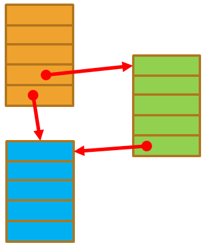
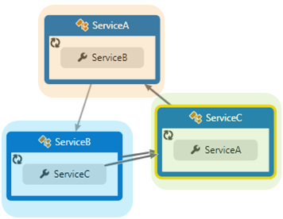

<!--
//____________________________________________________________________________________________________________________________________
//
// Copyright (C) 2024, Mariusz Postol LODZ POLAND.
//
// To be in touch join the community by pressing the `Watch` button and get started commenting using the discussion panel at
//
// https://github.com/mpostol/TP/discussions/182
//
// by introducing yourself and telling us what you do with this community.
//_____________________________________________________________________________________________________________________________________
-->

# Objects Serialization

## Introduction

From the previous considerations, we know that serialization/deserialization is the transformation process of data wrapped by an object from/to a bitstream form. These operations should be implemented as generic ones. It means that they must not depend on the type of the serialized/deserialized object because they should be offered as a generic library solution to allow multi-time usage against custom types. This process must start with recovering a set of value-holder members constituting the state of an object. Let me stress, that to provide a generic solution, this mechanism must not depend on the object type.

Let me stress again that we have two issues that we need to resolve. The first issue is a selection of the value-holder members that should be included in the resulting stream. The second is reading the values for these selected value-holder members without directly referencing the type definition.

Talking about serialization/deserialization we must answer the question of how to build universal and stand-alone libraries that will allow you to transfer data wrapped by an object to a bitstream and recover it from a bitstream to populate instantiated types. In other words, reading and writing values to its selected members without directly referring to its type. The main problem is that if the concrete type definition is not visible we don't have access to its members. We will analyze the following two typical approaches to implement this algorithm:

- **self-controlled** - the type exposes functionality that enables reading from and assigning to the type members contributing to the instance state
- **attributes and reflection** - metadata added by attributes to select state contributors and reflection that enables reading from and assigning to properties constituting the state

### Self-controlled Serialization

The first approach, compliant with the above scenario, is to implement access to object state values internally by a custom type. An example of this approach is presented later in this section. It is based on internal reading and assigning operations of the values creating the object's state in compliance with the object type definition. This way, it is possible to avoid the need for employing reflection. Instead, the [ISerializable][iserializable] interface has to be implemented.

```aspx-csharp
public interface ISerializable
{
  void GetObjectData(SerializationInfo info, StreamingContext context);
}
```

This interface acts as a contract between the target but custom class to be serialized and the class that implements the final transformation of a collection of values to a bitstream and by design, implements this algorithm without detailed knowledge about the target type. Only this interface is in common. We must be aware that the proposed solution is not perfect. There are still many issues that have been left unsaid. So let's start by systematizing the shortcomings of this proposal.

The first issue that we must address is the full autonomy of the serialization and deserialization process. In this approach, we must manually ensure that the appropriate values constituting the state of the target object are saved in the dedicated array, which is passed on to be written to the bitstream. It means that partially this functionality must be implemented by the custom type in compliance with the [ISerializable][iserializable] interface instead of being provided by a generic library.

The second issue related to the self-controlled approach to access values constituting the state of an object is the necessity of harmonization of the custom operations carried out during the serialization with the operations carried out during deserialization. From the mentioned examples we learn that two separate pieces of custom code are responsible for implementing this responsibility, and therefore any modification in one code piece must be mirrored in the other piece. This can lead to errors if this is not the case.

The main benefit of this technique is the lack of necessity to additionally determine the state of the object because this operation is postponed to the serialization mechanism itself. This mechanism must be implemented manually by the author of the type so it could be assumed that only vital values are transferred to the bitstream format and recovered from the bitstream.

Using self-controlled determination of a set of values contributing to the object state means splitting the functionality between the type to be subject for serialization/deserialization and library functionality, which is responsible for saving the value of the selected members independently in a bitstream. This solution requires that the type to be serialized must be prepared to read/write values from the members and create a table against an interface that is a kind of contract between both parties responsible for implementing the serialization/deserialization functionality. The main problem is that the type of concern must be prepared against the contract defined by the implemented interface.

Examples illustrating serialization using self-controlled access to values contributing to an object state are described later in the section [Self-controlled Serialization][self-controlled-serialization-example]

### Attributes and Reflection

Instead of using a self-controlled data access approach, the reflection may be employed to read and write values contributing to the object state. This way there is no custom code related to selecting, reading, and writing state values. To select only necessary values the following convention may be applied. It says that the state of the object is constituted by all the values that can be obtained by reading the public properties that have both getter and setter. So from this, you can read the current value and assign new ones. If this convention applies to the target object and all indirectly referenced ones we can state that the graph of objects is ready for serialization and deserialization using reflection. What is very important is to ensure symmetry between serialization and deserialization. This means that using reflection there is no need to add any dedicated functionality to the target class related to serialization and deserialization. It addresses the error-prone self-controlled data access responsibility of a type.

The rule that in the output stream all the values must be saved, which can be retrieved from public properties, and which have both getter and setter cannot be used uncritically. We also need to consider the case when such properties exist, but for some reason, we do not want to save their values in the output stream - they don't contribute to the object state. A solution to this problem may be based on applying dedicated attributes. It means that in practice properties of this kind are preceded by a selected attribute. For example, it may be `XMLIgnore`.

``` csharp
public class XmlIgnoreAttribute : Attribute
```

It indicates that you must use all public properties having a getter and setter, except those preceded by this attribute.

In this solution, the question is whether we can ensure the symmetry of the serialization and deserialization operations. The answer is yes because reading data and writing data functionality are side by side in the same place using the same property.

Recapping, from the above, we may learn how to use attributes and reflection to ensure full autonomy of the serialization process and harmonize the behavior of converting objects to a stream and stream to objects. Autonomy in this context means that the reflection is employed to implement a library and, as a result, the conversion process can be performed without dedicated custom code embedded in the type of objects to be serialized and deserialized.

Reflection-based serialization is a technique in software engineering where the internal structure of an object is recovered and internal data is serialized or deserialized based on metadata available at run-time related to the type of the object. This approach allows for dynamic transferring of object state to bitstream without explicit configuration. The main outcome of this approach is that in the target type (subject to serialization) there is no need to create dedicated code that is used to implement this operation. So we can say that reflection enables us to offer a strictly autonomous solution.

Discussing the reflection concept in detail is far beyond the scope of the examples collected here. We also talked about bitstream syntax and semantics using the example of XML files. We showed how to use the XML schema concept to describe details of the syntax and also the semantics of a document indirectly and to create the source code of a program that will be used in the serialization and deserialization process.

Examples illustrating serialization using reflection and attributed programming are described later in the section [Reflection-Based Serialization Example][reflection-based-serialization-example]

### Graph of Objects Serialization

Let's move on to the last issue related to the serialization of objects interconnected to each other forming graphs. So the objects have references between them and these references will determine the structure of the graph of objects. In this case, the main challenge is that all the objects must be considered as one whole.

Generally, we may distinguish two types of these structures. The first one is created using hierarchical interconnections, which resembles a tree. In this case, starting from any point of such a structure and following the directional references we never return to the starting point. Thanks to this feature, in mathematics this kind of graph is called acyclic. If graphs are cyclic then there are points in the graph that when we start from these points and follow the references, it is possible to return to the starting points. So such graphs have loops.

Since graph serialization requires an iterative approach, it requires that we iteratively traverse a tree of objects, provided that it is a tree. If there are cyclic connections (causing loops in the graph of objects) then there is a problem with stopping the iteration and avoiding double serialization (cloning) of the same object.

Assuming unidirectional interconnections between the objects and if a graph of objects is created as interconnected objects in such a way that they create a tree, or at least a layered model we can distinguish objects that are at the top of a hierarchy and objects that are beneath. Therefore, data transformation operations may be performed starting from those objects that are at the top and ending with those objects that are at the bottom of the hierarchy of references between objects.

Unfortunately, often happens that we must deal with more demanding structures, where these references create cycles. For example, in this example (fig. below), classes refer to each other creating a cycle.



Assuming that instances of all classes are created (fig. below), the question arises which one of the objects in the graph should be subject to the serialization process first. Therefore, in this case, we must not insist that the hierarchy between objects is dependent on the order of representation in the stream. Hence, here we must introduce the following term, namely equivalence of streams. If a stream contains a representation of all information including references, the order in which the data associated with each instance is placed in the stream is not relevant, provided that each object is serialized only once. Due to the above, it has to be considered that several different bitstreams contain equivalent states of individual objects and these object states will be placed in different orders but all of them are equivalent to each other. It means that on their basis it will be possible to reconstruct an equivalent graph of objects. Creating equivalent streams does not mean that they have to be identical and therefore, for example, they can be directly compared with each other.



Another issue that should be addressed here is when the serialization process should be ended. For example, if we start with an instance of one class, let's say `ServiceA` (fig. above), next proceed to serialize the instance of the `ServiceB` class and consequently proceed to an instance of the `ServiceC` class, we must have an iteration stop condition to avoid cloning of the instance `ServiceA` because it has been already serialized, i.e. the transformation process has been performed for it. For the more complex graphs, it could be not so easy.

In the case of cyclic graphs, there is no restriction on the number of paths between any pair of vertices, and cycles may be present. We may encounter two problems here. Firstly, we have to resolve many-to-one references in this type of graph, when many objects will have references to one object. As a result, we can expect that serializing such a structure may cause the cloning of objects in the stream. During recovery, if all these objects are recreated, many redundant copies are instantiated, so the structure will be different comparing it with the original. In the case of cyclic graphs (contain cycles - closed loops) in the relationship structure, we must take into account the fact that the serialization mechanism (the graph-to-bitstream conversion mechanism) will have to deal with this problem and therefore will have to set a stop condition to avoid cloning objects in the output stream. Well, we have two options to solve this issue. The first option is to write a custom library but this is a complex process. The second approach to address this problem is to choose an appropriate but existing library. There are many such libraries on the market and when analyzing their applicability, you should pay attention to these issues.

## Self-controlled Serialization Example

To illustrate this scenario, our task now is to implement a library class that enables reading from and assigning to properties defined as a member of a type that is a candidate to be serialized.

The [SelfControlSerialization][SelfControlSerialization] class contains three properties. One of them is named `AverageIncome` and returns a calculated value. In other words, it returns the result of an expression executed using local values. This example shows that to recreate an object of this class, we only need to transform two values because the third one is always calculated, so there is no need to preserve it in the bitstream. The constructor of this class is responsible for recovering the initial values (state) of this class when the object is created.

To transform an instance of this class (to serialize it), first, an attribute has to be associated with it that indicates that it is intended for serialization. However, this does not solve the issue of selecting the values contributing to the object state. The question is how to do it.

The first approach to selecting values contributing to the object state is to have built-in functionality in the target type selecting appropriate values. It means moving the responsibility of state selection to the target class. Unfortunately, it solves only partially the problem because this functionality must be implemented each time a new type is defined. Let's look at the serialization process using a unit test. The test method [SelfControlSerializationTest][SelfControlSerializationTest] implements functionality well suited for this purpose.

In this test class, we create an object of the target class that is to be serialized. In the next step, we must have a library class responsible for transferring a set of values to a bitstream. I have prepared a class called [CustomFormatter][CustomFormatter]. A bit later I will describe this class in more detail. After implementing the serialization functionality we can create a bitstream. Let's use a `FileStream` with a given name for this purpose and serialize the object to it, i.e. write a bitstream to this file content. After that, the content contains the state of the serialized object according to the selection made by the object itself thanks to the implementation of the [ISerializable][iserializable] interface.

After preparing the serialization result, in the next step, let's check that this file exists and that its length indicates that values that constitute the object state have been written to it. Then let's read this file and save it locally to manually examine its content.

But now let's move on to the implementation of the [CustomFormatter][CustomFormatter] class. Our [CustomFormatter][CustomFormatter] inherits from the [Formatter][Formatter] class. This class is defined in the language library and implements many operations to avoid cloning code and implementing the same functionality over and over. Using this type to implement serialization, it is assumed that the object to be serialized implements the [ISerializable][iserializable] interface. The main aim is to avoid using reflection and use embedded functionality that allows reading values that contribute to the object state. Thanks to implementing [ISerializable][iserializable], we can retrieve them from this object using the `GetObjectData` operation.

Again, using this approach to implement serialization, it is assumed that the object type to be serialized implements the [ISerializable][iserializable] interface. The main aim is to read values that contribute to the object state using typical programming means. By design, this functionality must be provided by the target type. An example is in the [SelfControlSerialization][SelfControlSerialization] class. Thanks to this, we can retrieve the vital values from the target object by using the `GetObjectData` method. As a result of this operation, we have access to all values even private ones, and we can perform serialization operations for all values even invisible outside of the target object. So, we can repeat the writing of individual values thanks to the `WriteMember` method, which is implemented in the `Formatter` class. Next, there are operations related to creating an XML document and saving this document in a file.

It is worth emphasizing that in our example we only write `double` values and it is a reason that only the `WriteDouble` method has been implemented. It creates an instance of the `XElement` type passing the value and key to the constructor. It is also important here that the [CustomFormatter][CustomFormatter] class is implemented in the library.

To implement deserialization we must create an instance of the type and populate value holders to initialize the object state. To implement this responsibility, the dedicated [SelfControlSerialization][SelfControlSerializationConstructor] constructor must be provided.

In this approach, the [CustomFormatter][CustomFormatter] class cannot have a reference to the definition of a target type that is subject to the serialization process. The object that is subject to the serialization process can be of any type but it must implement the [ISerializable][iserializable] interface and therefore must provide an implementation of the `GetObjectData` operation method. Because the target type is invisible, it can be recognized as a typical scenario where the dependency injection design pattern is required.

## Reflection-Based Serialization Example

It's time to move on to practical acquaintance with selected reflection mechanisms. To get more about reflection based on examples in selected programming language check out the document [Implementation Examples][ie]. These examples show how to represent type features as the [Type][system.type] class instances. The instances can be created using the `typeof` keyword or the `GetType` instance method for objects of unknown type. In both cases, an object-oriented type description is created. The examples discussed show how to use this description to read and write the values of a selected member of a type. This ability is especially useful when implementing serialization and deserialization operations. Similarly, we can also read and write values from fields and call instance methods. Similarly, it is also possible to create a new object without using the `new` keyword.

This example explains how to serialize using reflection and attributed programming. Examples collected in this section are dedicated to demonstrating how to deal with the presented above scenario. It defines a few helper functions, for serialization and deserialization located in the static [XmlFile][XmlFile] class.

The `ExDataManagement/DataStreams/DataStreams.UnitTest/Instrumentation` folder contains classes that represent the XML schema used by the program as an object model of the working data. An example of reflection-based data values access is the [Catalog][Catalog] class, which contains an array of CD descriptions. So here we have property, which is an array containing CD descriptions consistent with the [CatalogCD][CatalogCD] class defined in the same file.

Classes to be serialized were defined in the test project. Therefore, if we define a library that will be used to serialize these classes, this graph, then the serializing class cannot know the type of serialized classes, cannot have references to unit tests, and so it cannot know the types. This way it could be proved that the solution is generic, I mean it doesn't depend on the definition of serialized classes.

As we see in this example, we do not have to create custom code in the target type that is to be subject to serialization and used to implement this responsibility. So we can say that in this case, the serialization process is exactly autonomous.

The main aim of the [SerializationUnitTest.ReadWRiteTest][ReadWRiteTest] method is to test the serialization of the graph of objects represented by the [Catalog][Catalog] class. To be tested, the instances must be populated with test data. This class is located in unit tests, so I can add an appropriate method that populates the instance of this class with test data. The only question is where to add it. Adding this method to auto-generated text, i.e., text obtained as a result of an external program, is not a good idea, because our work is overwritten after each modification and generation of a new text. Therefore, let's take advantage of the fact that this class is generated as a partial class, and to populate the instance of this class with test data, we have to expand its definition by adding a custom part, which will be its integral part. In this part of the definition, located in a separate file, we can safely add all the operations we want to perform for this purpose. For this method called `AddTestingData` I used attributed programming again by adding an attribute that indicates that this method will be subject to compilation only when we have an environment configuration named [DEBUG][Debug].

Coming back to the unit tests, we see that an object has been created, and this object has been populated with test data. To make sure, we check that the instance has been created and initialized. Then we define the path where we want to save the file and use the `WriteXMLFile` method. This is a generic method. In its first parameter, we pass a graph of objects to be serialized, the file name, and details related to the output file creation.

The [WriteXmlFile][WriteXmlFile] method has been defined in the library. We will not analyze it in detail but the only important thing is that we use the `XMLSerializer` library to perform the serialization operation. The serialization is implemented in this statement:

``` csharp
  _xmlSerializer.Serialize(_writer, dataObject);
```

By design, all other instructions are used to protect against wrong values of parameters and to improve the formatting of the output XML text.

For testing purposes, an operation is performed to read the same file and create an equivalent graph of objects, i.e. deserialization implemented in the following assignment instruction

``` csharp
  Catalog _recoveredCatalog = XmlFile.ReadXmlFile<Catalog>(_fileName);
```

We can now check whether the result is consistent with our expectation, i.e. whether the original graph of objects and the equivalent graph of objects have appropriate values that are part of the object's state.

There are two more things worth noting about the [ReadWRiteTest][ReadWRiteTest] method. The first one is reading the stream and restoring an equivalent graph of objects. The second one is to check whether the graph of objects is equivalent compared with the original one. As we can see in this method, the same library called `XMLSerializer` is used. As previously the operation of restoring the graph of objects comes down to one instruction. From the example we can derive that testing if the recovered graph of objects is equivalent to the original one strongly depends on the custom type definitions and cannot be performed universally, therefore it must be the responsibility of developers.

Thanks to the presented example we may learn how attributed programming and reflection may be used to ensure autonomy and synchronization of object-to-stream conversion processes and vice versa. In the presented example there is no need to point out members contributing to the object state. In the [Catalog][CatalogAttributes] class attributes are only used to control the behavior of the serialization process.

Although we know that this is not a universal approach, let us return to the discussion of the topics related to checking the equivalence of the recovered graph compared to the original graph in this specific case. The primary graph was created while creating an object of the  [Catalog][Catalog] class and then filling it with test data using the `AddTestingData` method. After deserialization, we check that the `_recoveredCatalog` variable has references to the newly created object, so it is not `null`. Then we check how many elements the array has. It is assumed that there are only two elements, but it would also be worth checking the actual length of the array. However, the most important thing here is to check whether two subsequent disc descriptions compatible with [CatalogCD][CatalogCD] are equivalent to each other. The equality symbol is used to compare them, although we expect that the elements are equivalent, not identical. This effect can be achieved by redefining the equality operator in the [CatalogCD][CatalogCD] class. For this purpose, the definition of the equality operator has been overwritten. As a result, the behavior of a new definition of this operator determines what equals means. The standard `Equals` method is used here. This operation compares strings, which have been generated by the overridden `ToString` method. It determines which elements will take part in this comparison and how they will be formatted. It is worth emphasizing here that the string formatting may depend on the current operating system language settings and, depending on different data types, the formatting of this string may not be clear; it may not be the same every time.

## See Also

- [References](./../../../REFERENCES.md#references)

[ie]: README.md#implementation-examples-
[self-controlled-serialization-example]: READMESerialization.md#self-controlled-serialization-example
[reflection-based-serialization-example]: READMESerialization.md#reflection-based-serialization-example

[system.type]: https://learn.microsoft.com/dotnet/api/system.type
[Debug]: https://learn.microsoft.com/visualstudio/debugger/how-to-set-debug-and-release-configurations
[Formatter]: https://learn.microsoft.com/dotnet/api/system.runtime.serialization.formatter
[iserializable]: https://learn.microsoft.com/dotnet/api/system.runtime.serialization.iserializable
[WriteXmlFile]: Serialization/XmlFile.cs#L41-L62
[CustomFormatter]: Serialization/CustomFormatter.cs#L21-L153
[XmlFile]: Serialization/XmlFile.cs#L22-L97

[ReadWRiteTest]: ../DataStreams.UnitTest/SerializationUnitTest.cs#L42-L58
[Catalog]: ../DataStreams.UnitTest/Instrumentation/Catalog.xsd.cs#L21-L55
[CatalogAttributes]: ../DataStreams.UnitTest/Instrumentation/Catalog.cs#L19-L25
[CatalogCD]: ../DataStreams.UnitTest/Instrumentation/Catalog.xsd.cs#L56-L79
[SelfControlSerialization]: ../DataStreams.UnitTest/Instrumentation/SelfControlSerialization.cs#L22-L79
[SelfControlSerializationTest]: ../DataStreams.UnitTest/SerializationUnitTest.cs#L26-L39
[SelfControlSerializationConstructor]: ../DataStreams.UnitTest/Instrumentation/SelfControlSerialization.cs#L61-L66
