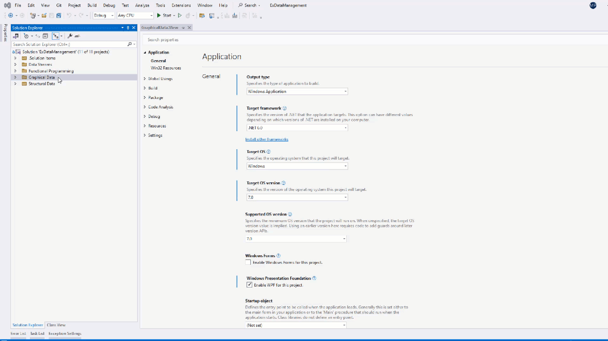
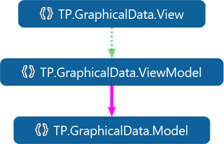
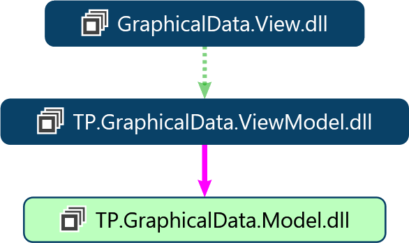
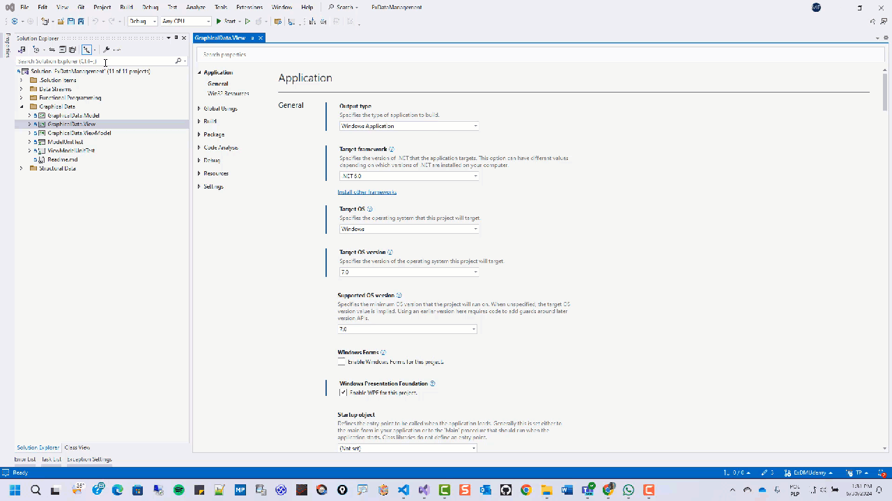

<!--
//________________________________________________________________________________________________________________________
//
//  Copyright (C) 2024, Mariusz Postol LODZ POLAND.
//
//  To be in touch join the community by pressing the `Watch` button and get started commenting using the discussion panel at
//
//  https://github.com/mpostol/TP/discussions/182
//
//  by introducing yourself and telling us what you do with this community.
//_________________________________________________________________________________________________________________________
-->

# MVVM Program Design Pattern

## Introduction

Let's start by defining the most important problems and indicating directions for further search for solutions regarding application architecture in the context of communication with the user using the MVVM pattern that stands for Model-View-ViewMode. In the case of user interface (UI), a program window is a self-contained graphical unit created by the program and managed by the operating system. Managed means moving, enlarging, reducing, etc. This, of course, is not surprising since the development of the first Windows operating system, in which the window is the basis for human-machine communication.

The program can, of course, use several windows, as well as several databases or several files. In all cases, we can talk about an independent external data repository. In the case of Windows, however, we must consider an important difference, namely the interaction is two-way. In the case of databases, we can also expect the need to consider dynamic data change. However, only in the case of using the Windows operating system (OS), programs must respond directly to events triggered by the user.

Manipulating an image, i.e. changing its features, such as form, color, and appearance, is the first task at the edge between the program and the graphical representation of process information. Here we return to the question of where to modify the image dynamically. The image is described by the [XAML][XAML] language not created to implement an operating algorithm, i.e. business logic. On the other hand, this language uses the types defined in CSharp. Hence, a trade-off between graphic customization and process-related behavior must be implemented.

## UI Elements Appearance

The window element is an organization unit composed using controls. The control UI element is any type that inherits directly or indirectly from the [Control][Control] type. The [Control][Control] class is the base class for most user interface elements. It means that types inheriting from the base [Control][Control] type can be rendered on the screen. In other words, they have a graphical representation.

Looking at the content of an example defining the main program window [MainWindow][MainWindow], we see that the displayed controls create a tree structure. The content is described using the XAML domain-specific language defined atop the `XML` language. The references of internal controls, for example, `TreeView`, are added to the collection of containing elements. The containment hierarchy is determined by the structure of the `XML` document. Theoretically, by manipulating the contents of these collections by adding and removing elements, you can change the window's content and behavior. Because this approach is limited to the design stage of the program life cycle we will not analyze it further.

Instead of adding controls to the parent control's collection, we can use the [Visibility][Visibility] property. It takes one of the following values `Collapsed`, `Hidden`, and  `Visible`. Therefore, a practical tip is to add all the controls that may appear on the screen when designing a static image and then dynamically change this property as needed.

Sometimes controls may be visible on the screen but in static mode. An example of this mode is an inactive key. The inactive key is visible on the screen but cannot be clicked. Another property, called [IsEnabled][IsEnabled], can be used for this purpose. It can be changed dynamically depending on the state the process is in. It is worth mentioning that GUI should be considered a state machine and the appearance of controls depends on the state of the UI. Hence, the controls should be grouped to change the state only of the selected part of the UI, not just by changing the individual controls.

## UI Modification

Similarly, by modifying the values ​​of various properties, we change other features of the controls, such as color, shape, filling method, etc. There are many of them. What to modify to refresh the user interface is the first important question. But now we come to the second question of where to make modifications. Of course, there are several answers to this question.

We already know the first answer to the question of where to modify. Of course, it is the `XAML` text. Modification in `XAML` has a disadvantage in that it is essentially limited to assigning constants. It should be emphasized here that default values ​​are already assigned for each property defined by the controls, so there is no need to modify anything for typical behavior. An example is `Visibility`, whose default value is `Visible`. This language allows us to assign any values compliant with the appropriate type but its use to implement algorithms not directly related to GUI control is not a good idea.

## Code-behind

Code-behind is a term used to describe the code joined with the `XAML` text. An example is in the [MainWindow][MainWindow] class. Both form one class definition because they are partial definitions. Therefore, all properties of this instance and all containing controls can be modified in the code-behind part.

However, this solution has several drawbacks. Let's narrow the discussion to the following ones that can be recognized as a good reason to exclude this approach.

1. The first drawback relates to the obvious violation of the principle of **separation of concerns**. This principle means avoiding the need to divide attention and encourages focusing only on single, well-separated issues. Probably,  this is a result of the human limitation of thought processes when solving a multi-threaded problem. In our case, if we are working on the GUI, we are not also working on process automation, i.e. algorithms implementation related to the process in concern. Let's focus solely on human-machine communication.
2. There is another very tangible disadvantage, namely one of the popular ways of checking the correctness of a program is the use of unit tests. Unit tests have the property that they do not support testing of a graphical user interface. Hence, to be used as widely as possible, the concerns of graphical representation and interface behavior controlling this interface should be separated so that independent unit tests can be created for them without the need to render graphics. In our example, I have achieved this separation by implementing interface behavior in the project `GraphicalData.ViewModel` implementing the `ViewModel` layer in compliance with [the MVVM pattern][mvvm-layered-architecture].
3. The next disadvantage is also tangible. In a project dedicated to implementing directly the screen form and behavior, we see a hard dependency, i.e. a reference to `Microsoft.WindowsDesktop.App.Ref`. This prevents the results generated by this project from being used on operating systems other than Microsoft Windows. So the program becomes hard to port. Placing text here that is not directly related to graphics violates another principle of programming engineering, namely reusability, so again it limits the possibility of reusing the text - in this case for other GUI technology. The possibility of reusing translates directly into money because if the product is not portable, a similar one must be developed again and, what is worse, it must be maintained later.

To sum up, placing the text of a program implementing any activities related to process data processing in the code-behind, violates the principle of separation of concerns, limits the possibility of using unit tests, and limits the portability of the solution. This analysis leads to the conclusion - let's not do it, it's not a good idea.

What about overriding the [OnInitialized][OnInitialized] in the `MainWindow` class? Am I contradicting myself? I will come back to this point. For now, please trust me that this is following the recommendations. Again, the recommendation says **the code-behind should not contain any line of code except the required one**. This exception is vital here.

Since the place where the user interface comes to life should not be `XAML` and code-behind, it must be other parts of the program. Here, unfortunately, we encounter a barrier related to type compliance control. Namely, you first need to know these types to control type compatibility. Suppose technologically unrelated projects are to be independent, as is the case with the `GraphicalData.ViewModel` and `GraphicalData.Model` projects. In that case, the mentioned projects cannot refer to the control types because they will become dependent on the technology and the elaborate plan will fail.

How to cut this Gordian knot? So far, the discussion has been reactive, ending with a statement of what we cannot do. As we can guess, the solution is, of course, a compromise. First, we limit the roles of the controls that make up the view to the role of an intermediary passing data between the user interface and the rest of the program. As a result of simplifying we can treat the view as a separate project. Simplifying, the role of the intermediary is limited to transparently transferring data from and to the screen. Occasionally, as part of this operation, we may provide a conversion operation, e.g. adjust the date format depending on the natural language used by the interface user. Additionally, the UI interface must respond to user commands by activating appropriate functionality.

The functionality of the scenario in which `XAML` is only a transparent data relay has been implemented in WPF technology. To expose data on the screen it must first be pulled from or pushed to some source. We don't have much choice here, they have to be objects, or rather their properties - described by types. Since these types must already be related to process data processing, their definition is dedicated to the needs of this process, which is located in the `GraphicalData.ViewModel` project. The `GraphicalData.View` project has a reference to this project. However, when WPF was implemented - specifically the transfer mechanism - it could not have known these types. Data transfer in WPF is a generic mechanism, so it cannot refer to specific types at design time, although it can have references to data holders of these types at run-time. This leads to the conclusion that we cannot use type definitions in this process, so what is left is only reflection, which allows us to recover these definitions during program execution, which should not worry us much, because we are not the ones who have to use the reflection directly and, consequently know this technology. A kind of relief is the [IntelliSense][IntelliSense] code-completion aid, which simulates run-time scenarios at the design time program development stage.

## MVVM Layered Architecture
  
### Preface

According to best practice of software engineering rules any program should have a layered architecture. Layered architecture means that one layer may be recognized as upper and a second one as a lower one although there are usually more layers. So that we can distinguish which one is higher. As a result, the inter-layer reference must be unidirectional, often called hierarchical. Because the hierarchy should be vertical the relationship should be top to bottom.

The program should have a layered structure - it's easy to say, but what is a layer? The program is text containing a stream of characters instead. Of course, in this principle the concept of a layer is abstract, but to say that the program architecture is layered, we must somehow implement this concept so that everyone knows what a layer is. In this respect, a programming pattern called MVVM is examined which stands for Model-View-ViewModel.

To make the discussion practical we must apply the layered pattern to the program text but not to the thinking process. The main goal is to apply the layered pattern rules directly to the program text as a result of the implementation of the algorithm derived from a research process. To promote a practical approach, I propose investigating this issue in the context of the syntax and semantics of a selected programming language. Although we are using a concrete development environment, the main hope is that the proposed approach is easily portable.

We will talk about the program architecture keeping in mind that the program is only a sequence of characters. Unfortunately, I often encounter the practice of disregarding the principles of layered program structure, because it only complicates matters and limits, and it is easier and possible to live without it, etc. Let us note that we have three significantly different approaches to this.

1. **PLD**: a typical program architecture, which distinguishes three layers called `Presentation`, `Logic`, and `Data` (`PLD` for short)
1. **MVVM**: the layered model that appears in the context of engineering a graphical user interface (GUI)
1. **Spaghetti**: no layers at all.

If all these approaches exist there are probably some reasons behind each of them, even trivial ones, such as lack of knowledge. To rule out a lack of knowledge let's take a closer look at this topic.

Simplifying, by design, the master `PLD` layered program design pattern applies to the program as one whole - keeping in mind - that the program is just a text.

The `MVVM` is a design pattern commonly used in [Windows Presentation Foundation (WPF for short)][WPF] to structure the code and separate concerns. Let me stress, here, we have the word _"presentation"_ in the name, in the context of the master architecture, we can assume that the layers of the `MVVM` model contribute to the presentation layer of the `PLD` master architectural model. Assuming that `MVVM` is an implementation of the `Presentation` layer in the master `PLD` model let's next answer a question: how to derive the implementation methodology of the `MVVM` from the general layered model concept?

Spaghetti means that there are no layers at all. This approach should be justified in the context of section [Layered architecture Benefits][Benefits].

### MVVM Implementation Using Namespace Concept

A program is just a text compliant with a selected programming language. Hence the pattern including the layers and layers relationship must be expressed using terminology defined by the language. Therefore, further discussion may depend on a concrete programming language selection. The examples are prepared using CSharp as the programming language and Visual Studio as the development environment. Hopefully, the proposal may be easily portable to other environments.

The layered architecture is an abstract term and must be implemented somehow. High-level programming languages are designed to be more intuitive and user-friendly for human programmers. They usually use the custom types definitions as building blocks that take responsibility for implementing the algorithm and process information in concern. To implement the layers I propose **sets of custom-type definitions**. In maths, the set is a group of well-defined entities called members. The set notion is well known from high school education, hence we may skip deep diving into this theory. In the proposed approach the well-defined entity is a custom type - a language construct. The only important thing is how to recognize the membership. There must be a boundary that we can use to distinguish if a type belongs to the selected set or not. To make the layer unambiguous it must be assumed that any type belongs only to one set, to one layer. This way we can convert the discussion about mathematical sets to an examination of types grouping. Now we must answer a question about how to recognize the membership of a type. In other words the fact of being a member of a selected group.

The namespace construct could be a relief to help make up a set's boundary and finally a layer. Namespaces are used to organize and provide a level of separation of program parts and to avoid name collisions. The namespace unique name could be used as a prefix of an identifier of definitions to make the full name unique in the program scope. On the other hand, the namespace can also be considered a container or an organization unit of definitions. This concept perfectly fits the idea of grouping or formally enforcing set membership of types. Let's examine how this works in the context of the MVVM programming pattern to build a Graphical User Interface (GUI for short).

A namespace is a linguistic construct containing a group of type definitions, so it is a good candidate for implementing MVVM layers. It's also easy to isolate text within a namespace of your choice. So, using filters, let's remove all organizational elements related to the tool. In the example, it is the folder and projects. After tidying up the diagram, we see that the MVVM layers have been implemented as namespaces. Within layers, there may be additional namespaces containing definitions of auxiliary types. For example, I have defined two auxiliary classes that facilitate the implementation and control of the correct use of this pattern and provide the implementation of responsibility needed for the `ViewModel` layer. Implementations of two interfaces, namely `INotifyPropertyChange` and `ICommand` may be found in the `MVVMLight` sub-namespace.

This concept is illustrated in the figure below. In this diagram, we can recognize three main layers created using the proposed method. It was generated from the text gathered in the `GraphicalData` folder. This image has been created using a code analytic tool embedded in the development environment. Thanks to this image - after removing unimportant parts - we can distinguish three layers View, ViewModel, and Model. It is also worth noting that internally, inside the layer circular references are perfectly OK. Let me recall that only between layers we must have unidirectional top-down dependencies.

As a side effect of using the embedded tool to analyze the architecture of the program text, there are different kinds of arrows. We may safely neglect this. This tool is not a subject of our examination.

### MVVM Implementation Using Project Concept

Namespace construct is one option to distinguish sets and finally create layers. The purpose of implementing layers using independent projects may be to minimize the program area dependent on technology. On the other hand, minimizing the number of projects in a solution reduces maintenance costs and dependency hell. Hence, if there are no special reasons it may not be worth forcing separate projects. However, for education purposes, we are dealing with a scenario where portability is critical, so separating projects is justified. Let me give you an example. A graphical user interface should be implemented differently for desktop devices with high-resolution monitors and smartphone devices. So let's try to put forward the thesis that layers can be implemented using projects.

From the development environment point of view, a project is just an organization unit within the solution. Solution and project are concepts related to the tool like Visual Studio, and not to the program text consistent with the selected programming language. This would indicate that using projects to implement layers is not a good idea. It looks like this concept has nothing in common with the programming language. However, we must consider an important project feature within a solution - the project is also a compilation unit. Therefore, its content must be consistent and compliant with a programming language. Hence, despite everything, it can be treated as the boundary of a set containing type definitions. Unidirectional and hierarchical top-down relationships can be implemented using the References/Dependencies branches.

Additionally, in the case of projects compared to namespaces, type definitions visibility (encapsulation - OOP paradigm) control can be employed, which should further facilitate the implementation of a layer as a set of type definitions and hierarchical unidirectional relationships between layers. The same code snippet is shown in the figure below but now exposes projects as implementation of the MVVM layers.

This example proves that while implementing the MVVM pattern it is possible to gather text describing the interface graphics - the `View` layer - in a separate project. It groups all references to WPF technology, namely to a certain group of types, whose definitions are tightly coupled with execution platform features.

Let's start with the fact that our sample program has three projects. The first one with the `View` suffix is ​​based on Framework Net 6.0 for Windows OS, so it is dedicated to a specific implementation of the .NET library. This limits the portability on other hardware and system platforms, but there is no option because WPF is a technology dedicated to Windows. The remaining projects are based on .NET Standard. .NET Standard is an abstract definition of the .NET library, i.e. it does not contain any implementation, only abstract definitions. Thanks to this, projects based on the .NET standard are portable and once the library is compiled, it can be deployed on any system platform for which there is a .NET implementation.

### Layered Architecture Benefits

Hierarchical architecture is often contrasted with spaghetti architecture if spaghetti can be called architecture at all. To prove there is no alternative let's summarize what we got in return for the layered architecture.

1. Separating the layers allows you to carry out design work independently assuming that the API (the layer interface) is abstract. This way, the GUI layers can be implemented in parallel. This approach can reduce the product development time as a result.
2. We can employ additional specialists and reduce time to market as a result.
3. The layered architecture enables portability from platform to platform.
4. The lack of cyclic references improves modifications and reduces the side effects possibility. This way maintenance costs can be reduced.
5. Efficiency of the design process may be increased by applying the principle of separation of concerns, i.e. good planning of layers avoids being distracted by solving several threads at the same time.
6. Layers can be deployed even on different physical machines. (a) Horizontal scalability is deployed by executing the same layer in parallel on many computers. (b) Vertical scalability means an ability to execute individual layers on independent hardware platforms.

### MVVM implementation Conclusion

Using this example, let's define a few simplified rules that will make it easier to implement the MVVM programming pattern.

1. Only definitions that refer to types defined in the `PresentationFramework` should be gathered in the `View` layer.
2. These definitions must refer only to types defined in the `ViewModel` layer.
3. By design, include text written in XAML and empty definitions in the code-behind part in the `View` layer.
4. In the `ViewModel` layer, define only type definitions that are bound to the properties of the controls.
5. Locating definitions of auxiliary types in the `ViewModel` layer to meet the requirements is optional. Due to the universal nature of these implementations, we often use external libraries.
6. To put it simply, the `Model` layer is everything else related to the implementation of the `Presentation` layer of the master `PLD` programming pattern. The `Model` layer encapsulates the responsibility and data-related operations relevant to implementing a graphical user interface and ensuring a clean separation from the UI rest of the program. It allows developers to work on business logic independently of the UI, making the application easier to test, maintain, and evolve.

Let me stress again. The `MVVM` is a programming pattern well suited to implementing the presentation layer in the `Presentation`, `Logic`, and `Data` (`PLD`) master programming pattern. By design,  the `MVVM` collects types in namespaces to maintain only hierarchical references between them. Therefore, a critical error for a layered architecture is if cyclic references occur between layers, i.e. if starting from any layer and moving along the dependency arrows you manage to return to the same namespace. You should also avoid situations where namespaces do not refer exclusively to the underneath layer.

When implementing layers using namespaces, we must consider the problem that these layers are not visible in the solution with the naked eye. A trade-off seems to be keeping folder names and namespaces in sync. The relationship is loose, but when you create a new class in a selected folder, it is added to a namespace whose name is created as a hierarchical combination of the default name, the names of the folders that make up the hierarchy, and with a suffix determined by the name of the final folder in the hierarchy.

## Selected Scenarios

### Master-detail Pattern

In this scenario, users start by scanning the master view to find the item they’re interested in. Once they select an item, the detail view updates dynamically to show relevant details. Users can navigate back to the master view or select another item to explore further. The master-detail GUI pattern is commonly used in software applications to display hierarchical data. The master view displays a list or summary of items (e.g. records, files, contacts, products). Users can select an item from this list. When a user selects an item from the master view, the detail view updates to show detailed information about that item. It provides a more comprehensive view, including additional data and related details. Depending on the capability of the hardware the detail view may be displayed on the same window, on the pop-up window, or a window replacing the master one.

### Pop-up Window

It is not difficult to imagine a scenario in which, when performing a certain operation, we need additional details from the user, for example, a file name. Obtaining this information requires additional at-hock communication with the user, which means engaging the topmost layer and displaying a pop-up window. This event must be handled by the layer underneath.

If a program is to be built according to the MVVM model, we can decide how the window should look only in the `View` layer. In the layer underneath we can decide when it should be displayed. Displaying another window, called **pop-up**, is a result of clicking on the basic window key, which is handled in the `View` model layer (implemented in a separate project). Let me remind you that a window is an object of some type. In this scenario, we ask for the `ViewModel` to instantiate a type and show it on the screen. Consequently, as part of this service, the `ViewModel` layer should instantiate an appropriate **pop-up** window object and display it, but this requires a reference to the `View` layer and, as a result, leads to recursion that is prohibited for the MVVM model. When multiple projects are used, it is not only a problem of breaking the rules, but also the inability to add cyclical dependence of projects to each other.

After taking a closer look at the example implementation of the `View` layer in the [MainWindow][MainWindow] class, we notice that the "empty code-behind" rule is not fully held. The exception is solely related to layer decoupling, i.e. ensuring hierarchical references at design time and communication in both directions at run-time.

It may be recognized as a confusion that the `ViewModel` layer should be constructed so it is not aware of the existence of the upper layer. At the same time, it is expected that this layer is showing a pop-up window. To address this contradiction, we should look for help in the Dependency Injection programming pattern. Those who have already heard something about this pattern may feel anxious that it is not another point in the discussion, but an introduction to a completely new topic. The concerns are justified, because many publications have already been written on this topic, and many frameworks and derivative terms have been defined. An example is "Inversion of Control". Without getting into academic disputes and deciding whether these publications and solutions concern dependency injection itself or the automation of dependency injection rather, we will try to solve the problem and separate the layers to avoid cyclical references between them, i.e. recursion in the architecture.

Let's start a Discussion about a graphical user interface implementation by determining how we can bring the content of a program user interface to "make it alive". The phrase "make it alive" is a colloquialism that means **dynamically modifying graphics features on the compute screen**, editing data through it, and responding to user commands. The basic element to compose a Graphical User Interface, we already know, is a Window. An example is shown in the figure below. The primary element (Window) is created during the bootstrapping by an executing platform according to the description in the program sequence. However, in the examined project, we have one more window. It appears after clicking one of the keys (in Fig. below).

Without going into details, let's assume that clicking a key causes some hard work to be performed in the background - for example, a file is being read and analyzed - and as a result, another window is displayed - a typical pop-up scenario - if everything goes well. This means that we must deal with

- event handling - deciding when a window should be exposed on the screen.
- view - deciding what the window should look like.

It is worth recalling here that a window is a class that inherits from the `Window` class and for the window to appear you need to call the [Show][Show] method. The solution is the [OnInitialized][OnInitialized] method.

## See also

- [XAML overview][XAML]
- [Desktop Guide (WPF .NET)][WPF]
- [IntelliSense in Visual Studio][IntelliSense]

[XAML]: https://learn.microsoft.com/dotnet/desktop/wpf/xaml
[WPF]:  https://learn.microsoft.com/dotnet/desktop/wpf/overview/

[Show]:         https://learn.microsoft.com/dotnet/api/system.windows.window.show
[Control]:      https://learn.microsoft.com/dotnet/api/system.windows.controls.control
[Visibility]:   https://learn.microsoft.com/dotnet/api/system.windows.uielement.visibility
[IsEnabled]:    https://learn.microsoft.com/dotnet/api/system.windows.uielement.isenabled
[IntelliSense]: https://learn.microsoft.com/visualstudio/ide/using-intellisense

[MainWindow]:       GraphicalData.View/MainWindow.xaml#L1-L46
[OnInitialized]:    GraphicalData.View/MainWindow.xaml.cs#L27-L33

[mvvm-layered-architecture]: README.MVVM.md#mvvm-layered-architecture
[Benefits]:                  README.MVVM.md#layered-architecture-benefits
