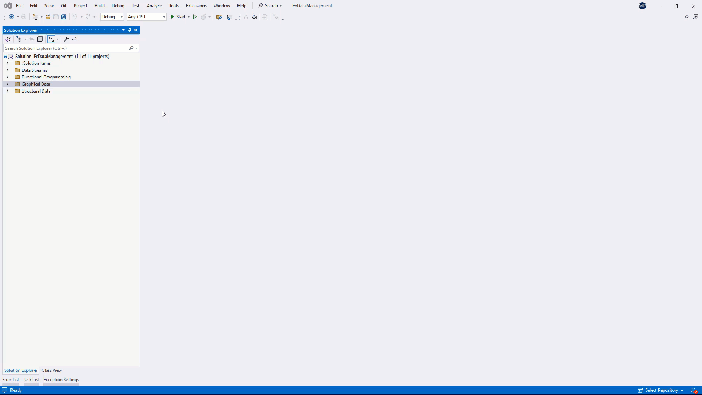
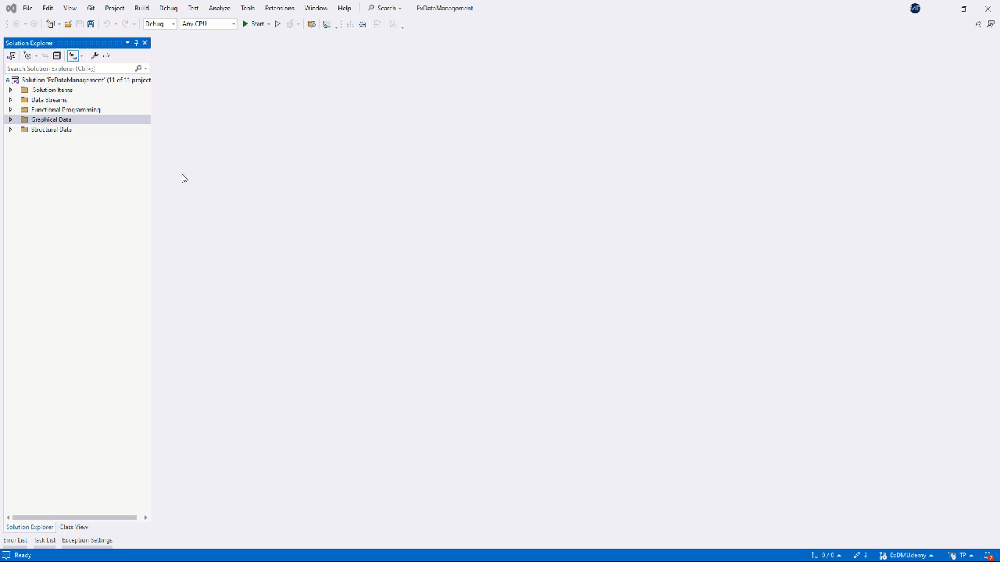

<!--
//________________________________________________________________________________________________________________________
//
//  Copyright (C) 2024, Mariusz Postol LODZ POLAND.
//
//  To be in touch join the community by pressing the `Watch` button and get started commenting using the discussion panel at
//
//  https://github.com/mpostol/TP/discussions/182
//
//  by introducing yourself and telling us what you do with this community.
//_________________________________________________________________________________________________________________________
-->

# User Interface Description

## Introduction

In this article, we continue the series dedicated to discussing selected issues related to the representation of process information in graphical form. The main goal is to address selected topics in the context of graphics, which is used as a kind of control panel for the business process. An image is a composition of colored pixels. They must be composed in such a way as to represent selected process information, i.e. its state or behavior. Similarly to the case of data residing in memory, which we do not process by directly referring to their binary representation, we do not create a Graphical User Interface (GUI for short) by laboriously assembling pixels into a coherent composition. Moreover, the GUI is a dashboard controlling the process, so it must also behave dynamically, including enabling data entry and triggering commands.

In a computer-centric environment, generating such graphics requires a formal description. In this section, a dedicated domain-specific language called Extensible Application Markup Language (`XAML` for short) is examined. By design, it is used to describe formally what we see on the screen. A new language sounds disturbing - especially since learning this language is beyond the scope of this publication. Fortunately, in-depth knowledge of it is not required. This is not a necessary condition to understand any of the topics in concern. The main goal is to examine selected topics bounded to generating a graphical user interface based on its formal description, which we programmers can somehow integrate into the entire program.

However, how to ensure the appropriate level of abstraction, i.e. hide the details related to the rendering of the image and not lose the ability to keep it under control. As usual, for our considerations to be based on practical examples we must use a specific technology. I chose the Windows Presentation Foundation (WPF). Technology refers to the tools, techniques, and processes used to design, develop, test, and maintain software systems. This encompasses a range of elements, including programming languages,  development tools, frameworks and libraries, best practice rules, patterns, and concepts. Still, I will try to ensure that we do not lose the generality of the considerations regardless of this selection. An important component of this technology is the `XAML` language, which we will use to achieve an appropriate level of abstraction. Hopefully, we will stay as close as possible to the practice of using the CSharp language to deploy a Graphical User Interface.

## XML Based Application Markup Language

### Why XML

Previously we described how to use an independent `Blend` program while designing the UI appearance. After finishing work in `Blend`, we can return to creating the program text, i.e. return to Visual Studio. Blend is an independent program that can be executed using the operating system interface, including the file browser context menu. It is independent, provided that the results of its work can be uploaded to the repository as an integrated part of the entire program and the history of its changes can be tracked. This will only be possible if its output is text. This is a demand today, which must be followed without any compromise. This is the cause why graphic formats such as GIF, JPG, and PowerPoint files, to name only selected ones for determining the appearance of the GUI are generally a bad idea.

Let's see how this postulate is implemented in the proposed scenario. After returning to Visual Studio, we notice that one of the files has changed. After opening it in the editor, we see that it is a file with XML syntax, i.e. a text file, although there is a similar image. Let's close the image because we should focus on the text itself. However, it should be noted that the image-text relationship exists. Going to the folder where this file is located, we can analyze its changes. I suggest not wasting time examining the changes in the file itself. It is better to spend this time understanding the content and role of this document as a part of our program. So let's go back to Visual Studio.

Probably the first surprise is that instead of CSharp we have XML. There are at least two reasons for this.

1. The first is that the graphics rendering process is not related to the implementation of algorithms related to the process in the CSharp language. In other words, it is a data-centric process. So the first reason is the portability of the work result.
2. The second reason is related to the use of the `Blend` editor, i.e. an independent software tool. Let me stress that the XML standard was created as a language intended for exchanging data between programs, i.e. for application integration. Here we see how it works in practice for `Blend` and Visual Studio. Blend and Visual Studio are two independent programs whose functionality partially is compatible with each other.

### XML Meaning

From the point of view of graphic design, the fact that we are dealing with `XML` should not worry us much. All that is needed is for people who know colors and shapes to give us the generated file, which we will attach to the program and Visual Studio will do the rest. Unfortunately, this approach is too good to be true. This whole elaborate plan comes down to the fact that sooner or later - and as we can guess rather sooner - we have to start talking about integrating the image with program data and behavior, which is, what we are paid for. However, we define data, i.e. sets of allowed values ​​and operations performed on them, using types and we need to start talking about them. Hence we must learn more about the meaning of this XML document.

## XML Compilation Process

### Partial Class

Further examination of using `XML` documents may start by noticing a seemingly trivial fact: the `XML` file is coupled with another file with the extension `.cs`. After opening it we can recognize that it is CSharp text. Moreover, we see the word partial in the header of a class, so we must deal with a partial definition of a type. Maybe these two files create one definition. This only makes sense if the parts are written in the same language - they have the same syntax and semantics. In the case under consideration, this is not met. Here, trying to merge text documents compliant with different languages must lead to a result that is not compliant with any language. Our suspicions are confirmed because as we can see the first element of this `XML` file contains the `class` attribute and the name of the partial class that is coupled.

Therefore, we can consider it very likely to be a scenario in which a document written in compliance with a certain language based on `XML` syntax is converted to the CSharp language. After this, they can be merged into one unified text, creating a unified class definition as a result of merging it from two parts. As a result, we can return to the well-known world of programming in CSharp. We call this new language `XAML`. According to the scenario presented here, we do not need to know this language. And that would be true as long as a static image is to be created. However, we need to bring it to life, i.e. visualize the process state and the behavior, i.e. display process data, enable data editing, and respond to user commands. We can be reassured by the fact that, in addition to the `XAML` part, we have a part in CSharp, called code-behind. Additionally, if the compiler can convert `XAML` to CSharp, maybe we can write everything in CSharp right away. The answer to the question of whether it is possible not to use `XAML` is positive, so the temptation is great. Unfortunately, this approach is costly. Before starting the cost estimation, we need to understand where they come from, but remember that we have three options. Only `Blend`, only CSharp, and some combination of them.

### Conversion of XAML to CSharp

To estimate the previously mentioned costs of converting `XAML` to CSharp and better understand the mechanisms of operation of the environment, we need to look at what the compiler does based on the analysis of the program text. Let's do a short analysis without going into details. In the class constructor, we will find a call to the [InitializeComponent][InitializeComponent] method, which - at first glance - is not present (the compiler reports an error). Anyway, let's launch the program with the break point just before the [InitializeComponent][InitializeComponent] method. It works, so after breaking execution we can select "Step Into" from the `Debug` menu to enter the method. We can see that this text is automatically generated by the compiler, but also it does not contain a simple conversion of the `XAML` text to CSharp, but instead passes the path to the `XAML` file to the `LoadComponent` method.

``` CSharp
            System.Uri resourceLocater = new System.Uri("/GraphicalData.View;component/mainwindow.xaml", System.UriKind.Relative);
            
            #line 1 "..\..\..\MainWindow.xaml"
            System.Windows.Application.LoadComponent(this, resourceLocater);
```

The implementation of this method is provided by the library, but from the description we can learn that it creates all relevant objects using reflection. Reflection is a higher level of education and these are the costs. Without reflection, error-free conversion of `XAML` to CSharp is generally impractical or even impossible.


### XAML Semantics

The syntax and semantics of `XML` files defined by the specification are not sufficient to explain the meaning of the document. Let's try to explain what the word [Grid][Grid] means in a snippet of `XAML` text taken from an example in the repository. From the context menu, we can go to the definition of this identifier and see that an additional tab opens with the definition of the class with the same name. There is a parameter-less constructor for this class. This allows us to guess that the meaning of this `XML` element is as follows: call the parameter-less constructor and, consequently, create and initialize an object of this class. Analyzing the subsequent elements and attributes of this `XML` file, we see that they refer to properties, i.e. properties of this class.



## Rendering Types

To put it simply, rendering is an activity of creating a composition of pixels on the screen following some formal description - in our case, it is turning text into a living image. Since we compose pixels on the screen, we can only talk about the program execution time. In the case of object-oriented programming, this formal description existing during program execution must be a set of objects connected in a structure, i.e. a graph. Objects are instantiated based on reference types. Therefore, the types that we will use to describe the image must have a common feature, namely an assigned shape. Therefore, the entire image must be a composition of typical shapes that enable the implementation of two additional functions, such as entering data and executing commands. Consequently, these shapes must also be adaptable to current needs. All this can be achieved thanks to the polymorphism paradigm and properties of types.

So let's go back to the `XAML` file. We can recognize it as a formal description of how to instantiate types and an interoperable shape on the computer screen. And now we know that the objects we create must have a common feature, namely, that they can be rendered. If an object is created, what should we do with a reference to it - for example, we create an object based on the definition of the `Grid` class. If nothing happens after instantiation, the garbage collector will immediately delete and release it. Therefore, let us assume that each object created in compliance with the hierarchy of elements of an XML document is a collection of internal objects. In such a case, the mentioned `Grid` object would be added to the [MainWindow][MainWindow] class, but it is not a collection. Note that the [MainWindow][MainWindow] class inherits from the `Window` class, which may already be or contain such a collection. As a result, a tree of objects is created, the root element of which - i.e. the trunk - is the [MainWindow][MainWindow] class, which is a partial class and inherits from the `Window` class.

A systematic discussion of the `XAML` language is a topic for an independent examination. Let's assume we get an `XAML` document from the work of aesthetics, ergonomics, and business process specialists. Without going into the details of this file, we can notice that the image created on the screen is also tree-like and consists of images that are further composed of subsequent images. In our example, the window is a kind of array, in which cells contain a list, keys, text fields, etc. In other words, each object we have created is rendered on the screen, i.e. each class formally describing this object must have an associated appearance, so the rules for creating a certain pixel composition. These classes are commonly called controls. So, without going into details, a control is a class definition that implements functionality reproducing a certain shape and behavior on the screen.

In other words, any control is a type that encapsulates user interface functionality and is used in client-side applications. This type has associated shape and responsibility to be used on the graphical user interface. The [Control][Control] is a base class used in .NET applications, and the MSDN documentation explains it in detail. A bunch of derived classes inheriting from this class have been added to the GUI framework, for example, `Button`.

## Program Bootstrap

It may sound mysterious at first, but the fact that the graphical user interface is an element of the program is obvious to everyone. However, it is not so obvious to everyone that it is not an integral part of the executing program process. Let's look at the diagram below, where we see the GUI as something external to the program. Like streaming and structured data. This interface can even be deployed on another physical machine. In such a case, the need for communication between machines must also be considered.


As a result, we must look at the User Interface and the running program as two independent entities operating in asynchronous environments. So the problem is how to synchronize its content and behavior with the program flow.

In object-oriented programming, launching a program must cause instantiation and initialization of a first object. Its constructor therefore contains the instruction that is first executed by the operating system process to be a platform for running the program. This raises the question of how to find it.

Each project contains a configuration file. In the project, its content can be read using the context menu. There is a place where the `Startup Object` may be selected. There is only one to choose from, and its name syntax resembles a type name.



Since this is an automatically generated but custom type, it is worth asking how the development environment selects types to this list. Could there be more items on this list?

Since this is the `Startup Object`, the identifier in the Dropbox must be the class name. We find the [App][App] type in the solution explorer tree. After opening, we see that it is `XAML` - compliant text. Notice that this file is coupled with a CSharp file. This is another example of a partial class written in two languages, so we expect `XAML` to CSharp conversion and text merging. In this definition of the [App][App] type, we can find a reference to another `XAML` file, namely an assignment to the `StartupUri` property pointing to the `MainWindow.xaml` file. It contains the definition of the graphical user interface, often called a shell.

It is worth paying attention to the fact that this class inherits from the `Application` class. The definition of this class is practically empty, i.e. it doesn't even have a constructor, which means that the default constructor is executed, i.e. does nothing. However, this allows you to define your parameter-less constructor. You can also overwrite selected methods from the base class to adapt the behavior to the program's individual needs. We can locate the required auxiliary activities using the mentioned language constructs here before implementing business logic. A typical example is preparing the infrastructure related to program execution tracking, calling the `Dispose` operation for all objects that require it before the program ends, and creating additional objects related to business logic or preparing the infrastructure for dependency injection.

## Bindings - User Interface Interoperability

### Coupling Controls with Data

Let's look at an [example][TextBox] where the `TextBox` control is used. Its task is to expose a text on the screen, i.e. a stream of characters. The current value, so what is on the screen, is provided via the `Text` property. By design, it allows reading and writing `string` values. The equal sign after the `Text` property identifier must mean: "transferring the current value to/from the selected place". We already know that the selected place must be a property of some object. The word `Binding` means that it is attached somehow to [ActionText][ActionText]. Hence, the [ActionText][ActionText] identifier is probably the name of the property defined in one of the custom types. Let's find this type using the Visual Studio context menu navigation. As we can see, it works and the property has the name as expected.


### DataContext

As you can notice, the navigation works, so Visual Studio has no doubts about the instance of type this property comes from. If Visual Studio knows it, I guess we should know it too. The answer to this question is in these three lines of the [MainWindow[DataContext] of XAML definition.

``` xaml
    <Window.DataContext>
      <vm:MainViewModel />
    </Window.DataContext>
```

Let's start with the middle line that contains a full class name. The namespace has been replaced by the `vm` alias defined a few lines above. The class definition has been opened as a result of previous navigation to a property containing the text for the `TextBox` control. Let's consider what the class name means here. For the sake of simplicity, let's first look up the meaning of the `DataContext` identifier. It is the name of the property. It is of the `object` type. The `object` is the base type for all types. Since it's a property, we can read or assign a new value to it. Having discarded all the absurd propositions, it is easy to guess that the `MainViewModel` identifier here means a parameter-less constructor of the `MainViewModel` type, and this entire fragment should be recognized as the equivalent of an association statement to the `DataContext` property of a newly created instance of the `MainViewModel` type. In other words, it is equivalent to the following statement

``` CSharp
  DataContext = new MainViewModel();
```

Finally, at run-time, we can consider this object as a source and repository of process data used by the user interface. From a data point of view, it creates a kind of mirror of what is on the screen

### Binding

Let's go back to the previous example with the [TextBox][TextBox] control and coupling its `Text` property with the [ActionText][ActionText] property from the class whose instance reference is assigned to the `DataContext` property. Here, the magic word `Binding` may be recognized as a virtual connection that transfers values between interconnected properties. When asked how this happens and what the word `Binding` means, i.e. when asked about the semantics of this notation, I usually receive an answer like this "It is some magic wand, which should be read as an internal implementation of WPF", and `Binding` is a keyword of the `XAML` language. This explanation would be sufficient, although it is a colloquialism and simplification. Unfortunately, we need to understand at least when this transfer is undertaken. The answer to this question is fundamental to understanding the requirements for the classes that can be used to create an object whose reference is assigned to the `DataContext` property. The main goal is to keep the screen up to date. To find the answer, let's try to go to the definition of the `Binding` identifier using the context menu or the F12 key.


It turns out that `Binding` is the identifier of a class or rather a constructor of this class. This must consequently mean that at this point a magic wand means creating an instance of the `Binding` class that is responsible for transferring values ​​from one property to another. The properties defined in the `Binding` type can be used to control how this transfer is performed. Since this object must operate on unknown types, reflection is used. This means that this mechanism is rarely analyzed in detail. The colloquial explanation previously given that the transfer is somehow carried out is quite common because it has its advantages in the context of describing the effect.

The [AttachedProperty][AttachedProperty] class definition simulates this reflection-based action providing the functionality of assigning a value to the indicated property of an object whose type is unknown.

### INotifyPropertyChange

Using properties defined in the `Binding` type, we can parameterize the transfer process and, for example, limit its direction. Operations described by the `XAML` text are performed once at the beginning of the program when the `MainWindow` instance is created. Therefore, we cannot here specify the point in time when this transfer should be carried out. To determine the point in time when an instance of the `Binding` type should trigger this transfer, let's look at the structure of the [ActionText][ActionText] property in the [MainViewWindow][MainViewWindow] type. Here we see that the setter (used to update the current value) performs two additional methods. In the context of the main problem, the `RaisePropertyChanged` method is invoked. This method activates the `PropertyChanged` event required to implement the `INotifyPropertyChanged` interface.

``` CSharp
    public event PropertyChangedEventHandler PropertyChanged;
```

This event is used by objects of the `Binding` class to invoke the current value transfer. As a result of activating this event, we call methods whose delegates have been added to the `PropertyChanged` event required by the mentioned interface. If the class does not implement this interface or the activation of the `PropertyChanged` event does not occur, the new value assigned to a property will not be pulled and transferred to the bonded property of a control. Finally, the screen will not be refreshed - the screen will be static.

It is typical communication where the [MainViewWindow][MainViewWindow] instance notifies about the selected value change and the `MainWindow` instance pulls a new value and displays it. In this kind of communication the [MainViewWindow][MainViewWindow] has a publisher role and the `MainWindow` is the subscriber. It is worth stressing that communication is a run-time activity. It is initiated in the opposite direction compared with the compile time types relationship. Hence we can recognize it as an inversion of control or a callback communication method.

### ICommand

The analysis of the previous examples shows the screen content synchronization mechanism with the property values change ​​of classes dedicated to providing data for the GUI. Now we need to explain the sequence of operations carried out as a consequence of issuing a command by the user interface, e.g. clicking on the on-screen key - `Button`. We have an example here, and its `Command` property has been associated, as before, with something with the identifier [ShowTreeViewMainWindowCommend][ShowTreeView]. Using navigation in Visual Studio, we can go to the definition of this identifier and notice that it is again a property from the [MainViewWindow][MainViewWindow] class, but of the `ICommand` type. This time, this binding is not used to copy the property value but to convert a key click on the screen, e.g. using a mouse, into calling the `Execute` operation, which is defined in the `ICommand` interface and must be implemented in the class that serves to create an object and assign a reference to it into this property.

For the sake of simplicity, the `ICommand` interface is implemented by a helper class called [RelayCommand][RelayCommand]. In the constructor of this class, you should place a delegate to the method to be called as a result of the command execution. The second constructor is helpful in dynamically changing the state of a button on the screen. This can block future events, i.e. realize a state machine. And this is exactly the scenario implemented in the examined example program. Please note the [RaiseCanExecuteChanged][RaiseCanExecuteChanged] method omitted in the previous explanation.


## See also

- [XAML in WPF](https://docs.microsoft.com/dotnet/framework/wpf/advanced/xaml-in-wpf)
- [TreeView Overview](https://docs.microsoft.com/dotnet/framework/wpf/controls/treeview-overview?view=netframework-4.7.2)
- [Control Class][Control]

[Control]:             https://learn.microsoft.com/dotnet/api/system.windows.controls.control

[AttachedProperty]:       ../DataStreams/DataStreams/Reflection/AttachedProperty.cs#L20-L27

[RelayCommand]:           GraphicalData.ViewModel/MVVMLight/RelayCommand.cs#L24-L101
[ActionText]:             GraphicalData.ViewModel/MainViewModel.cs#L74-L83
[ShowTreeView]:           GraphicalData.ViewModel/MainViewModel.cs#L104-L107
[MainViewWindow]:         GraphicalData.ViewModel/MainViewModel.cs#L20-L150
[RaiseCanExecuteChanged]: GraphicalData.ViewModel/MVVMLight/RelayCommand.cs#L88-L91

[TextBox]:                GraphicalData.View/MainWindow.xaml#L44
[Grid]:                   GraphicalData.View/MainWindow.xaml#L12-L45
[DataContext]:            GraphicalData.View/MainWindow.xaml#L9-L11
[InitializeComponent]:    GraphicalData.View/MainWindow.xaml.cs#L23-L26
[MainWindow]:             GraphicalData.View/MainWindow.xaml.cs#L21-L34
[App]:                    GraphicalData.View/App.xaml#L1-L7
