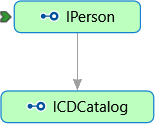
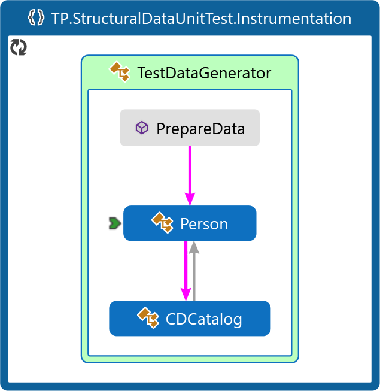
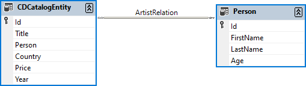

<!--
//________________________________________________________________________________________________________________
//  Copyright (C) 2024, Mariusz Postol LODZ POLAND.
//
//  To be in touch join the community by pressing the `Watch` button and get started commenting using the 
// discussion panel at https://github.com/mpostol/TP/discussions/182
//
//  by introducing yourself and telling us what you do with this community.
//________________________________________________________________________________________________________________
-->

# Structural Data

## Introduction

Generally speaking, we can say that data processing is carried out through the execution of operations. From this point of view, we can divide the data into:

1. **Simple** - in this case, the data can be processed by a single operation, it is one action as a result of which the value is referred to as one whole. For example, changing the sign of an int variable.
2. **Complex** – here the data is composed of components. Therefore, to operate on complex data we apply a selector operation to select a component that is to be subject to an operation. The data type determines the selection method, e.g. index for arrays and field selection for class or structure.
3. **Structural** - by design, the distinguishing feature is that individual data items in a structure are selected based on intentionally programmed relationships between items.

This section is focused on structural data. In object-oriented programming, the basic way to create structural data is to define custom types and interconnect them using references. Let's analyze this case using sample code in the context of intentionally programmed relationships between items. As an example consider the [IPerson][IPerson] and [ICDCatalog][ICDCatalog] interfaces. Now let's perform a graphical analysis of the code. They are abstract definitions but a reference between interfaces in the diagram could be distinguished.

Because the mentioned interfaces are abstract definitions, they must be implemented first to instantiate a graph of objects based on them. We will analyze a few different implementations of them. Despite the differences, they always represent the same structure built up using reference types.

To operate on complex data we need a selector operation to select a component that is to be subject to an operation (for example, index for arrays and field selection for class or structure). By design, the distinguishing feature of the structural data is that individual data items in a structure are selected based on intentionally programmed relationships between items. As a result, a selector operation must be replaced by a kind of browsing or query mechanism. Using browsing operations the data is explored by applying a navigation through available references to discover relevant content. By design, the Database Management Systems don't support object-oriented programming, hence instead of browsing the query must be used. Query operations are employed to synchronize specific data from a database to in-process snapshots that offer a buffering operation. A query is usually expressed in a domain-specific language. For example, using SQL to retrieve specific rows from a database table based on conditions is a query operation.

A technology called LINQ is a powerful feature in C# language that allows performing queries against data directly within the language. The LINQ abbreviation stands for Language Integrated Query. LINQ is the name for a set of technologies based on the integration of query capabilities directly into the programming language.

The [Person][Person] and [CDCatalog][CDCatalog] classes are example implementations of these interfaces. They have been defined in the [TestDataGenerator][TestDataGenerator] instrumentation class. It is worth stressing here that it is a fully manual implementation. In the referred code snippet, the [Person][Person] class contains a representation of a set of albums released by one author, so it has references to instances of the [CDCatalog][CDCatalog] type. This code snippet is included in the unit test project and used later to analyze the next use case of creating a similar structure but using a dedicated embedded tool this time.

Now, let's perform a graphical analysis of the presented code. We can see the same reference between classes in the diagram. This relationship is inherited from the interface definition. As a result, the concrete classes can be used to create structured data, i.e. a certain group of objects interconnected by references. This group is often called a graph.

This approach is dedicated to be used for modeling in-process data. At run-time, in-process data refers to data that occurs and is maintained within the boundaries of a single operating system process. At design time it must be formally described by types. This design activity may be recognized as data modeling. In the case of object-oriented programming, it delivers an object model, i.e. a group of interconnected types definitions. Unfortunately, by design maintained by the program in-process data is limited only to necessary or relevant for further processing data. Deployment of communication, archival, and user interface access to external data is also required. Continuing discussion on the main topic, namely external data management (the main goal of this section) is to continue this discussion in the context of structural data. The subsection [LINQ Expression][LINQ Expression] presents the LINQ in detail.

## External Repositories

In general, the data managed by external repositories can be grouped as follows:

- bitstreams offered by the file system and network
- data structures offered by database management systems

Topics related to the use of bitstreams have been already discussed and we will not return to them now. So let's go straight to discussing issues in the context of accessing external repositories managed structural data.

We already answered the question of what structured data is and how to process it as part of the process responsible for hosting our program. External data means that it is managed by an independent process. This process has two tasks: data sharing and data processing. This requires that it has allocated resources, such as processor, memory, files, network, etc. Consequently, we must talk about a database management system. An example is a relational database. In a relational database, data is processed using SQL. SQL stands for Structured Query Language.

Unlike files, a DBMS allows the sharing of data. This means that if we want to use the file we have to open it and as a result, **it is locked for exclusive use by the modifying process**. There is no such limitation for databases, but access to data is carried out using queries. Such queries can be handled sequentially ensuring data consistency.

There is a fundamental difference between operating on streaming and structured data managed by an external system:

- streaming data is serialized and deserialized into local structural data from a bitstream stored in a file
- access to external structural data is provided through queries that are carried out in the DBMS process, i.e. remotely, and data processing can take place both remotely and locally

Usually, in the case of data sequences, for example, a sequence of records from a personal database, we process them iteratively, i.e. we repeat selected activities for each element of the sequence, starting from the first element up to the end of the sequence. The need to perform queries remotely via the DBMS forces the process to be divided into two stages:

- **remotely**, selection of data that meets a certain condition
- **locally**, processing only preselected data

In the case of external data repositories, we have no alternative to deploy this scenario but both stages can be subject to independent mechanisms. Therefore, in practice, it also turned out that such an approach is a good scenario when operating on local in-process data gathered in the working memory. More about interconnection with external databases may be learned from the subsection [LINQ to SQL][LINQ2SQL].

## Internal Repositories

An alternative way to create in-process structural data manually by definition of custom types is to use a dedicated editor that allows specifying data schema using a graphical interface. But we also noticed that data pre-selection makes sense in the case of local data structures, i.e. certain object graphs. Here we will encounter a challenge of how LINQ can help.

By design, in-process structural data doesn't need any special prefetching data access mechanism. A naive approach is that we don't need in-process data in case we are going to maintain the process data in external repositories. By definition, computer programs work on local variables instead of processing data on the database site. In other words, local variables are a natural environment for data processing addressed by the education classes, programming languages, and development environments. It leads to

- limiting the operations executed on a repository site only to create, read, update, and delete (shortly CRUD) operations
- maintaining a sort of in-memory snapshot using in-process local variables
- mapping database schema to types of variables  and vice versa

CRUD operations are actions used to manage data in a database. The **Create** (C) operation inserts new data into database content. The **Read** (R) operation retrieves existing data from the database to local variables. The **Update** (U) operation modifies existing data in the database. The **Delete** (D) operation removes data from the database. Understanding CRUD operations is crucial for building robust programs for all kinds of databases.

A set of variables are value holders when data is retrieved from the database. They represent a partial snapshot of the data at that moment. Any changes applied to the in-process data should be persisted back to the database to make database content consistent. This scenario requires a synchronization mechanism.

Seamless interaction between the program and the database needs a sort of mapping. The primary purpose of the mapping is a harmonization of metadata between the program object model and the database schema. It defines how features and relationships of types in the program are related to database components. Relationships define how entities are related to each other. For example, database components in the case of the relational database are tables, rows in tables, tables relationships, etc. The object-oriented programming is applied to model relationships defined by the database schema. Hence, the reference types are of crucial importance to create the mapping. The variables in the memory subject to processing mirror the relationships between tables in a database. They serve as a bridge between the object-oriented programming approach and database content.

A crucial impact on the improvements of the program development performance related to the database integration should be expected by automation of synchronization between the DBMS and in-process database representation, including but not limited to query creation and communication. The term ORM is commonly used in the context of software development when working with databases. ORM stands for Object-Relational Mapping. It’s a technique that bridges the gap between object-oriented programming and relational databases. Instead of writing raw SQL queries, you interact with objects in your programming language such as Python, Java, or C#. It abstracts away the low-level details of database interactions using automatically created queries. It facilitates smooth communication between the application and the underlying database. It acts as a translator, allowing developers to work with objects in their programming language while mapping them to corresponding database entities (such as tables, views, or stored procedures).

To implement a partial in-process database snapshot the following differences between an object model and database schema must be harmonized:

- relation of entities
- data types

Recently the object model concept is applied to create relationships between entities contributing to one whole in memory. It requires using object-oriented programming and finally the reference types.

In contrast, database management systems (DBMS) don't allow to use of object-oriented programming, for example, in relational databases. The common approach to reflect the relationship between entities is primary and foreign keys. A primary key is a column (or a collection of columns) in a table that uniquely identifies each row in that table. Most databases automatically index primary keys, which speeds up data retrieval operations using the key. A foreign key is a column (or a collection of columns) in one table that references the primary key of another table. The most common use of foreign keys is to create a one-to-many relationship between two tables. For example, in a database containing table `Person` of [PersonRow][PersonRow], and an associated table managing the [CDCatalogEntityRow][CDCatalogEntityRow], the table containing [CDCatalogEntityRow][CDCatalogEntityRow] would include a foreign key `Person` that references the primary key `Id` of the table containing [PersonRow][PersonRow].

In summary, primary keys ensure uniqueness and data integrity, while foreign keys establish relationships between tables, enabling querying and maintaining consistency in the database.

Typically, the types used by the database schema are incompatible with types built in the programming language. Additionally, the program can define custom types unknown by DBMS. There must be a kind of mapper handling the translation between these two environments causing the transfer of sequences of bitstreams between the DBMS and in-process values. The bitstream must be converted based on its meaning. In other words, after selecting an equivalent type the translator is responsible for picking up equivalent value from the target type.

In conclusion, we can state that the development environment is completely different and needs different knowledge, experience, and tools to be engaged to deploy successfully a database solution. An example of an in-process database that resembles the one deployed on a relational database is the `DataSet`. The subsection [LINQ to Object][LINQ2Object] presents how to create and maintain an example of this data structure. Let's look at how to design, create, maintain, and use such structures. Here we will also try to answer how LINQ can help us.

## See also

### Subsections

- [LINQ Expression][LINQ Expression]
- [LINQ to Object][LINQ2Object]
- [LINQ to SQL][LINQ2SQL]

### Online Documentation

- [Language Integrated Query (LINQ)](https://docs.microsoft.com/dotnet/csharp/programming-guide/concepts/linq)
- [Query Syntax and Method Syntax in LINQ (C#)](https://docs.microsoft.com/dotnet/csharp/programming-guide/concepts/linq/query-syntax-and-method-syntax-in-linq)
- [LINQ to SQL tools in Visual Studio](https://docs.microsoft.com/visualstudio/data-tools/linq-to-sql-tools-in-visual-studio2?view=vs-2017)
- [LINQ to SQL](https://docs.microsoft.com/dotnet/framework/data/adonet/sql/linq/)
- [Entity Framework Documentation](https://docs.microsoft.com/ef/)

[LINQ Expression]:    StructuralData\README.LINQExpression.md
[LINQ2Object]:        StructuralData/README.LINQ2Object.md
[LINQ2SQL]:           StructuralData/README.LINQ2SQL.md

[IPerson]:            StructuralData/Data/IPerson.cs#L16-L22
[ICDCatalog]:         StructuralData/Data/ICDCatalog.cs#L14-L19
[PersonRow]:          StructuralData/LINQ%20to%20object/Catalog.Designer.cs#L1136-L1235
[CDCatalogEntityRow]: LINQ%20to%20object/Catalog.Designer.cs#L959-L1131

[TestDataGenerator]:  StructuralDataUnitTest/Instrumentation/TestDataGenerator.cs#L17-L73
[Person]:             StructuralDataUnitTest/Instrumentation/TestDataGenerator.cs#L29-L58
[CDCatalog]:          StructuralDataUnitTest/Instrumentation/TestDataGenerator.cs#L60-L70
