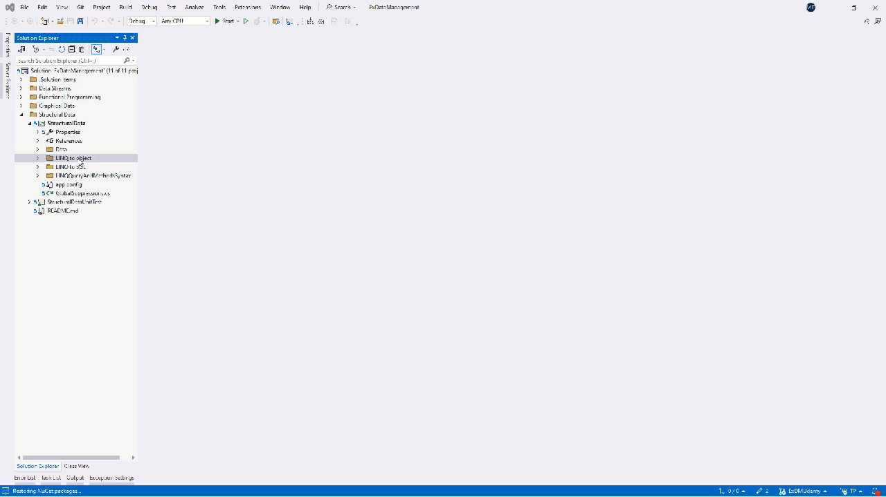
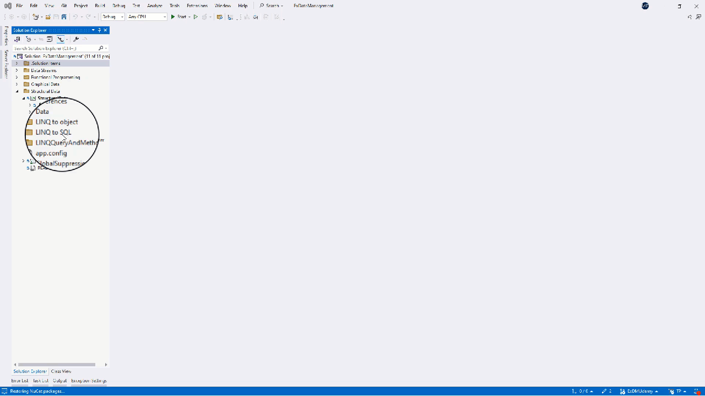
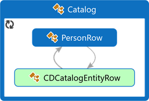

<!--
//________________________________________________________________________________________________________________
//  Copyright (C) 2024, Mariusz Postol LODZ POLAND.
//
//  To be in touch join the community by pressing the `Watch` button and get started commenting using the 
// discussion panel at https://github.com/mpostol/TP/discussions/182
//
//  by introducing yourself and telling us what you do with this community.
//________________________________________________________________________________________________________________
-->

# LINQ to Object

## DataSet - Creating Structural Data

This section continues on topics related to structural data and the possibility of creating queries using LINQ expressions. Let me remind you that the LINQ abbreviation stands for Language Integrated Query. The main goal of embedding the LINQ expressions into the programming language is to create a construct that allows automatic preparation of queries in a domain-specific language compliant with a remote database management system without leaving a comfort zone, I mean to change the programming language. But we also noticed that pre-selection of data makes sense in the case of local data structures, i.e. certain object graphs. Here we will encounter a challenge of how LINQ can help.

An alternative way to create in-process structured data manually by defining custom types interconnected by references is to use a dedicated editor that allows you to specify an object model using a graphical interface. To start working, add the `DataSet` component, which can be found in the set of available Visual Studio components, in a selected place in the project. It is easier to find them if we limit the number of displayed components by selecting `Date` in the category tree. Using this approach - for comparison - I propose to define a functionally equivalent data structure to the one discussed previously. Let's call it `Catalog`.



Once created, the new multi-component item appears in the selected location. By double-clicking on the element grouping these components, the graphic editor appears. It allows you to add data tables, and their rows and define relationships between them. I have initially prepared two `DataTable` items, similar to the classes from the previous example. I also defined the relationship between them as before. We can also edit the properties of this relationship in a separate editor window, which we open from the context menu. I will use the previously defined classes in unit tests to initialize the data structure, which confirms their equivalence from the point of view of the represented information.



Designing this structure results in automatically generated program text that implements it in a partial class. We see that this time the program contains multiple classes, each representing dedicated information. The entire structure is represented by the [Catalog][CatalogDataSet] class, and all others are defined as its internal class definitions. The author is represented by a class named [PersonRow][PersonRow], and the CD is represented by [CDCatalogEntityRow][CDCatalogEntityRow].

Since the [Catalog][CatalogDataSet] class is a partial class, we can implement custom functionality in a separate file. As before, there are three methods implementing the same algorithm in three different ways, namely selecting a list of people indicated by the method parameter. We will return to these implementations in the context of unit tests, which we will use for a more detailed comparative analysis of these three implementations.

Since the generated text of the [Catalog][CatalogDataSet] class is over 1000 lines, I now suggest analyzing it using the Show on Code Map function. The resulting graphical representation of the text describes the content of the generated classes and shows the relationships between them. The goal of the analysis is to find similar relationships that we had previously in classes created manually.



Analysis using this tool requires an appropriate configuration of filters so that only the most important components of the definition appear on the screen. In this case, we are looking for the [PersonRow][PersonRow] class and a component that provides relationships to objects of the [CDCatalogEntityRow][CDCatalogEntityRow] class. This many-to-one relationship between [PersonRow][PersonRow] and [CDCatalogEntityRow][CDCatalogEntityRow] is implemented as the [GetCDCatalogRows][GetCDCatalogRows] method, which returns an array of the type [CDCatalogEntityRow][CDCatalogEntityRow] instances.

``` CSharp
            public CDCatalogEntityRow[] GetCDCatalogRows() {
                if ((this.Table.ChildRelations["ArtistRelation"] == null)) {
                    return new CDCatalogEntityRow[0];
                }
                else {
                    return ((CDCatalogEntityRow[])(base.GetChildRows(this.Table.ChildRelations["ArtistRelation"])));
                }
            }
```

Let's now move on to finding the relationship in the opposite direction, namely the relationship that will connect the CD with its author. And again, we need to properly configure the display filters to make the image readable for this presentation. In the [CDCatalogEntityRow][CDCatalogEntityRow] class, the one-to-one relationship connecting the corresponding [PersonRow][PersonRow] object is implemented by a property with the same name as the target class, namely [PersonRow][PersonRow].

Let us now move on to the analysis of the added methods in the context of unit tests filtering data from the structure created in this way. These methods are located as components of the [Catalog][CatalogDataSet] class, or rather in its internal class [PersonRow][PersonRow].

## DataSet - Usage

Let us now move on to the analysis of the added methods in the context of unit tests filtering data from the structure created in this way. These methods are located as components of the [Catalog][CatalogDataSet] class, or rather in its internal class [PersonRow][PersonRow].

The first [FilterPersonsByLastName_ForEachTest][FilterPersonsByLastName_ForEachTest] uses the `foreach` statement and an internal if statement responsible for filtering the table content according to the value of the method parameter.

``` CSharp
      public IEnumerable<PersonRow> FilterPersonsByLastName_ForEach(string lastName)
      {
        List<PersonRow> _result = new List<PersonRow>();
        foreach (PersonRow _row in this)
          if (_row.LastName.Equals(lastName))
            _result.Add(_row);
        return _result;
      }
```

In addition to the value returned by the method, the type of the returned value and the result of calling its `ToString` method are also examined. Based on the result analysis it could be stated that an object of the generic class `List` is returned. Its type parameter is [PersonRow][PersonRow]. This is the next proof that the result is a collection of selected values.

In the [FilterPersonsByLastName_QuerySyntaxTest][FilterPersonsByLastName_QuerySyntaxTest] we examine the returned value of a method implementing the same filtering algorithm but implemented using a LINQ expression written using the query syntax as a sequence of operations using extension methods. This time the returned object type of the method result is different, which again confirms that LINQ expressions return an object representation of the expression itself, not its result.

The last test [FilterPersonsByLastName_MethodSyntaxTest][FilterPersonsByLastName_MethodSyntaxTest] concerns the implementation of a method using a LINQ expression written following the method syntax. This time the result is identical to the previous one, confirming that the result of using a LINQ expression is always the same regardless of the syntax used. Of course, this statement is true as long as the compiler can translate the program text into a form that allows such transformation during its execution.

[FilterPersonsByLastName_ForEachTest]:     ../StructuralDataUnitTest/LINQ_to_objectUnitTest.cs#L44-L57
[FilterPersonsByLastName_QuerySyntaxTest]: ../StructuralDataUnitTest/LINQ_to_objectUnitTest.cs#L60-L73
[FilterPersonsByLastName_MethodSyntaxTest]: ../StructuralDataUnitTest/LINQ_to_objectUnitTest.cs#L76-L89

[CatalogDataSet]:     LINQ%20to%20object/Catalog.Designer.cs#L25-L1304
[PersonRow]:          LINQ%20to%20object/Catalog.Designer.cs#L1136-L1235
[CDCatalogEntityRow]: LINQ%20to%20object/Catalog.Designer.cs#L959-L1131
[GetCDCatalogRows]:   LINQ%20to%20object/Catalog.Designer.cs#L1227-L1234
