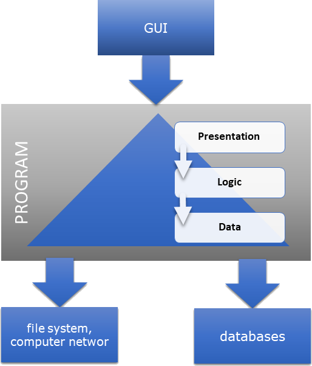
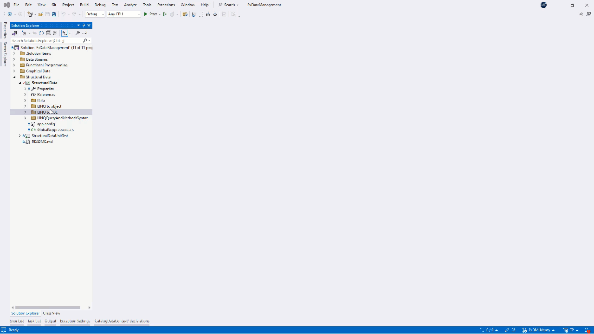
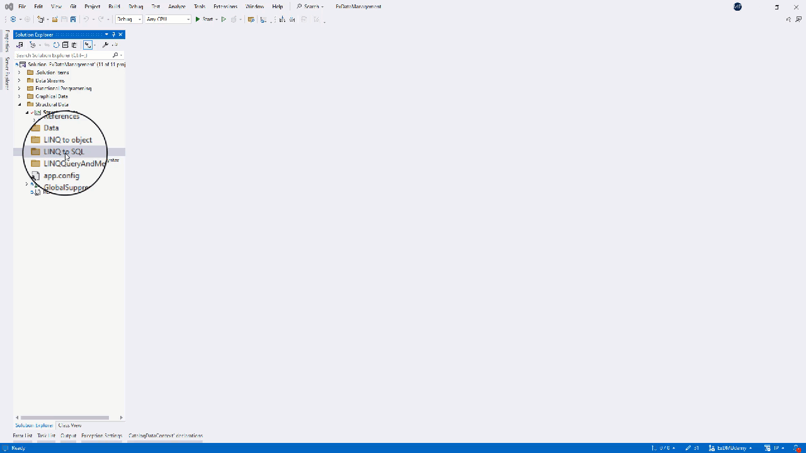
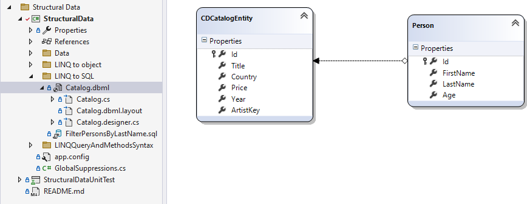
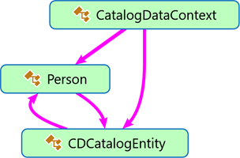

<!--
//________________________________________________________________________________________________________________
//  Copyright (C) 2024, Mariusz Postol LODZ POLAND.
//
//  To be in touch join the community by pressing the `Watch` button and get started commenting using the 
// discussion panel at https://github.com/mpostol/TP/discussions/182
//
//  by introducing yourself and telling us what you do with this community.
//________________________________________________________________________________________________________________
-->

# LINQ to SQL

- [LINQ to SQL](#linq-to-sql)
  - [Introduction](#introduction)
  - [Database Deployment](#database-deployment)
  - [Database Usage](#database-usage)
    - [Database Connection](#database-connection)
    - [Creating SQL Queries](#creating-sql-queries)
    - [Mapping](#mapping)

## Introduction

In this chapter, we will continue to discuss structured data and the ability to create queries using LINQ expressions. Let me remind you that the LINQ abbreviation stands for language-integrated query. This time, we will use these queries to pre-select data from the relational database.

However, I must emphasize here that we will focus only on issues related to the programming language, i.e. its syntax and semantics. Unfortunately, we cannot completely avoid topics related to the design environment used, namely Visual Studio and the dedicated libraries used. Anticipating questions about why I chose this and not another approach, I would like to emphasize that, in my opinion, it guarantees minimization of the costs of entering the subject. If the priority is different, then of course most of what we will talk about also applies in another environment, e.g. Entity Framework.

Let's start with a few definitions, explanations, and indications of directions for searching for new solutions in terms of improving the management of access to external data using relational databases as an example.

At run-time, the text of our program (in the following illustration) has been compiled, entered into memory, and has become a process managed by the computer's operating system. The operating system strongly defends the integrity of resources committed to the process. This defense is encapsulation, which forces you to use the operating system when you need to exchange data with the external environment.



The figure also shows the layered architecture of the program. The reasons for introducing layers have already been discussed. I suggest not returning to this topic now. Currently, our goal is to discuss issues related to the management of external data, i.e. data whose entities are outside the boundaries of the process hosting the program.

Shared bitstreams exposed by the filesystem are one option, and we've already talked about them. Later, we will discuss the graphical representation of information intended for communication with the user.

Now our goal is to discuss issues related to the interaction of the process executing the program with databases, i.e. with an external database management system (Database Management System, DBMS for short). The purpose of a DBMS is to consistently store and archive data according to a certain scheme that allows for the creation of data structures. Data is made available and processed by the DBMS using a query language that should be widely known and accepted to guarantee the scalability of solutions. Examples include the relational database and SQL. Other examples that can be treated as equivalent in this context are Triple Store and SharePoint databases. However, in further analysis, we will refer only to relational databases, although the topic of how to use the discussed mechanisms to gain access to other types of databases will also be the subject of discussion.

In the above figure, we can distinguish two places where data can be located. Of course, this is the database itself, but also the data layer of the program. To make this possible, in the data layer of the program we must have a kind of process data buffer and an interface enabling management of the database itself. A typical operation directly related to the DBMS, but only indirectly related to the process data, is opening and closing a connection to the database. From time to time the local data has to be synchronized with a database storage.

Database operations are executed and data between the mentioned locations is transferred using the:

- Custom application in concern
- Local system software, and libraries referred to by the program
- Operating system
- Communication protocols in the case of a distributed system - this is usually also part of the operating system
- Query language interpreter in DBMS software, for example, SQL language processor

It's a very diverse environment, so the real challenge is how to:

- ensure proper training of programmers
- minimize the possibility of making mistakes
- ensure a consistent diagnostic system
- ensure the possibility of transferring solutions between various environments, for example changing the operating system,

LINQ expression, i.e. language integrated query, is a technology integrated with a programming language that allows for the implementation of many of the mentioned goals. Therefore, we will devote this lesson to familiarize ourselves with this mechanism in the context of relational databases as an example that can also be expanded and used for other external data repositories.

## Database Deployment

To have something to practice on, we will start by creating a sample database and connection setup using the Visual Studio design environment. To make the example useful, we also need to create metadata describing the structure of the data in the database. We will call this metadata database schema. By design, the database schema is a logical representation of how data should be organized and stored within a database system. It acts as a blueprint that defines the structure and relationships of data. Think of it as the skeleton of the database, outlining the essential components.

Since the database functionality is implemented as an independent external process called Database Management System (DBMS) the program we have developed cannot directly use its functionality. Instead, it uses the intermediary of the operating system by using a local data cache to indirectly operate on the database. As a result, we have a solution similar to the well-known proxy pattern. Additionally, for local program needs, the replica represents the schema and is a process data buffer. Typically, this is a partial replica that is not fully functionally equivalent to the DBMS and contains only selected data. And here we have a problem with how to define the criterion for selecting data in the buffer. These issues will be our concern in this part of the lesson.

The next issue is using the database in a custom program. We will examine selected issues related to this topic using unit tests. For a local replica to be useful, it must be interconnected with the database. In addition to creating appropriate communication channels between the replica and the DBMS, they are connected by a session responsible for authentication and authorization of operations performed on the database. Operations on the database and the data deposited in it are performed based on a formal description, in this case, compliant with the SQL language. Creating error-free SQL queries in the context of a custom program written using another programming language is another challenge we have to face. If we use expressions written using query syntax written in a programming language, we can automatically translate them into any other language, including SQL. How to do it? An attempt to answer this question is included in this part, which will concern mapping definitions in the local replica and remote database schema.

Since the examples discussed require access to a database, it is necessary to provide a server that acts as a DBMS and publishes data following a previously designed scheme for testing purposes. Since the program text is in a public repository and can be used in various environments, the unified use of a real SQL server is difficult to fulfill. One way to solve this problem is to use the Visual Studio environment in the server role. This requires creating a database file and then making it available for testing in such a way that the conditions of our tests do not differ significantly from the real production environment in which an external server is natural.

So we'll start by creating a sample database file. The example is located in the unit test project in a separate folder. The folder name doesn't matter. Our library is indeed educational, not production-oriented, but this approach allows us to design a library implementing the data layer in such a way that it is completely independent of the DBMS implementation method and does not contain elements dedicated to the test environment. Thanks to this, it can be later used in production without the need to modify the program text.

Therefore, in the selected place in the project, from the context menu, select add a new element. A window appears with a vast variety of components that we can potentially add to the project. Let's limit the list of proposals by selecting `Date` in the list of available categories. The component we need is a `Service-based Database`. It is added to the project already with the name `CDCatalog`. As a result, two files are attached to the project. Select the option `copy always` to make sure that they are copied to the output folder after the program compilation is completed. We will come back to this issue later because it is a condition for the correct use of the relational database imitation created this way.


The condition for using subsequent tools available in Visual Studio is to establish a connection and, as a result, create an imitation of a SQL server. For this purpose, we will use the Server Explorer and Data Connection windows in the server type selection tree. The context menu allows us to add a new connection. You must select Microsoft SQL Database File as the data source. This will permit us to select a file with the .mdf extension in the next step. We can still test the correctness of the connection to this database server. The result is a new multi-component tree node that, when expanded, has content identical to that of a typical relational database.


For the example to be useful, we also need to create metadata describing the structure of the database. We will call this metadata the database schema. Designing a database schema is beyond the scope of this document. However, this will not be a big divergence from the real scenario if we assume that the database already exists and is compatible with the purpose it is intended to serve. According to our needs, a schema was created assuming the creation of, as before, a primitive CD catalog, which consists of two tables: CDCatalogEntity and Person. Stepping into these tables - colloquially speaking - shows their structure and the SQL scripts that can be used to create them. It is worth paying attention to the external key defining their mutual relationship. This feature of the diagram will be used later.


For the program to process data stored under the control of an external repository, i.e. an independent process, it must be fetched to local memory first. This means that a local memory replica is used to store relevant data. It is like a database mirroring feature. The replication may be partial or complete. In addition to buffering process data, it is also responsible for providing the functionality of data synchronization with the repository. The mentioned functionality and process data structures require their implementation using types. To meet this requirement, two mutually consistent areas can be distinguished. The first area consists of typical solutions, repeatable for every program using a DBMS. The second area includes the need to meet individual requirements. An example of individual requirements is the local mapping of usable data structures. As a result, from the program's point of view, the obtained replica creates an additional abstract layer, i.e. it hides the implementation details of the actual mechanisms of interaction with external structured data repositories.

Repeatable solutions are offered in the form of design environment dedicated features (for example, Visual Studio and its server explorer), but also libraries and additional tools. These tools can be used, for example, to automate the process of managing program text related to meeting individual needs. One of such needs is the automatic generation of types that will represent a similar process data structure to that in the repository. The whole thing usually creates a complex infrastructure, often referred to as a framework. Our main goal is to focus on solutions integrated with a programming language that can be used in any case. Discussing the selected infrastructure is beyond the scope of the course, but something must be chosen to ensure that relevant content is placed in a practical context. Since we're discussing LINQ expressions, LINQ to SQL seems like a natural choice.

To start working with the database, in a selected place in the application project, add the LINQ to SQL classes component, which can be found in the set of available Visual Studio components. It is easier to find this component if we limit the number of displayed components by selecting Date in the category tree. As you can see, the LINQ to SQL classes technology is not the only implementation that enables cooperation with external repositories for archiving and processing data. Let's call this component similar to the previous one, namely Catalog.



Once created, the new multi-component item appears in the selected location. By double-clicking on the node grouping these components, the graphical editor appears.



This editor allows you to transfer tables from a previously connected SQL server to the working plane of the graphical editor. Using the schema defined in the database, we can drag and drop two previously designed tables on the graphical editor surface. The structure diagram created this way contains appropriate properties for table columns and relationships between tables. It is worth noting here that the types of these properties were automatically selected based on the component types used in the tables.

The created diagram resembles a UML class diagram. In this diagram, as I mentioned, the classes were automatically connected using associations. This association in the diagram is a consequence of the foreign key used to define the relationship between table entities in the database. It must therefore be implemented in the program code as a reference value to introduce similar structural dependencies into the program. We can edit relationship properties in a separate editor window, which we open from the context menu.

Designing this structure results in automatically generated program text that implements it in partial classes. This time, the program contains three classes representing dedicated information. The database is represented by the [CatalogDataContext][CatalogDataContextDBML] class. The author is represented by a class called [Person][PersonDBML], and the CD is represented by the [CDCatalogEntity][CDCatalogEntityDBML] class. It is worth noting that all classes are partial so that additional definitions can be added in a separate file, thus meeting individual needs related to the implemented data processing algorithm.



The [CatalogDataContext][CatalogDataContextDBML] class inherits from `DataContext`from the .NET library. This inheritance shows how polymorphism was used to meet individual needs and the base class to implement common requirements for functionality dedicated to operating on the database as one whole. This class also implements the IDisposable interface, which should be used to properly manage the lifetime and state of an object created from this class.

Since the auto-generated text contains several hundred lines, I now suggest analyzing it using the Show on Code Map function. The resulting graphical representation of the text, i.e. the diagram, describes the content of the generated classes and shows the relationships between them. The goal of the analysis is to find similar relationships that we had previously in classes created manually. As we have already established, the generated text contains three classes, which can be seen in the created diagram. After filtering out the elements that are unnecessary for this analysis, it can be seen that the [Person][PersonDBML] class representing the author of the disc and [CDCatalogEntity][CDCatalogEntityDBML] representing the disc are recursively connected.



First, we look for the [CDCatalogEntity][CDCatalogEntityDBML] class and the one-to-one relationship connecting the CD with its author, namely the [Person][PersonDBML] class. It is implemented by a property with the same name as the target class, namely [Person][PersonDBML]. It returns a reference to an instance of the [Person][PersonDBML] class.

Let's now move on to find a relationship in the opposite direction, namely the relationship that will connect the author represented by the [Person][PersonDBML] class and all his records, i.e. a member that provides relationships between instances of the [Person][PersonDBML] class and instances of the [CDCatalogEntity][CDCatalogEntityDBML] class. This many-to-one relationship is implemented as the CDCatalogEntities property, which returns a reference to the generic `EntitySet` instance. As you can see, in the created program text, an instance of this type is a collection of the [CDCatalogEntity][CDCatalogEntityDBML] instances.

Since the [CatalogDataContext][CatalogDataContextDBMLCustom] class, which represents the database as one whole, is a partial class, we can implement our custom functionality dedicated to individual needs in a separate file containing a separate partial part. In our case, we will limit the code to examples of using various kinds of LINQ expressions and compare them with typical iteration operations.

Therefore, as before, there are three methods implementing the same algorithm in three different ways, namely selecting a list of people indicated by the method parameter. We will return to these implementations in the context of unit tests, which we will use for a more detailed comparative analysis of these three implementations.

Additionally, this class contains the [AddContent][AddContentDBMLCustom] method, which is intended for adding initial data to the database. Additionally, the [TruncateAllData][TruncateAllDataDBMLCustom] method is used to clean the database content. It is useful in unit tests to ensure that the initial conditions of the test are uniform.

The first method used to compare different data filtering implementations uses the foreach statement. In the second, the filtering algorithm was written using the LINQ query expression. The last implementation uses the method syntax of the LINQ expression. We will examine the features of individual implementations using unit tests. It should be emphasized again that the tests we will discuss in a moment are not intended to check the correctness of the proposed solutions, but only to test their features.

## Database Usage

### Database Connection

Let's now move on to analyzing example methods for filtering data from the database in the context of unit tests. They act as services that provide access to structured data to higher layers. The important issues here are the connection to the database, building SQL queries, and their implementation in the context of this connection. Since data is processed locally using a certain partial replica of the database located in the in-process memory the query creation must be harmonized with the structure of this replica.

To apply this approach, a file with the database content was attached to the test project. To prevent tests from modifying their content each time they are executed, it must be copied to the testing workspace. For this purpose, the `DeploymentItem` attribute is used, whose job is to copy the file to a local folder with a predictable name before running tests in this class. This attribute copies the file using the current path to the output folder where the compiler places its results. This allows you to copy files regardless of the compiler configuration you are currently using.

For a previously added database file to be copied by the compiler (or rather by the `msbuild` program) it must have the appropriate property set to the option `copy always` in the settings file. We can do this using the context menu for this file, in this case, the `CDCatalog` file with the `mdf` extension.

The [ClassInitializationMethod][ClassInitializationMethod] method is responsible for creating a valid connection string based on the known location where the database file is copied and the template text enabling the use of the Visual Studio environment to emulate a connection to the database server, i.e. the DBMS. The designated stream of characters will be further used to establish a connection with an imitation of the database DBMS.

The database is represented by the local replica as an object of the [CatalogDataContext][CatalogDataContextDBMLCustom] class. Because this class implements the `IDisposable` interface, it is instantiated in the using statement, which guarantees calling the Dispose method whenever the `_newCatalog` variable leaves the visibility scope, so the object to which it stores references can no longer be directly used in the program. A connection string is passed to the constructor of this class, which indicates that the created object is responsible for managing the connection and the session created on its basis. The session stores the context in which communication takes place between the local objects creating the database replica and the DBMS. Within this context, the identity that will be used to authorize operations requested by the local replica to the remote DBMS is important.

``` CSharp
      using (CatalogDataContext _newCatalog = new CatalogDataContext(m_ConnectionString))
      { ... }
```

Typically, a database contains data reflecting the state of a certain process, which means that it is necessary to depend on the history of operations applied to this database. As a consequence, from the point of view of tests, the content of the database becomes unpredictable - it is not determined in time. To ensure predictable unit test results, the database content must also be predictable. The purpose of the [PrepareData][PrepareData] method is to solve this problem. It creates objects and connects them into a graph with repeatable and known content. We will use it as test data that will serve as initialization data. To initialize the database, we must create objects with types consistent with the contents of the tables in the database and combine them into an equivalent structure. The created graph has no additional functionality, so it can be treated as a Data Transfer Object (DTO). In the presented case, it is more of a graph than a single object, but this is an irrelevant detail.

``` CSharp
          _newCatalog.AddContent(TestDataGenerator.PrepareData());
```

Concrete classes that meet DTO requirements have been defined in the unit tests project, so they are not visible in the main library. To implement the `AddContent` method, let's use the dependency injection programming pattern. According to it, the parameter type of this method is abstract, it is two interfaces `IPerson` and `ICDCatalog` combined into a structure, which can be implemented depending on the needs. This approach allows you to separate the specific data source, i.e. the place the data is created, from the place it is used.

Let's move on to an example, and the example is the [Person][Person] and [CDCatalog][CDCatalog] classes that have been defined in the TestDataGenerator class. In the program code, we see that the [CDCatalog][CDCatalog] class has references, i.e. a reference, to the instance of the [Person][Person] class to represent information about the author of the CD. It is a one-to-one relationship. The [Person][Person] class, on the other hand, contains a representation of a set of albums released by a single author, so it has references to instances of the [CDCatalog][CDCatalog] class. This time the relationship is one-to-many. These references are available as an object that implements `IEnumerable`, and such an object can be used as a data source in a foreach statement and a LINQ expression.

### Creating SQL Queries

As previously noted, all operations performed on the database must be described in the appropriate language for the selected DBMS. Since we use a relational database in the example, its natural language is SQL, but we write the program in C#. Using three implementations of the same data preselecting algorithm, we will examine how to deal with this problem without using SQL directly.

The [FilterPersonsByLastName_ForEach][FilterPersonsByLastName_ForEach] method uses the foreach statement and an internal if statement responsible for filtering the table contents according to the value of the method parameter. In the [FilterPersonsByLastName_ForEachTest][FilterPersonsByLastName_ForEachTest], the type of the returned object and the result of calling its `ToString` method are also examined in addition to the value returned by the method. As a result, we see that an object of the generic `List` class is returned, with the type parameter of [Person][Person] type. This is further proof that in this case, the result is a collection of selected values, and therefore the result of the above-mentioned instructions. The consequence of such an implementation is the need to download all values from the [Persons][Persons] table to make locally a final decision about the selection of the data.

In the second test [FilterPersonsByLastName_QuerySyntaxTest][FilterPersonsByLastName_QuerySyntaxTest], we examine the [FilterPersonsByLastName_QuerySyntax][FilterPersonsByLastName_QuerySyntax] method implementing the same algorithm but using the LINQ query expression. The test result is identical to the previous one, but this time the returned object type of the method result is different, which again confirms that LINQ expressions return an object representation of the expression itself, not its result. Of course, this statement is true as long as the compiler manages to translate the program text into a form that allows such transformation to an object-oriented form during its execution.

In the [FilterPersonsByLastName_MethodSyntaxTest][FilterPersonsByLastName_MethodSyntaxTest] test, we examine the result returned from the [FilterPersonsByLastName_MethodSyntax][FilterPersonsByLastName_MethodSyntax] method implementing the same filtering algorithm but written using the method syntax of LINQ expression. Again, the test result is identical to the previous one, and additionally, examining the type of the returned object gives the same result as before, which confirms that the result of using a LINQ expression is always the same regardless of the syntax used.

It is worth noting that the text returned from the `ToString` method for an object resulting from the operation of the tested methods using LINQ expressions resembles an SQL query. I saved this [text][FilterPersonsByLastNamesql] to a separate file and added it below. We now see that this is a typical select query. Before being sent to the remote DBMS, it must be supplemented with the parameter value of the method in which it will be used.

``` SQL
SELECT [t0].[Id], [t0].[FirstName], [t0].[LastName], [t0].[Age]
FROM [dbo].[Person] AS [t0]
WHERE [t0].[LastName] = @p0
```

Let's try to explain this result. Using the "go to definition" shortcut in the context menu or the F12 key, we will move to the definition of the where method. We see that this is a method that extends the `IQueryable` interface and is located in the static `Queryable` class of the .NET library. This class also contains all the other methods necessary to implement LINQ expressions. This is an important statement and is worth remembering to understand the answer to the previously asked question: what is a LINQ class expression and how does it differ from expressions that do not belong to this class? As I mentioned, this question was already asked in the previous lesson, but we will try to answer it again.

Based on the analysis of the program text, we conclude that `Where` is a method extending the `IQueryable` interface. The definition of this interface is empty, but the inheritance chain indicates that this interface also requires an implementation of the `IEnumerable` interface. So again we can say that we are dealing with a LINQ expression. Since we did not receive an SQL query previously, this does not explain the different behavior of the LINQ expression compared with the regular expression. The difference is the non-generic interface `IQueryable`, which is also in the inheritance list. Its definition shows that it requires the implementation of three getters, which are used by the .NET environment to translate the internal representation of a LINQ expression into its external SQL equivalent. Implementation of these properties-getters determines which language will be chosen as the target language.


Since a LINQ expression always looks the same - it has the same syntax regardless of the data source, the key question here is how to learn that it will be translated into a query of an external data repository and not executed locally on data residing in-process local memory. The answer should be sought by analyzing the origin of the definition of the return value used as a data source, i.e. after the word in or as the first operand in a LINQ expression written using method syntax, i.e. in the presented example it is the value returned by `Persons` property. Going to the definition of this property, we can see that it returns the value of the generic type `Table`. Further analysis, the origin of the definition of this type leads to the Microsoft component `System.Data.Linq`. The definition of this type indicates that it implements the `IQueryable` interface. Since it is a component of LINQ to SQL technology, its implementation guarantees conversion to SQL queries.

It must be stressed once again that the syntax of a LINQ expression does not unambiguously answer the question of what will happen when the expression must be executed instead of translated. In other words, there is a weak connection between syntax and semantics, so the meaning of the text is not clear, which can lead to very troublesome errors.

### Mapping

One more puzzle remains, namely the implementation of `IQueryable` in the `Table` type is responsible for converting the internal representation of the LINQ expression into an SQL query. Looking at the example and recovered SQL query, we see that the conversion operation can only be successful if it has some additional information, such as table name, column name, and data types in individual columns. In order not to change the programming language, the conversion operation to SQL must be performed dynamically, i.e. during program execution.

Therefore, it is reasonable to ask: how to obtain this information, or rather recover it, during the implementation of the program?

First, note that the `Table` type is generic. So let's analyze the type of its current parameter for the selected example, i.e. `Person`. Going to the definition of this class, we see that it is preceded by the `Table` attribute. The answer is obvious - reflection, i.e. metadata is recovered from the definitions of auto-generated types using reflection mechanisms.

Reflection has already been discussed earlier, so you can remember if there are any doubts about its operation. This knowledge will be needed because the next test method [ObjectRelationalMappingTest][ObjectRelationalMappingTest] shows how the data needed for translation can be recovered in the implementation of the `IQuerable` interface.

[ObjectRelationalMappingTest]: ../StructuralDataUnitTest/LINQ_to_SQLDataServiceUnitTests.cs#L147-L164
[FilterPersonsByLastNamesql]: LINQ%20to%20SQL/FilterPersonsByLastName.sql#L1-L3
[FilterPersonsByLastName_ForEachTest]: ../StructuralDataUnitTest/LINQ_to_SQLDataServiceUnitTests.cs#L60-L80
[FilterPersonsByLastName_MethodSyntaxTest]: ../StructuralDataUnitTest/LINQ_to_SQLDataServiceUnitTests.cs#L106-L126
[FilterPersonsByLastName_QuerySyntaxTest]: ../StructuralDataUnitTest/LINQ_to_SQLDataServiceUnitTests.cs#L83-L103
[Person]: ../StructuralDataUnitTest/Instrumentation/TestDataGenerator.cs#L29-L47
[CDCatalog]: ../StructuralDataUnitTest/Instrumentation/TestDataGenerator.cs#L61-L72
[PrepareData]: ../StructuralDataUnitTest/Instrumentation/TestDataGenerator.cs#L19-L27
[ClassInitializationMethod]: ../StructuralDataUnitTest/LINQ_to_SQLDataServiceUnitTests.cs#L28-L36

[FilterPersonsByLastName_MethodSyntax]: LINQ%20to%20SQL/Catalog.cs#L61-L64
[FilterPersonsByLastName_QuerySyntax]: LINQ%20to%20SQL/Catalog.cs#L55-L60
[FilterPersonsByLastName_ForEach]: LINQ%20to%20SQL/Catalog.cs#L47-L54
[Persons]: LINQ%20to%20SQL/Catalog.designer.cs#L71-L77
[TruncateAllDataDBMLCustom]: LINQ%20to%20SQL/Catalog.cs#L76-L81
[AddContentDBMLCustom]: LINQ%20to%20SQL/Catalog.cs#L21-L46
[CatalogDataContextDBML]: LINQ%20to%20SQL/Catalog.designer.cs#L26-L471
[PersonDBML]: LINQ%20to%20SQL/Catalog.designer.cs#L89-L248
[CDCatalogEntityDBML]: LINQ%20to%20SQL/Catalog.designer.cs#L251-L471
[CatalogDataContextDBMLCustom]: LINQ%20to%20SQL/Catalog.cs#L19-L83

<!--

In both examples, LINQ operations remain essentially the same. The difference lies in the data source to which LINQ expressions are applied.

If the source implements `IEnumerable<T>` then operations with additional conditions are generally performed in memory, as in this case of LINQ to Objects.

If the source implements `IQueryable<T>` (which extends `IEnumerable<T>`) then operations with additional conditions may result in optimization, that translates to SQL queries enriched with these conditions that are generally performed on the database, as in the case of LINQ to SQL.

-->

<!--

#### 3.3.4. Mapowanie

O refleksji było już wcześniej, więc można sobie przypomnieć, jeśli są jakieś wątpliwości co do jej działania, a wiedza ta będzie potrzebna, bo kolejna metoda testowa `ObjectRelationalMappingTest` pokazuje jak można potrzebne do konwersji dane odzyskać w implementacji interfejsu IQuerable.

## 4. Praca domowa i zakończenie

### 4.1. Wstęp

Na koniec lekcji, jak zwykle, praca domowa.

### 4.2. Zakres

Pokazana metoda wykorzystuje wyrażenie LINQ, w którym tworzone są obiekty typu anonimowego. Trzeba przekształcić ją tak aby zwracała wyrażenie LINQ podobnie jak inne metody w tej klasie, a nie jak to jest teraz sformatowany string z wstawionymi wynikami selekcji.

Następne zadanie dotyczy jej metody testowej – znajdźmy ją w tekście programu. W ramach zadania trzeba dopisać w tej metodzie niezmiennik - przypomnę metodę z klasy Assert- niezmiennik ten ma sprawdzać zwracany tekst kwerendy SQL.

Kolejne zadanie dotyczy modyfikacji omawianej metody selekcji, w której w miejsce metod rozszerzających LINQ trzeba użyć własnych metod rozszerzających. Tu wystarczy sprawdzić jaki to ma wpływ na zwracany rezultat. Podobnie, trzeba sprawdzić jaki wpływ na typ zwracanej wartości ma zastąpienie wyrażenia lambda przez metody nazwane i typu anonimowego przez własny i auto-generowany typ nazwany.

## 5. Zakończenie

W tej lekcji to już wszystko. Dziękuję za poświęcony czas. Tą lekcją kończymy grupę tematyczną związaną z operowaniem na danych strukturalnych dostępnych w zewnętrznych repozytoriach. Omówione tu przykłady ograniczyliśmy do współdziałania z relacyjną bazą danych. Musimy jednak pamiętać, że poznane konstrukcje językowe są uniwersalne i rozszerzalne. Innymi słowy mogą być wykorzystane w kontekście dowolnego repozytorium i zaadoptowane do własnych potrzeb.
-->