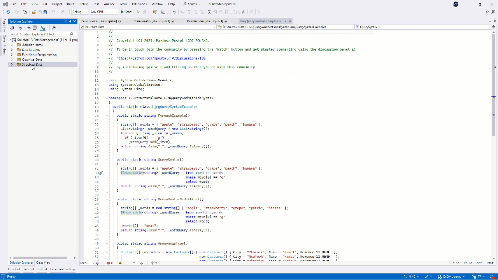

<!--
//________________________________________________________________________________________________________________
//  Copyright (C) 2024, Mariusz Postol LODZ POLAND.
//
//  To be in touch join the community by pressing the `Watch` button and get started commenting using the 
// discussion panel at https://github.com/mpostol/TP/discussions/182
//
//  by introducing yourself and telling us what you do with this community.
//________________________________________________________________________________________________________________
-->

# LINQ Expression

## Introduction

An impression can be made from the section [Structural Data](../README.md#structural-data) that

> **data is data, and it doesn't matter where it comes from provided it is reliable**.

Following this deep and generic thought, a common mechanism should be available that can be used to fetch the necessary data from any available source. The only possible way to design this mechanism is by utilizing expandability. Expandability has to allow the possibility of adaptation of this mechanism to any external and internal kind of data repository. A technology called LINQ is a powerful feature in C# that allows you to perform queries against data directly within the language. The LINQ abbreviation stands for Language Integrated Query. LINQ is the name for a set of technologies based on the integration of query capabilities directly into the programming language. It is necessary to indicate the following elements that this term includes:

1. Extension of the basic programming language with a new syntax called LINQ query syntax
2. Extension of the basic programming language with a new semantics for LINQ expressions
3. Extending the compiler with new mechanisms for implementing LINQ expressions in the code
4. Extension of the .NET library offering new mechanisms for accessing structured external data

I introduced the new term "LINQ expression". Hence, it is needed to explain what makes this expression different from typical and well-known expressions. Let's start with a few definitions, explanations, and indications of directions for searching for new solutions to improve access to data managed by external resources.

## Iteration vs Filtering

Let's start the analysis of access mechanisms to complex data with the [QuerySyntaxForeachExampleTest][QuerySyntaxForeachExampleTest], which checks the results returned from the two methods defined in a separate library. The first method [ForeachExample][ForeachExample] contains a sequence of instructions that processes an array containing a few words. As a result of using the `foreach` statement and the `if` statement, all words that start with "g" are selected and added to the list defined as the `_wordQuery` variable. Finally, in the return statement, we concatenate all the selected words in the list, separate them with a semicolon, and return them as a single string. The second approach is implemented in the [QuerySyntax][QuerySyntax] method. It implements the same algorithm and operates on an identical array of words, based on which the value of the `_wordQuery` variable is evaluated. Again, the return value is concatenated into a string of words separated by commas.

Because:

1. the last instructions are the same in both methods
1. the returned result is the same for both cases

we can conclude that the `from` ... `in` .. construct in the [QuerySyntax][QuerySyntax] method plays a similar role as the `foreach` statement in the [ForeachExample][ForeachExample] method. The following expression in the [QuerySyntax][QuerySyntax] method is called a LINQ expression.

``` CSharp
      IEnumerable<string> _wordQuery = from word in _words
                                       where word[0] == 'g'
                                       select word;
```

In the above code snippet, the query syntax has been applied. Later, we will also analyze a different form compliant with the method syntax.

It should be emphasized here that we have an instruction in the [ForeachExample][ForeachExample] method. In contrast, there is an expression in the [QuerySyntax][QuerySyntax] method so they cannot be compared directly because they are two different language constructs. We can only talk about their similar role in the determination sequence of the return value but we cannot speak about their equivalence. The iterative `foreach` loop instruction refers to a process or sequence of steps that iterate using an index as a selector over the elements in a data source to achieve a desired outcome. In contrast, the main aim of the LINQ expression is to select only relevant data from the data source. In both cases, the data source is a value implementing the `IEnumerable` interface.

It is worth noting that in both cases there is the `_words` variable representing the data source with a certain sequence of values. A sequence is characterized by the fact that its first element is known and for each element except the last one its successor is known. Complex data that is characterized by such relationships between elements is represented by the `IEnumerable` interface.

The F12 key will take us to the definition of this interface. From this definition, we see that it contains one method: `GetEnumerator`. Again, the F12 opens the definition of the `IEnumerator` interface. Next, the F12 key opens the non-generic definition of the same interface. The definition of this type shows that the selection of components of the returned object involves highlighting one element, called the `Current` one. However, the `MoveNext` method confirms that this composition is a sequence. This property returns `true` if the enumerator was successfully advanced to the next element; otherwise,  `false` if the enumerator has passed the end of the sequence.



Returning to the analysis of our sample code, it should be emphasized that the `_words` variable must be of a type implementing the `IEnumerable` interface. This is due to the language requirements of the definition of the `foreach` statement and LINQ expression.

However, since we can use two different language structures to implement the same information processing algorithm, we must formulate an objective condition allowing us to choose one of them in a specific case. In other words, we have to address the question: why do we need two similar language constructs and two different ways of operating on data sequences? To answer this question, we need to know one more feature of LINQ expressions.

## LINQ Expression - Query Syntax

So let's recall the form of a LINQ expression written using query syntax. An example of the LINQ expression written using query syntax can be found in the method [QuerySyntax][QuerySyntax]:

``` CSharp
    public static string QuerySyntax()
    {
      string[] _words = { "apple", "strawberry", "grape", "peach", "banana" };
      IEnumerable<string> _wordQuery = from word in _words
                                       where word[0] == 'g'
                                       select word;
      return string.Join(";", _wordQuery.ToArray());
    }
```

By definition, an expression is a sequence of operators and operands. In other words, expressions are composed of operators, variables, function calls, and literals. They represent computations or transformations and yield a result of a type known in advance. The previously discussed expression written using query syntax does not look like such a sequence at first glance. Unfortunately, the text in the example code contains unknown keywords, such as `from`, `where`, and `select`, but it does not resemble a sequence of operations. To be executed it must be converted to a form compliant with this definition. Okay, but what if not? What are the consequences? In such a case, since we will not be able to recognize this text as an expression, we will not be able to apply the semantics of the expression to it, i.e. knowledge about how it is implemented and finally executed, in other words, what this text means.

Instead of adding a new theory to the right side of the assignment instruction, it seems that it will be simpler to try to convert this syntax to the well-known syntax of an expression, which is a sequence of operators and their operands. It should be noted that conversion - or translation - from one syntax to another means acting on the program text. This, in turn, means that any software developer can perform this conversion. The next section briefly describes this process using examples.

## LINQ Expression - Method Syntax

But now coming to the point, let's start with an observation that as required by a LINQ expression, the data source, in our example, the value of the expression following the `in` keyword must implement the `IEnumerable` interface. If so, let's use the extension method concept to extend this interface. The extension method, anonymous types, and lambda expression concepts will be helpful and even irreplaceable in converting the syntax and as a result obtaining the typical form of an expression.

Using this hint, it's time to look for a solution that will allow us to convert the expression syntax written in the form of a query into an expression written as a sequence of operations and their operands using the mentioned extension methods, but also lambda expressions and anonymous types. Their importance is fundamental, so if there is any doubt about their full understanding, I suggest returning to these topics before continuing to learn the details of the LINQ expression.

A code snippet after conversion can be found in the [MethodSyntax][MethodSyntax] method,

``` CSharp

    public static string MethodSyntax()
    {
      string[] _words = { "apple", "strawberry", "grape", "peach", "banana" };
      // IEnumerable<string> _wordQuery = from word in _words where word[0] == 'g' select word;
      
      IEnumerable<string> _wordQuery = _words.Where<string>(word => word[0] == 'g').Select<String, String>(word => word);
      
      return String.Join(";", _wordQuery.ToArray());
    }
```

which can be found in the [LinqMethodSyntaxExamples][LinqMethodSyntaxExamples] class. This method is tested in a separate unit test [MethodSyntaxTest][MethodSyntaxTest]

``` CHarp

    public void MethodSyntaxTest()
    {
      Assert.AreEqual<string>("grape", LinqMethodSyntaxExamples.MethodSyntax());
    }

```

The test result and the content of the method indicate that it is functionally equivalent to the previously discussed implementations.

In the example discussed, the first extension method used in the conversion process is the 'Where' method. Of course, the similarity of the names of the keyword `where` in the query syntax and the name of the method in the transformation of this text to a sequence of operations and their operands is not accidental. In other words, the method name is equivalent to the `where` keyword in the query syntax.

Using the `go to definition` menu entry or the F12 key, we will move to the definition of the `Where` method. You can see that it is in the static `Enumerable` class of the .NET library.


This class contains all other methods necessary to perform the conversion. Therefore, the same approach can be applied to the next keyword in the query syntax, i.e. the `select` keyword. Again, we can use the `Select` extension method of the `IEnumerable` interface because the `Where` method returns an object implementing this interface. As we can see from the definition of the `Enumerable` class, most of the extension methods defined in this class are the extension methods returning objects implementing the `IEnumerable` interface.

Now that we know how to convert a `LINQ` query into a sequence of method calls, let's consider what to do with the constructs following the where and select keywords. At first glance, they look like expressions, and in fact, their syntax follows the syntax of an expression. However, the where method is called on a sequence of elements, so this expression must be executed on every element in the data source. In this case, we check whether the first letter of each word in the array is `g`. To make this possible, following the semantics of the language, we must replace them with a method that will have one parameter with a type consistent with the element type in the source and will return a true or false value. Since we cannot send another method as an argument to a method, let's use the concept of delegate, i.e. references to a method. Additionally, we can write this as an anonymous function using lambda expression syntax.

We can do a similar thing with the expression following the word 'select' and replace it with a delegate to a method using the lambda expression syntax. In our example, this method returns the value of the current argument, so it does nothing and is therefore removed from the next example.

finally, again let's look at the method text resulting from the query transformation in the context of a unit test. The test shows that the result is identical to the method using the LINQ query syntax.

``` CSharp
      Assert.AreEqual<string>("grape", LinqMethodSyntaxExamples.MethodSyntax());
```

Comparing different implementations based only on a returned result may be recognized as erroneous. Therefore, let me only recall that the main aim of the discussion is to prove that query syntax is not any game changer in this respect. This proves that the compiler must have additional functionality to convert the program text from query syntax to method syntax before further processing the LINQ expressions. The only working statement that must be made here is that all methods required for conversion are defined in the Enumerable static class. This is an important statement worth remembering to understand the answer to the more important question, namely what is the difference between the LINQ expression and a typical expression we know from the beginning of the programming era? The next section tries to address this question. It is worth stressing that the answer must not depend on the LINQ syntax applied.

## Deferred Execution of the LINQ Expression

### Query Syntax Expression

So let's move on to the [QuerySyntaxSideEffectTest][QuerySyntaxSideEffectTest] test method. This unit test was used to call another implementation of a similar algorithm determining a string value based on the content of an array as before, i.e. containing several words. Unlike the previous implementation, in the [QuerySyntaxSideEffect][QuerySyntaxSideEffect] method under testing, one instruction has been added to modify the source array in such a way as to eliminate words starting with the letter q, but placed in the code after the assignment instruction containing the LINQ expression, which, according to its semantics, is responsible for selecting words for q.

Here we can notice a certain contradiction. An expression is a sequence of operations performed to determine a value of a type, which has to be predictable in advance at the compilation stage, i.e., when writing the program. However, suppose that the operations described by the LINQ expression are successfully performed. In that case, the _wordQuery variable should contain a string of selected words, and the [data source modification statement][QuerySyntaxSideEffectL45] should not affect the final result of the operation.

``` CSharp
      _words[2] = "pear";
```

Unfortunately, based on the [QuerySyntaxSideEffectTest][QuerySyntaxSideEffectTest] it may be observed that the result is an empty text so the previous statement must be `false`.

Before explaining this apparent contradiction we must imagine again that the `_words` variable represents an external data source, e.g. a database. In other words, the `_words` variable represents a table in a relational database. Locally it contains only in-process data necessary for processing activity and fetched from an external resource. This assumption completely changes the understanding of an expression as a complex but still local value evaluation activity. For this scenario to be realized, the following operations must happen:

- the expression must be translated into a query written in a language understandable by the external repository, e.g. an SQL query if the expression is to be executed in a relational database
- the query must be transferred somehow to the database management system (another process), often implemented remotely on different hardware and system platforms
- after receiving the query, the external process begins to execute it, carrying out the operations described therein, provided, of course, that they are positively authorized in the context of some identity and its permissions
- after completion of the execution, the result is returned as a stream of values. This stream can be further processed locally by subsequent program instructions

Now let's go back to the previous example ([QuerySyntax][QuerySyntax]) and try summarizing the effect of using the LINQ expression. Due to the need to gain access to external data, we must clearly distinguish two stages in the algorithm:

- selection of data that will be subject to further processing
- processing only selected data following algorithm needs

In the first step, the LINQ expression is not executed but prepared for translation only and represented as an object. The reference to this object is assigned to the _wordQuery variable. In other words, until a LINQ expression is executed, the assigned value to the `_wordQuery` variable represents what needs to be done to select values in compliance with an expression. This recipe (translated expression) later can be

- executed against a local data source as a typical expression
- translated into any domain-specific language compliant with a selected external repository,  sent to it for remote execution, and after that, the preselected data is collected by the local variable

The scenario in which an expression is translated into another language instead of immediately executed to be executed remotely requires additional conditions to be met. For example, let's consider a theoretical scenario in which we use the `foreach` statement and a variable representing an external repository. Since in both cases this variable must implement the `IEnumerable` interface, this is even practically possible. However, in this case, pre-selection cannot be performed and all data must be fetched to local storage from the remote repository to be used by this instruction.

This breakdown into (a) selection of relevant data and (b) processing of only selected data applies not only to external repositories where it must be used. Namely, it is also useful when it is necessary to separate the place of data pre-selection and processing in the program to improve the software development performance according to the separation of concern principle.  The separation of concern (SoC) is the fundamental principle in software engineering. It aims to break down complex problems into smaller, more manageable parts.

### Method Syntax Expression

So let's check whether, after converting the LINQ expression from query syntax to method syntax, it still retains features indicating that, as before, the LINQ expression execution is deferred to make room for possible further translation into a form compliant with the language queries valid for the selected repository, for example, a relational database.

To check this, similarly as before, we modify the data source between the statement assigning a value obtained from the expression after conversion to the _wordQuery variable and the statement to check the final result in the unit test. Since the result we expect is a list of words starting with g, and we receive an empty text, we can state that the operation of determining the value is deferred similarly as before.

### Conclusion

Again, the `_wordQuery` variable is assigned a value representing only the description of the expression located on the right-hand side of the assignment symbol. In other words, the syntax of a LINQ expression does not matter to its features. In other words, writing an expression using query syntax or method syntax has no impact on the semantics of this notation. We deal with LINQ expression regardless of the syntax applied in both cases.

## Anonymous Type

### Query Syntax

To describe the next conditions having an impact on the classification of the LINQ expression the [AnonymousTypeTest][AnonymousTypeTestQS] test method together with the [AnonymousType][AnonymousTypeQS]  method under test must be the subject of further research. The text is added below for your convenience.

``` CSharp
    public static string AnonymousType()
    {
      Customer[] customers = new Customer[] { new Customer() { City = "Phoenix", Name = "Name1", Revenue=11.0E3F  },
                                              new Customer() { City = "NewYork", Name = "Name2", Revenue=12.0E4F   },
                                              new Customer() { City = "Phoenix", Name = "Name3", Revenue=13.0E4F   },
                                              new Customer() { City = "Washington", Name = "Name4", Revenue=14.0E4F   }
      };
      var _customerQuery = from _customer in customers
                           where _customer.City == "Phoenix"
                           select new { _customer.Name, _customer.Revenue };
      return string.Join("; ", _customerQuery.Select(x => $"{x.Name}:{x.Revenue.ToString("F", CultureInfo.InvariantCulture)}").ToArray<string>());
    }
```

This method selects from the array of 'Customer' elements all items in which the following condition is hold

``` CSharp
City == "Phoenix".
```

As a result, a sequence of anonymous type values is returned by the expression preceded by the `select` keyword. However, there is doubt as to whether the use of the anonymous type is necessary. Is it possible to create new values by the `select` expression using a custom-named type?  Note that the custom type may not be known in the context of the query language used for the selected external data repository. Anonymous types are a set of values that can always be converted to a sequence of ordered pairs (key, value), which is a representation that could be easily implemented in the context of any query language compliant with any external data repository.

### Method Syntax

In addition to query syntax, the LINQ method syntax may be used. The same functionality using method syntax has been implemented in the following method  

``` CSharp
    public static string AnonymousType()
    {
      Customer[] customers = new Customer[] { new Customer() { City = "Phoenix", Name = "Name1", Revenue=11.0E3F  },
                                              new Customer() { City = "NewYork", Name = "Name2", Revenue=12.0E4F   },
                                              new Customer() { City = "Phoenix", Name = "Name3", Revenue=13.0E4F   },
                                              new Customer() { City = "Washington", Name = "Name4", Revenue=14.0E4F   }
      };
      var _customerQuery = customers.Where(_customer => _customer.City == "Phoenix").Select(_customer => new { _customer.Name, _customer.Revenue });
      return String.Join("; ", _customerQuery.Select(x => $"{x.Name}:{x.Revenue.ToString("F", CultureInfo.InvariantCulture)}").ToArray<string>());
    }
```

The text is also available in the [AnonymousType compliant with the method syntax][AnonymousTypeMS] method. As previously, based on the [AnonymousTypeTest][AnonymousTypeTestMS] implemented for the method syntax it can be proved that both solutions return the same result.

## Summary

The code snippets in the [LinqMethodSyntaxExamples][LinqMethodSyntaxExamples] class

``` CSharp
  public static class LinqMethodSyntaxExamples {...}
```

demonstrate the process of converting the query syntax of a LINQ expression to the method syntax using lambda expressions as the operands for these operations. Here it is worth asking whether delegates to named custom methods can be used instead of anonymous methods. The answer is yes, but in this case, you need to be aware that such methods may not be known in the external repository making unable reference to them in a query written in a language dedicated to this repository. A similar limitation must be considered in the case of custom types. Both requirements must be taken into consideration to distinguish LINQ typical expressions.

Because the LINQ expression's behavior differs significantly from the behavior of typical expressions the question of how to distinguish them must be addressed. Earlier we said that conversion from query syntax to the method syntax requires the use of extension methods defined in the `Enumerable` class. We can create custom extension methods for each type definition, which is also true for the `IEnumerable` interface, as we know. Hence, Using these methods during the syntax conversion is also possible. Of course, this is possible but the expression will no longer be a LINQ expression and, as a result, cannot be automatically converted by the development environment to an external query that can be executed remotely in a repository as an equivalent operation. Using methods belonging to the `Enumerable` class may be obtained using only query syntax and letting the compiler do the rest. In contrast, using the extension methods, lambda expressions, and anonymous types allows the developer to understand the program better in terms of a programming language because query syntax and method syntax have the same meaning.

Finally, we can conclude that the LINQ expression is to be converted to an internal representation as long as the compiler is able to translate the expression to the internal representation considering the final aim to be achieved. If it is impossible for some reason an expression must be immediately executed or a compilation error may occur.

[LinqMethodSyntaxExamples]: LINQQueryAndMethodsSyntax/LinqMethodSyntaxExamples.cs#L19-L48
[MethodSyntax]:             LINQQueryAndMethodsSyntax/LinqMethodSyntaxExamples.cs#L21-L27
[AnonymousTypeMS]:          LINQQueryAndMethodsSyntax/LinqMethodSyntaxExamples.cs#L38-L47

[ForeachExample]:           LINQQueryAndMethodsSyntax/LinqQuerySyntaxExamples.cs#L20-L28
[QuerySyntax]:              LINQQueryAndMethodsSyntax/LinqQuerySyntaxExamples.cs#L30-L37
[QuerySyntaxSideEffect]:    LINQQueryAndMethodsSyntax/LinqQuerySyntaxExamples.cs#L39-L47
[QuerySyntaxSideEffectL45]: LINQQueryAndMethodsSyntax/LinqQuerySyntaxExamples.cs#L45
[AnonymousTypeQS]:          LINQQueryAndMethodsSyntax/LinqQuerySyntaxExamples.cs#L49-L60

[QuerySyntaxForeachExampleTest]: ../StructuralDataUnitTest/LinqQuerySyntaxExamplesUnitTest.cs#L21-L25
[QuerySyntaxSideEffectTest]:     ../StructuralDataUnitTest/LinqQuerySyntaxExamplesUnitTest.cs#L28-L31
[AnonymousTypeTestQS]:           ../StructuralDataUnitTest/LinqQuerySyntaxExamplesUnitTest.cs#L34-L37

[MethodSyntaxTest]:              ../StructuralDataUnitTest/LinqMethodSyntaxExamplesUnitTest.cs#L21-L24
[AnonymousTypeTestMS]:           ../StructuralDataUnitTest/LinqMethodSyntaxExamplesUnitTest.cs#L33-L36
