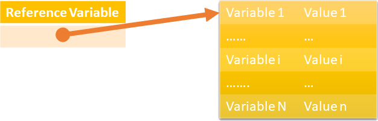
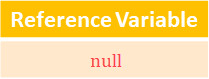

# Custom types

## Preface

I would like to invite you to participate in the next lesson of the course Information Computation. The main goal of this lesson is to introduce custom types. After the lesson, you will be able to declare your custom type, distinguish between value and reference types, get background related to static class, and reuse the singleton pattern.  All of that we will discuss in the context of the examples gathered in the TP repository.

## What's the Problem?

### Custom Type Necessity

Let us now return to the `Roman` representation of numbers. This coding system is well-known. Therefore, I selected it as an example to answer a more generic question of what to do if you need a custom approach in this respect. What to do, we already know. Because assuming that type is an implementation of a selected coding system we have to define a new type if an appropriate one doesn't exist already. Precisely speaking, we must answer the question of how to do it. By custom approach, I mean that you cannot only reuse existing well-known types offered by your development environment. In other words, consider a situation where none of the existing types can be used due to specific requirements regarding the information representation. In all programming languages I know, this procedure is very similar. Hence, the examples I am using should be easily portable.

### Value and Reference Types

From the previous lesson, we know that the type should be recognized as a set of values and operations used against these values. But from time to time we must deal with a scenario where we need to point out that there is no value at all. We will investigate it on examples prepared in this language but again it is a common approach so I expect that the knowledge will be reusable for other languages.

### Complex and Structural Types

Designing custom types we must consider a set of values that contains parts making up a structure. As far as I know, the most popular is the array of indexed values. We may define a few commonly used templates that may be used to define a relationship between embedded values but as usual, we also must consider the scenario that the processing needs don't fit, and hence, we need a custom template. A typical relationship not supported by all programming languages I know is a binary tree. Anyway, it is the next issue we must face up talking about the custom types for sure.

## Type Concept

### Built-in Types

Simplifying, the type definition may be recognized as the definition of two sets. The first set determines all values that belong to the type. In other words, the values are compliant with the type. In most languages, some additional grouping of types kind is engaged. The language defines built-in types and this group is not relevant to us because it depends on the programming language definition, but not the features of a type. C# is not an exception. The built-in types may be used immediately without bothering about the definition source. Examples belonging to this group are int, double, etc.

### Simple Types

In spite of the definition origin, types may be grouped as simple, complex, and structural. The prevailing feature of simple types is that the values defined by the simple types are processed as one whole even if the value by design contains parts. An example is the floating-point values of the double type containing mantissa and exponent - two related numbers representing one rational number. The second example is the `Roman` type previously defined.

### Complex Types

Complex type values contain embedded parts but thanks to that the relationship between these parts is well known in advance a selector operation can be defined. Examples of these kinds of types are array and record. To select and process a part (value) contained by the array an indexer can be used. In C#, the record is implemented as the `class` or `struct` type. In this case, it is possible to select the value member identified as the unique identifier.

### Structural Types

Last but not least are structural types. In this case, by design the relationship between parts is custom.  Typical patterns used to define structural data are tree, stack, and stream, to name only a few. Because the structure is also subject to the design there is no one generic selection operation, hence instead of selecting we are using a browsing operation. To enable definition types to allow designing custom structures reference types are introduced in many languages.

## Roman Type

Following my promise, it is time to investigate an example of the custom type. Check out the code from the project CustomTypes if you want to follow the discussion using your copy of the examples. In this line of code, I have defined a dedicated type called `Roman` to represent integer numbers written down using `Roman` syntax. Using the context menu I can take us to the definition of this type. We can see that it is a structure. Precisely, this type is defined using the `struct` keyword. But an interesting observation is that this type additionally defines operators, and therefore also defines operations that we can perform on values of this type. Therefore, returning once again to the definition of a type, I need to recall that the type is a set of values, but also a set of operations that can be performed on these values. Further investigation of the definition will cause a deep dive into the language used, so if you are interested to learn the language in more detail, you must continue this analysis as your homework, on your own. In any case of questions or doubts, you may post them using the discussion panel of the repository.

## Type Definition Methods

I want to continue the discussion focussing on methods that we may use to define custom types. From the previous examples, we know that a new type may be defined using an appropriate language construct. Previously we used the `struct` keyword to create a declaration containing the definition of a new type. From this example, we learn that a new type may be defined applying similar syntax but the `class` keyword is used instead of the `struct`. So the next topic to investigate is why we need two keywords to obtain a similar result. That is a complex type. It looks like we must deal with two categories of types. Later we will learn more about delegate, anonymous, generic, and partial types as methods we may use to define custom types.

## Value and Reference Types

From the previous lesson, we know that the type should be recognized as a set of values and operations against these values. But from time to time you must deal with situations where you need to point out that there is no value at all. It could be achieved by applying a variety of measures. One of them could be a special value added to the set of regular values. This additional entity cannot be called just a next, new value because it signals no value at all. This approach is inconsistent, and additionally, it requires changing the original set of values in case you need to derive a new type based on an existing one. Usually, it is impractical or even impossible. The next option is based on an assumption that the regular value can be accessed only indirectly if exist. In other words, in this case, the variable is only an access point - a reference - but not the value holder. This value exists somewhere in memory. For this approach, there is no need to care about the implementation of the reference (sometimes called pointer or association) and the location of the pointed-out value if any. This relationship is illustrated in Fig. 1.

**_Figure 1. Reference variable pointing out a value_**

In the presented case, the variable `ReferenceVariable` content is a reference associating a regular value with this variable, or alternatively, it may manifest that the second part of this couple doesn't exist (Fig. 2). Because of the role, to signal that the second part containing regular value doesn't exist only one common value expressed as a keyword `null` could be used for all types. This way we can create two main categories of types that we call value and reference types. We will analyze the features of both categories using the next examples.

**_Figure 2. Reference variable containing null value - not pointing out any value_**

## `struct` versus `class` Definition

For illustration purposes, I will use a definition of two types prefixed as `Coordinates`. You may find them in the namespace `CustomTypes`. To define the first type, I use the `struct` construct as previously in the case of the `Roman` type. To define the second type the `class` construct is used. By design, both represent point coordinates on the x, and y plane and both have a constructor that allows you to assign initial values. The x and y internal variables are current coordinates values holder. For the structure, I defined additionally two static methods that create the value of the structure type. In one of these methods, I use a local variable that is not initialized using a constructor. Now let's look at the behavior of values that are of type structure. In the first step, I define two variables for which I assign the same coordinates.

## Value Types Modification

How to use the definitions I will explain using tests located in the `CoordinatesTest` class. Here we have the method CoordinatesNoChange - I will use the Alt-F12 key to open its definition. The definition is below in the same file, but it will be more convenient to look at it when it is directly below the program text located in the place where we are analyzing it. Here we can see that the parameter is defined as the input. It means that the assigned value is transferred only in one direction - from the callers. Although these instructions modify both variables using pseudo-random numbers the original value doesn't change, and both variables are equal to each other. To be able to modify the value of the structure type, we must use the `ref` keyword. It causes the parameter becomes input-output, and the assigned value is transferred in both directions. Let's look at the definitions again. Here, we do the same as previously. The coordinates are modified using random values, but this time the operation is effective because the parameter is input-output, so the modified result is transferred back to the caller. As the result, the values here are not equal to each other.

## Reference Types Comparison

Now this variable is of the class type. First, I can assign to it an initial value of null, which means that this variable has no associated value. In this case, when the variable is of a class type, you have to deal with two values. The first value is assigned directly to the variable, and this is a reference, a kind of pointer. It is worth stressing that the reference is an abstract concept, which means that the implementation details of the reference are hidden. The second part of this value is an object compliant with the variable type. This object is created using the new keyword. Next, a newly created object is assigned to the second variable, which is the same type. It is initialized to the same coordinates. As the result, of course, the coordinates are equal to each other, but the values ​​of the variables are not. Why? The reason is that these variables have references to different objects and therefore have references pointing out to two different objects. Let me stress, in this case, we don't compare the values ​​of the objects, we do not compare the objects themselves, but in this case, we compare only the references. Therefore, in this case, the usage of the equality comparison operation could be confusing. Again, references are abstract therefore, it is hard to explain what equality means. It is the reason why I compare the references themselves using the `AreSame` and `AreNotSame` assertions. In this case, we are answering the question of whether the target objects are the same, or alternatively if there is only one object referenced by many variables.

## Reference Type Modification

In this case, the call to the method that has an input-only parameter is effective. It is because it modifies variables inside an object - the parameter causes indirect access to and modification of the internal state of the referenced object. These assertions prove that the coordinates x and y are not the same, and so we can state that they have been successfully modified. In this case, the method parameter is also a variable that is not the value in concern but only an access point to the value after creation, the objects are initialized to the same values​, but later this method modifies one of them successfully.

## Value and Reference Types Summary

Analyzed examples show how to define a new type belonging to value or reference categories, and suggest conditions we may apply to select an appropriate category. The syntax and semantics of the definitions are similar while the examples show fundamental differences related to the representation of the lack of value and the behavior of the method parameters. The examples don't cover all methods that can be used to define a new type. We will return to enumerations and delegates in the context they are especially useful later during the course. To continue the discussion about the classes I propose an investigation of the static class concept in the next example and comparing it with the singleton pattern. I believe that you will find this topic especially useful to extend your knowledge and improve your understanding related to the type concept.

## Static Class

Examples illustrating the use of the static class are located in the `StaticClassTestMethod` method. We will not discuss them in detail but there are a few things that need to be underlined. Especially, I will not discuss the issues related to the programming language itself. So if you need detailed information about the syntax of the static class definition you must check out the CSharp user guide. It is worth stressing that the static class cannot be used as the type of a variable. As a result, we can state that in fact, the static class is not a type, you cannot instantiate the static class, and you cannot operate on values of that type. So in the sense of type, as a linguistic construct that defines a set of allowable values, a static class cannot be used. On the other hand, a static class can contain variables and these variables can be modified. It may also contain functionality. What it is if it isn't the type because its features don't fulfill the type definition. Because it can contain members - I mean variables and methods - we can recognize the static class as an organization unit gathering internal definitions and declarations available in the context of the static class name. We will return to the static class features while discussing extension methods.

## Singleton Pattern

In the case of the `Singleton` class, let's move on to the definition of this class - it is pretty simple isn't it - again I leave the lexical analysis of this class as homework, here the important issue is that for the `Singleton` class, for the singleton pattern, we can only create one instance. The proof you may find in the unit test method called `SingletonTest`. The most important feature is that we cannot directly create an instance of this class because the constructor is hidden and cannot be directly used by the code outside the class - it is private. To get access to this class instance we have to use this static property that returns an existing instance or creates a new one otherwise. Here we can see that if we have two variables for which we assign initial values, then using this assertion method we prove that these references are the same, so they led to the same instance, the same value.

## Conclusion

It is time to conclude and actually repeat. After this lesson, you should know how to create custom types to make a foundation for the program semantics. You must also be aware of the value and reference types features and be able to select the appropriate one that meets the requirements of the algorithm you are going to implement. We also shortly discussed a static class construct that only partially fulfills the type concept but it resembles the singleton design pattern. Examination by unit tests of the attached examples shows that both have almost nothing in common and you must select one of them carefully. Later I will present another method that we can use to create new types, namely inheritance. There is still an open question about what to do in case we don't know the details that allow us to create a custom type. This programming scenario we call dynamic programming but it will be covered by an independent course related to the processing of external data.
