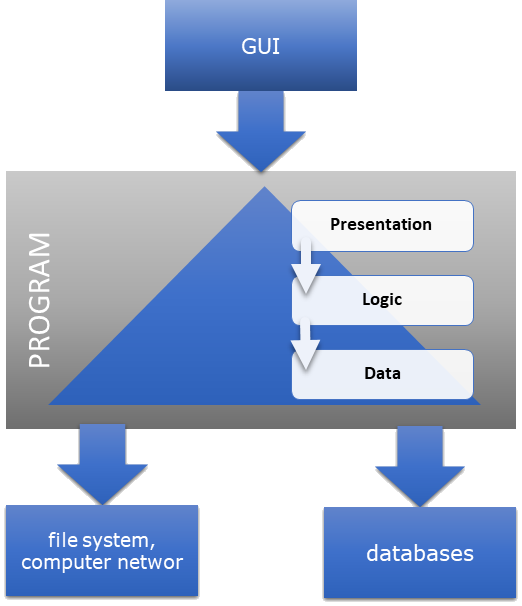
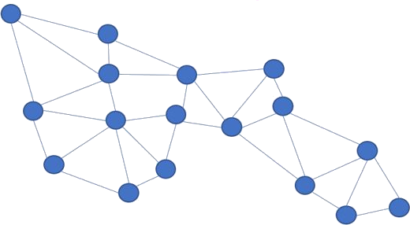

# Program Layered Architecture

## Preface

I would like to invite you to participate in the next lesson of the course Information Computation. The main goal of this lesson is to learn more about the architecture of the computer program. A computer program begins its life cycle as a text that follows the rules of a selected programming language, for example, CSharp. In order to decrease the cost and improve the performance of the program development process, often the text of the program is organized into autonomous fragments hierarchically related to each other creating a layered model. The main challenge we must face during this lesson is learning all about computer program layered architecture.

## What is the problem ?

- what benefit we should expect
- how this architecture should be implemented

It's just theory but from the practical point of view, we need to answer a few questions to follow up and apply this architecture. First is what benefit we should expect compared with the program that is just messy. We are expecting measurable benefits. It could be even better if we can prove that this architecture is mandatory for some reasons. The second question is how this architecture should be implemented to be rewarded by finally receiving the expected benefits.

## Life Cycle of Program Development

### Information Processing

To deploy the automation of information processing - let me remind you that it is the main goal of the software developer job - we have to engage a computer. That is a programable device. To be helpful in solving our problem the computer needs to execute a program. Computation is the process of running a program. It is a run-time stage of the program development process. A computer program is a piece of software that is designed, developed, deployed, and maintained by us as a community or even team job responsibility.

### Algorithm

The program development should be commenced by researching knowledge helpful to solve our problem or achieve the computation goal. This knowledge as one whole we call algorithm. A very useful concept while working on the algorithm is a separation of concerns. From sociology we know, that it improves our performance of thinking because thanks to the separation of concerns we may think about independent topics with minimal overlapping between them. So to improve our productivity at algorithm design time we must leverage separation. It is important because by improving productivity we are decreasing development costs and decreasing probability of the failure in the long run. Finały as a result we are reducing development costs.

### Program

Unfortunately, usually designing an algorithm and its implementation are tightly coupled with each other and cannot be disjointed. It could even happen that after finishing the work on the program text the next step is to document the algorithm implemented by the program. It is not hard to imagine iteration in this respect. Anyway, at the end of the day, we must have a program executed by a computer for information processing automation purposes. Simplifying we can recognize the program as a text compliant with selected programming language syntax and semantic rules. Additionally, before it may be used by a computer it must be converted to a binary executable form because each computer is a binary machine. Usually, this transformation and validation are accomplished thanks to a compiler that is responsible to build the outcome of our work and is aware of the programming language in concern. It is worth stressing that only errors free text could be recognized as a computer program. If the compiler complains about the correctness of text it is just a sequence of characters but not a program worth further analysis against its meaning, against semantic rules.

### Separation of Concerns is Required

Unfortunately, this introduction doesn't explicitly answer the question of when and where we should deal with the separation of concerns - while thinking about the solution or while implementing it as a text. The only thing that is out of the discussion is that it is very beneficial to apply separation of concerns. What's more, shortly I will try to prove that it is also necessary for some reasons. To prove that something is required,  or even necessary - we need a condition that may be easily verified. A typical condition in this respect should sound like this: without implementation of the separation of concerns concept, it will be impossible to ......\<to do something\>. Anyway, talking about the program we are talking about the text. Taking about the text it is impossible to talk about the concerns as long as the text doesn't have meaning but we can distinguish program parts according to selected language constructs. It looks like the only way to implement the separation of concerns concept. Continuing we may call this implementation a separation of parts. Further, we try to find constructs that are applicable in almost all programming languages that can be used to define separate parts implementing the separation of concerns concept.

### Program Testing

Separation of parts is necessary to effectively apply unit testing to verify the correctness of the outcome. Unit testing is a testing method by which individual parts of source code are tested to determine whether they are fit for use. From this description, we can learn that distinguishing program parts are necessary to engage this kind of program validation method.

### Maintenance

For maintenance purposes, independent parts also may be recognized as beneficial because any required modification could be scoped only to selected parts. It limits the impact on the correctness and performance of the program. Again this way we can improve our software development performance.

## Layered Architecture

### Introduction

Concluding, implementing the separation of concerns concept in practice we must deal with a program, but not only with the design thinking. A computer program begins its life cycle as a text that follows the rules of a selected programming language, for example, CSharp. In order to improve the performance of the program development process as a result of applying the separation of concerns concept, often the text of the program is organized into autonomous fragments hierarchically related to each other creating a layered archetype. In this architecture, each layer refers only to the layer below. Of course, there is no reference to the top layer at all. Similarly, the bottom layer doesn't refer to any other layer because there is no layer below. The layered program design pattern is clear and doesn't need any special education background or explanation to understand it but it is only an example. Hence, my proposal is to use it for further discussion but keeping in mind that it is only an example how to deploy the separation of concerns in practice.

### Layers relationship

To have layers we must be able to distinguish the vertical hierarchy, and position of the layer in a stack. For example, the top, middle, and bottom layers. Doesn't matter what the layer means. It could be books, carpets, or autonomous program parts. Hence, in the layered arrangement, the most important thing is the unidirectional top-down relationship. In a layered architecture, layer relationships could be recognized as a directed association. The directed associations are a relationship between entities that are navigable in only one direction, from top to bottom. Transferring this concept to the program a directed association indicates that the upper layer depends on the layer directly below it. A most common form of a directed association is a solid line with an arrow that indicates the direction of navigation and the top-down relationship. For the picture on the paper or on screen, it is obvious but for the program text, it could not be so clear.

## Layered Architecture Benefits

### Introduction

By applying the layered architecture we should gain measurable benefits compared with the program that is just messy. It could be even better if we can prove that this architecture is mandatory for some reasons. Let's try to justify the following benefits to name only the most important:

- simultaneous development - to reduce the design time
- independent testability - to improve diagnostic
- the adoption of technology change - to improve adaptability
- scalability - it is easier to spread the functionality to different computers

### Simultaneous development

Because the implementation of the layers is independent we may consider simultaneous development of them to reduce design time and make the development process chipper. Simultaneous layers development, following the more general concept called Simultaneous Product Development (SPD), is a design collaboration method in which team members work in parallel, synchronously, or asynchronously, to create and finalize the product. Simultaneous means occurring, operating, or done at the same time. Finally, we can reduce the time to market by reducing the time needed for development.

### Independent Testing

There is one more good reason for leveraging layered architecture. Before shipping our implementation to the post-production processing you must assure the correctness of the proposed solution somehow. Sometimes as proof of correctness we can get a statement like "it just works". Unfortunately, in many cases, it is just wishful thinking. However often it means that the outcome has been tested as proof of correctness. As a rule of thumb, you must keep in mind that testing may be only applied to discover errors but not to prove the correctness of this implementation. Be careful because according to a well-known paradigm there is always at least one more bug in each implementation in spite of intensive testing. Deep dive into testing is far beyond the course scope. During the course, I have limited usage of the testing to expose examples of features but not to prove the correctness of the code. Regardless of this, when the test result warns you about an error during testing, thanks to the layered program arrangement you are sure that the issue source is located inside your implementation of the layer or the testing implementation of the layer below. Let me stress that a bug if any is in your code where you should look for problems, not in the code of your teammate. For sure, testing only your stuff improves the performance of the debugging process.

First, while testing the selected layer, we must remove dependency on the layer located just below the tested one. More precisely, we must replace dependency on the implementation of the layer below only,  by providing quite a new implementation for testing purposes only. In other words, the new testing implementation must replace the implementation developed for production purposes. It is a perfect example of polymorphism that requires layered architecture. We will get back to this topic again very soon.

### Technology Change Adaption

It is obvious that technology will change over and over. It is a continuous process. So very vital question is how to be prepared for technological change. Layered architecture could be a real relief because we can replace only the affected layer after the technology change. It is especially important for the layers, which depend on the progress of technology, like data repositories, networking, and graphical interface resources.

### Scalability Leveraging

The next good reason to apply the layered archetype is the possibility to make scalability and portability deployment easier. I will get back to this topic later but now as an example let me just mention the possibility to spread the layers execution to different computers or the necessity to change the execution platform.  This benefit is tightly coupled with the possibility to follow technology progress.

## Layers

### Introduction

Following this introduction let's use the separation of concerns concept to separate the program text into units, with minimal overlapping between the responsibility of the individual units. There are a lot of patterns that could be helpful to implement this idea of separation. One of them I mentioned as an example to define what is the problem, namely layers. Again, we will extensively explore this arrangement of the program as a very important one but keep in mind that it is only an example. So, let's get back to software engineering. You know that usually talking about a layered program we may distinguish three layers: the presentation, logic, and data layers as follows:

- **Presentation** - responsible for managing the communication with the user using typically the graphical interface
- **Logic** - responsible for the implementation of a dedicated algorithm related to the process in concern
- **Data** - responsible for accessing data representing the process state and behavior information typically managed by the file system, computer network, custom communication interfaces, and databases to name only the most common.

This design pattern on the screen (Fig. 1) is clear and doesn't need any special education background or explanation to understand it but it is only an example. Hence, my proposal is to use it for further discussion but keep in mind that it is only an example.

Figure 1. Layered program architecture

### Responsibility

Talking about layers I am talking about responsibility but not about the functionality of the layer. The main reason is that responsibility is a commitment. It is only a promise. This term better suits the design process. Functionality may be recognized as a contribution to the behavior but it applies to run-time but not design time context. Writing a program as a result of the algorithm implementation process is design-time activity therefore I prefer to talk about design time. To be honest I don't think it has an impact on the program development methodology.

### Presentation Layer

So, get back to the responsibility of layers description. The presentation layer is responsible to provide interaction with the program end user. Today, usually we are using a graphical user interface but not only. The computers may have many additional devices that we can use. For example, obviously, a screen to present any graphical information but also headphones to play music. There are many reasons why this layer should be separated as an independent unit, namely user interface flexibility, and technology dependence to name only the most important for now.

This layer is also responsible for providing data using a natural language. It is a reason to implement this layer as an independent one. Hence, in this case, it should allow the possibility to replace the communication with the user without any impact on the rest of the program. It makes also the solution more flexible against general user interface requirements, for example, symbols, colors, and screen arrangement. It is not an easy task to deal with the user requirements because the representation is not formal so could be subject to many changes during the life cycle.

### Logic Layer

Just below the presentation layer, there is the logic layer. It is responsible for provisioning the main functionality implementation of the algorithm related to the process in concern. As I said previously, the algorithm is abstract knowledge, but we must implement it somehow. Here the main challenge we must face up is how to distinguish the main functionality from the rest.

### Data Layer

The data layer is the bottom one in the architecture. The name could change but by design, the responsibility is always the same. The data layer is responsible for allowing access to the data managed using available local or remote resources. For example files, networks, or databases. Remote resources could be determined as relevant equipment for the distributed systems. The outline of the distributed systems is out of the course scope, so we may safely remove remote resources from the discussion. The same is with the connectivity over the network. Fortunately thanks to the program execution platform usually we may employ remote resources as local ones.

## Layers Dependency Rules

### Presentation to Logic

To follow the layered program pattern the presentation layer uses only the logic layer. The relation is there (Fig 1.). It must be the top-down dependency relationship between these two layers and this relationship is unidirectional. For example, it is incorrect to put another arrow here and say that the logic refers also to presentation because it is against the layered pattern. In the case of a bidirectional relationship, it is hard to say that the presentation is above logic. So let's erase this arrow. Top-down is the only allowed direction. So first talking about the layers we must prove that we have a top-down unidirectional relationship between the layers. We must face up to answer the question, how to prove this when we are talking about the program? I will try to help you answer this question shortly.  the only thing I must stress now is that any program is a text. It is a sequence of characters compliant with a selected programming language. The language in turn is defined on a foundation of the alphabet, syntax, and semantic rules.  We must keep it in mind while discussing dependency relationships.

### Presentation to data

It is also not allowed to provide this dependency relationship (presentation => data) because in this case, we don't know if the layer below is logic or alternatively data from the presentation point of view because following the dependency relationship both are on the same level. Therefore it is also not correct. The only possibility is that the upper layer refers to the layer below and only the below one. It is the only correct relationship.

## Deployment Layers

### Layered Architecture of Program Text

First I must remind you that the algorithm development is far beyond the course scope. The main goal is to apply the separation of concerns rules directly to the text development but as a result of the implementation of the solution derived from a research process, shortly algorithm. The second observation is that to make the course practical we must apply the layered architecture to the program text but not to the thinking process. I propose to do it in the context of the selected language semantics. In spite that we are using a concrete development environment, the main hope is that this approach is easily portable to at least all the strongly typed languages. The examples have been added to the project `LayeredArchitecture`.

### Layered Architecture in Program Context

Earlier we already proved that layered program architecture is very beneficial and is derived from a general concept called separation of concerns. Simplifying, by design, the separation of concerns applies to the way of thinking, but as software developers, we need to implement it as an architecture of the program text. A program is just a text compliant with a selected programming language. In our case it is CSharp. Hence the architecture including the relationship of layers must be expressed using terminology defined by the language itself. In other words, talking about functionality is perfectly OK if we talk about the algorithm but not the program.

### CSharp as Language

Languages offering object-oriented programming usually use types as a construct that takes responsibility to implement the algorithm in concern. Further discussion may depend on the selection of a concrete programming language. Therefore, according to the rules of the course the further discussion I will conduct using CSharp as the language and Visual Studio as the development environment. Check out the project to follow me in this respect.

### Layer as Group of Custom Type Definitions

From the examples gathered in the `LayeredArchitecture` project, it is easy to guess that I propose the implementation of a layer as a set of custom types definitions. In maths, sets are a collection of well-defined entities called members of a set. In the proposed case the well-defined entity is a custom type - a language construct. The set notion is derived from the mathematical theory and is well known from the background school education, hence we may skip dive into this theory. The only important thing is how to recognize the membership. There must be a boundary that we can use to distinguish if a type belongs to the selected set or not. To make the layer unambiguous it must be assumed that the type belongs only to one set. This way we can convert the discussion about mathematical stets to an examination of types grouping. On the screen, you can see a few custom definitions of types. That is `DataLayerAbstract`, `ServiceA`, and `View`. Now we must answer a question about recognizing the membership of groups called layers. In other words the fact of being a member of a selected group.

### Namespace as Set Boundary

The namespace construct could be a relief to help answer this question. Namespaces are used to organize and provide a level of separation of program parts and to avoid name collisions. The namespace unique name could be used as a prefix of the definition identifier to make the definition name unique to the program scope. They can also be considered as a container that consists of definitions.  This concept perfectly fits the concept of definitions grouping or more formally enforcing set membership of types.

### Relationship Implementation

Collecting custom definitions using namespaces to implement layers as the program architecture is only the first part of the solution. We have to implement also unidirectional top-down relationship. In the case of treating customs definitions as members of a layer, it may be accomplished very easily because definitions are related to each other using bidirectional dependency relationships. It is your responsibility to limit the freedom of direction of the dependency of types definitions to follow the rules defined previously for layers.  Let me stress, to implement this hierarchical and layered architecture the definitions belonging to one layer should depend only on definitions belonging to the layer directly below.

### Selection of Layer Membership

So any discussion about the layers must be conducted in the context of definitions expressed as a text according to the selected programming language.  For example, the presentation layer must contain part of the program text responsible for the implementation of the user interface but the question is which one? Which part of the program should be aggregated by the presentation layer? Of course on the one hand it could be related to the main responsibility of this layer that at the end of the day it ensures required functionality at run-time. In the meantime, the responsibility must be implemented as a set of definitions organized and separated as one unit using namespaces. As we did prove previously it is very clear how to create layers using definitions grouped by namespaces. The real mystery of software development is the aggregation and separation of definitions to precisely cover the layers of responsibility.  Therefore working on an algorithm and its implementation is a process usually tightly coupled with others and needs an iteration approach.  Because responsibility and functionality are abstract terms it is very difficult to prove that we have aggregated all the appropriate functionality as layers. In summarizing, talking about layers we are talking about a set of definitions grouped together and separated from other layers using a namespace concept. I believe that this approach is pretty universal and easily portable to other languages.

### Abstract Layer Interface

To develop layers independently from each other, the development scope or responsibility of layers must be precisely defined to avoid implementation overlapping or gaps. More specifically at the end of the day, the independently developed layers must fit each other to fulfill the correct control flow from the upper layer to the layer below at run-time. The problem with simultaneous development is how to start working on the development of the upper layer without knowing how to pass the control to the layer below. To deal with that we must have a sort of contract derived from the layer below that is to be followed up by the upper layer. It must be abstract because we don't yet have an implementation of the layer below. According to the primary assumption, we have to consider that the development of the layer below is underway or even has not yet started. For the Logic layer, an example is located in the AbstractLayerInterface namespace branch.

### Applying Object-oriented Programming

The need to provide an abstract representation of a layer is a very good reason to apply object-oriented programming to accomplish it. The main idea behind the Object-Oriented Programming concept is encapsulation, abstraction, inheritance, and polymorphism. Let me stress that the mentioned above abstraction is one of them. How to apply abstraction depends on the programming language, but in most languages, I know we may use constructs like interfaces and abstract classes that may be used to deliver abstract definitions. By design, we can recognize abstraction as hiding the implementation details. It suits very well to our simultaneous development scenario because having abstract definitions makes independent implementation possible as a result of removing the dependence on the implementation of the layer below. How to realize the abstract interface of a layer you can investigate using the examples available in the mentioned above namespace branch AbstractLayerInterface.

### Inheritance and polymorphism

There are next two very useful ideas behind object-oriented programming that are necessary to successfully deploy the layers concept, namely inheritance, and polymorphism. Inheritance is a mechanism where a new definition can be derived from an existing one to share the basics features or implement abstract definitions. Polymorphism is a concept that refers to the ability of an implementation to take on multiple forms. In our case, one form is for final, production purposes, and the second one is for testing purposes. The most important for us is that both forms, more specifically both implementations are derived from the same contract,  or using object-oriented programming terminology inherit the same abstraction to share the same features.

### Implementation for testing purpose

An example is in the `BusinessLogicTests` which pretends to test the Logic layer. To Test only the Logic layer the production version of the Data layer must be replaced by an implementation created for testing purposes only. This implementation is provided by the `DataLayerAbstractFixture` class. An instance of this class is injected - that is assigned - as an actual argument to the factoring method of the Logic layer.

## That's all for now

That's all about the implementation of the algorithm using a layered program. To be honest, it could be done using the partial mesh approach (Fig. 2.) but thanks to layers the following benefits may be accomplished:

- separation of concerns
- simultaneous development
- independent testability
- the adoption of technology change
- scalability
  

Details have been already provided. All of them make development faster, more reliable, and finally cheaper. Thank you for your time.
