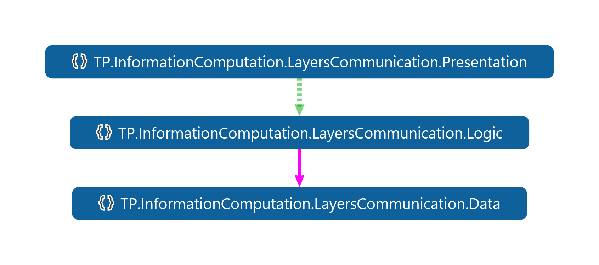

# Inter Layer Communication

## Topic introduction

By design, the layered program architecture means its organizations, in which we can distinguish independent entities of a program related to each other making a top-down hierarchy. Usually, for all languages, an entity may be implemented as a set of declarations compliant with the selected programming language. Hence, the layered architecture may be implemented using these sets. The distinguishing feature of a layer is that all definitions belonging to a layer are self-contained internally in a layer or may refer only to the declarations visible from the layer below. In other words, the top-down relationship means that the layer above only refers to the declarations available by the layer below. We discussed it already stressing that it is a compile-time pattern. At run-time, we must consider control flow and data flow in both directions for sure. This lesson address the topic of how to implement bidirectional control and data flow using a unidirectional layered architecture. As usual, at the very beginning, we will enumerate the main problems we must face up.

## What is the problem?

### Communication

Layers must be interoperable. Interoperability is the ability of different program layers to cooperate with each other in a coordinated way. The layered program architecture was discussed earlier during this course. This lesson address inter-layer communication as a foundation of interoperability. In general, communication means sending or receiving information. In the context of an algorithm, communication may be recognized as the act of giving, receiving, and sharing information - in other words, talking or writing, and listening or reading. In the context of information computation, inter-layer communication may be considered as control flow, data transfer, and event notification.

**Control Flow**: The control flow is the order in which statements or method calls of a program are executed or evaluated.

**Data Transfer**: From the previous lessons, we know that data is a representation of information. The data transfer may be considered as an assignment of a new value to a variable by its producer. If the variable is visible to a consumer its value - data may be freely read and utilized.

**Event Notification**: To avoid time-wasting poling to check if there is new data available, a notification operation must be enforced as a result of the assignment. Notification may be considered as an operation pushing a notice that a condition has been met. For example, notification that new data is available. Sometimes events are not coupled with additional data, for example, it is a case if we are waiting for the end of the computation and don't care about the computation result.

### Conclusion

The main challenge we will face up is how to implement all of that using layered program architecture. We will talk about internal communication only avoiding touching the topics related to networking. To avoid further theoretical discussion let's analyze the available options that are provided by the selected programming language. I will try to make the examples portable to other development environments and also reusable in the context of communication over a network. Again, portability and networking are beyond the lecture scope and these topics must be covered by independent courses.

## Introduction To Examples

I have prepared a few examples to explain how control flow, data transfer, and event notification fulfill requirements of the bidirectional inter-layers communication. To make it as straightforward as possible, we will return to the example discussed in the dependency injection context. Let's assume that our task is to ship a library for an unknown in advance number of users. Additionally, we don't know where and how our library will be used. We only assume that it is the logic layer. The presentation and data layers have been added to make the examples more comprehensive. The examples to be investigated are located in the project `LayersCommunication`. We will use many communication patterns to validate the sequence of methods invocation. In other words, we will test the behavior of a program. The mentioned set of methods contains methods named Alfa, Bravo, Charlie, and Delta. The methods must be invoked in alphabetical order. Of course, in a production environment, we must provide only one implementation of this set but for the sake of example, we have independent implementations for proposed design patterns.

## Program Architecture

We will analyze the proposals in the context of layered architecture presented in the following figure. The layers are created using namespaces Presentation, Logic, and Data. For sake of simplicity they are gathered in one project. The namespaces are named after the folders in the project. This architecture, as expected uses layers interconnected by the unidirectional top-down relationships. The namespaces play the role of the declaration sets. I must stress, this architecture has nothing in common with the layers communication but shows only the dependency hierarchy of definitions gathered in namespaces. If you haven't done it yet clone the repository and check out the solution to learn more about the details. I will refer to details during further discussions and conclusions related to the proposed patterns. Again, let me recall that our challenge is to show how to implement interoperability of layers created using unidirectional dependency relationships based on bidirectional communication.



## Testing Methods

### Introduction

To make the examples self-contained and as simple as possible they are gathered in one executable project. The presentation layer contains the command line user interface. It is not a typical approach but in this solution, it is used to log the program behavior. As an alternative, unit tests gathered in another project called `LayersCommunicationTest` are provided.

### User Interface

A user interface that engages the command line operating system window is implemented in the internal static class Program. It is used to generate a screen log tracing the behavior of the program. For the purpose of the production environment, you should consider moving this layer from the library to a separate project if any. After executing the program a text like this should appear on the screen. I have attached to the project a markdown file containing this result. A user interface is provided only to mimic the existence of the presentation layer. For us, the only interesting point is that this layer refers only to the layer below using abstract definitions.

### Unit Tests

To mimic the existence of the presentation layer, another approach is the engagement of the unit tests against the logic layer. As usual, we will apply the unit test to extract and illustrate the usage of the most important patterns applied to implement inter-layer communications. Of course, partially the unit tests gathered in the project that is named  LayersCommunicationTest after the previously mentioned project in concern. As previously, all tests refer to only abstract definitions exposed by the logic layer as a public interface named ILogicAbstraction. Using an access modifier we can control the visibility of the declarations outside of the project. Without any additional tools, this way we can control which definitions make up the program layer interface (PLI). That is the set of definitions used by the layer above to interact with the layer below. Additionally, we can assure that the dependency is one way only. Unit testing has much more advantages but now we are not talking about software diagnostics but about communications of layers. So let's get back to the communication patterns you can reuse for this purpose.

## Methods Invocation

### Calling Method Provider Correct Sequence

Implementation of the inter-layer bidirectional communication using method call is available since the very beginning of the software engineering era. A method is a named block of code that contains a sequence of statements or instructions. Terminology depends on the language syntax. In this pattern, the upper layer has to invoke the methods defined in the layer below. It causes the execution of the sequence of statements. While calling a method all required arguments must be provided. Execution of the sequence of statements must be recognized as top-down flow control. Assignment of the actual arguments to the formal arguments fulfills data transfer needs. Formal arguments play the role of variables holding the values provided during the method call. Argumentless methods could be used to notify the layer below by the upper one that a condition is met. This synchronous call of methods is perfect for the implementation of top-down communication but it is irreversible. To implement bottom-up data transfer we may only use ref arguments, out arguments, and return values to transfer data to the upper layer from the layer below provided that the data type is standard or defined as a member of the layer below. Exactly this approach has been used in the CheckConsistency method call statement.

``` C#

Assert.IsTrue(callingMethodProvider.CheckConsistency());

```

In this line of code, we are expecting that the method returns true because the methods call sequence is correct in this example.

### Calling Method Provider Wrong Sequence

Returning false in the previous example is not informative enough because for all of the possible errors the result is always the same. Hence, it doesn't provide enough diagnostic information that can be used to improve the code and avoid similar problems in the future. Partially we can overtake this by throwing an exception in the layer below to notify the layer above that there is an unexpected condition. Contrary to many descriptions, an exception is just a class derived from the standard Exception class but not an event or notification. Hence, an instance of the exception may also be used to transfer data up to the upper layer. In almost all programming languages we have special instructions to throw an exception. Usually, it is a kind of goto instruction with a parameter, which must be an exception class instance. The main drawback of this kind of control flow and data transfer is that using the throw instruction should be a kind of last resort. According to the widely accepted best practice rule, throwing an exception is allowed only and only if the continuation of execution of the instructions sequence doesn't make sense and as the result, it must be broken and handled somewhere earlier in the call chain. For more details related to the behavior of the throw instruction and exception concept visit the user guide of the selected programming language. Concluding, sometimes the throw instruction may be classified as communication implementation but it must not be used as a regular communication behavior. We need to improve the methods call to implement inter-layer communication. It is worth remembering that the rest patterns I am going to discuss are derived somehow from the concept of the method invocation concept.

## Callback Based Bottom-up Communication

### Bottom Layer of Callback Based Bottom-up Communication

The next option for implementation of the bidirectional inter-layer communication founded on the unidirectional layer relationship is the callback method concept. In general, a callback method is a method passed into another method as an argument, which is then invoked to complete a sequence of instructions. Invocation of methods using variables - precisely speaking formal arguments - you can find in the CallBack class. A sequence of instructions may be called by the layer below at any time bottom-up communication is required. This way we can implement bottom-up notification and control flow. Because while invoking a method all its current parameters must be provided also data transfer is possible. It is worth stressing that at the very beginning of this concept a method is treated as data. Therefore, we need a special type that allows defining a set of allowed values and using it to prefix a variable. This approach needs programming language support and depending on the language different terminology may be used. For CSharp, we have a delegate type. An example defined for the example purpose is TraceDataDelegate. The type declaration determines allowed values by specifying the signature of the methods. The delegate value is a set of references to methods that have a common signature predefined for the delegate type. In this approach instead of using a method name to invoke the aggregated functionality, we are using a variable current value. It is worth stressing that in the place a method is invoked we know only its signature but not the actually implemented functionality. In our example, the functionality is defined in the upper layer.

### Upper Layer of Callback Based Bottom-up Communication

As previously the upper layer implementation you may be found in the presentation layer located in the main project called LayersCommunication or in the unit tests project called LayersCommunicationTest. Let's investigate only the second example located in the CallBackUsage test class where you may find the invocation of methods in concern. An example of the method compliant with the signature declared for the mentioned above type is the TraceData instance method declared as a member of the InMemoryTraceSource instrumentation class. Finally, we can fulfill all needs of bottom-up communication by invoking a diagnostic method using delegates. Because this way method becomes data we may also preserve it for future use detaching the callback from the assignment of a variable.

## Event Based Bottom-up Communication

### Bottom Layer

Events are a very popular form of callbacks. Using the event-based approach, we will try to examine this mechanism to implement bottom-up inter-layer communication. The TraceDataEvent is of the delegate type. It means that it is a variable and it may contain a set of references to methods that shall be invoked to notify that the layer Logic encountered an expected condition and is willing to inform all interested parties by invoking the methods added to this set. Making this variable visible in the upper layer allows assigning a delegate referencing a method supplied to notify the condition. All methods that are members of this example use the variable TraceDataEvent to invoke the methods provided that the set is not empty. Invoking a method means at least bottom-up notification and control flow. Parameters of the methods may be used for data transfer. As far as now the proposed pattern resembles the previous example. The only syntax difference is that the delegate variable TraceDataEvent is prefixed by the keyword event. To explain the semantics difference we must again refer to the type concept. All types including delegates define a set of values and a set of operations that may be applied to values belonging to the type. For all types except the delegates, the keyword used to declare the visibility of a variable applies to all operations defined by this type as well. Using the keyword event introduces a selective availability policy that restricts the scope of some operations visibility. For example, the invoke operation can only be executed inside the class where the event is declared. The main reason is to improve robustness by distinguishing and clearly separating the publisher and consumer roles. As the name says, the publisher is recognized as a class that is a source of communication realized using events. Therefore, only inside this class, we can invoke the methods referenced by the event variable. It means that we can consider the invoke operation as always private despite the accessor prefix of the variable. Subscribers express their willingness to be a destination of the communication by adding a reference to a method that can be used as a starting point to consume the communication outcomes. This relationship multiplicity is one too many.

### Upper Layer

The subscriber functionality consuming the event exposed by the EventBased class we may find in the presentation layer located in the main project called LayersCommunication or in the unit tests project called LayersCommunicationTest. Let's investigate only the second example located in the EventBasedUsage test class where you may find the invocation of methods in concern. In this line, we are creating a delegate value that refers to the TraceData, which is the instance method of the InMemoryTraceSource class. After that reference of the method as a delegate, a value is added to the set that is holden by the TraceDataEvent variable. By invoking the CheckConsistency instance method of the same object we are proving that all the methods in concern have been invoked in the expected sequence. If not the test method fails.

## Reactive programming

### Two Main Asynchronous Interactions

Returning to the previous discussion, we shall notice that while talking about inter-layer communication, we can distinguish two main intentionally asynchronous interactions. I mean top-down and bottom-up communication. Communication is an operation observed at run time but it must be implemented at the design time of the program life cycle. In all scenarios for layered architecture, to implement bottom-up communication top-down communication is required for the layered program archetype.

### Top-down Communication

At least the top-down communication is required to express a willingness to receive messages by the upper layer, I mean to be notified by or receive data from the layer below. Operations that express this we call subscriptions. Finally, it leads to the publisher-subscriber interoperability pattern where senders of messages, called publishers, do not send them directly to specific receivers, called subscribers, but instead, categorize published messages into classes without knowledge of which subscribers if any, there may be.

Similarly, subscribers express interest in one or more classes and only receive messages that are of interest, without knowledge of which publishers, if any, there are. There is no tight relationship between the Subscribers and Publishers, the Subscriber must deal with this issue in a reactive rather than proactive way.

### ReactiveProgramming Preface

Concluding, reactive communication allows the implementation of a design pattern that relies on asynchronous programming logic to handle incoming updates by the upper layer. It allows the implementation of a mechanism for receiving push-based notifications. Using the examples gathered by ReactiveProgramming we will investigate this approach to implementing inter-layer bottom-up communication based on reactive programming.

### IObserver, IObservable interfaces

Implementation of the reactive communication pattern is founded based on the IObserver, and IObservable interfaces. The IObservable interface requires an implementation of the Subscribe method by the publisher. This method shall be invoked to announce a willingness to receive data compliant with the selected type. The class derived from the IObserver that plays the role of the subscriber shall implement three methods: OnNext to push new data by the publisher, and OnError to notify about an error. If a publisher wants to notify that there is no more data to push it invokes OnCompleted. To unsubscribe an IDisposable object returned from the Subscribe method is used.

### Publisher

In the snipped of Reactive Programming, the event concept has been reused making this example comparable to the example based on the event concept foundation only. As an implementation helper, the Observable static class is engaged. To meet our needs each call to methods offered by the ILogic interface triggers an event and finally, it is converted to the appropriate method invocation available from the Observable class implementation.

### Subscriber

I used the ReactiveProgrammingTestMethod to subscribe to the publisher defined previously as a part of the logic layer. The method is located in the LayersCommunicationTest project. You may also check out the Program static class located in the presentation layer to investigate the usage of the ReactiveProgramming class for communication. This unit test shall be considered as an upper layer located just above the logic layer. The test invocates all the methods in concern declared by the ILogic that shall be considered as production stuff. We are expecting that all invocation of the methods Alpha, Bravo, Charlie, and Delta will cause a notification in the InMemoryTraceSource object. After finishing the subscription is canceled using Dispose method instance method of an object returned from the Subscribe method. As previously, the correct sequence of invocations is checked by the CheckConsistency method. In this example, the onNext parameter is implemented as a delegate using the anonymous function concept we have discussed already. The parameters onCompleted, and onError are not used for the sake of simplicity.

## Dependency Injection

### Dependency Injection Introduction

Dependency injection is the next pattern that can be engaged to implement bidirectional inter-layer communication preserving the top-down layer design time relationship. The main point of this pattern is an assignment to an abstract variable a reference of an unknown type that is derived from this abstraction and which cannot be instantiated locally for some reasons. I named this pattern dependency injection to somehow distinguish the situations of using just object-oriented programming alone. In this scenario, we are using object-oriented programming to deal with the separation of concerns. One concern is the usage, and the second one is the implementation of a concrete type. Hence, shortly the dependency injection is a pattern where we are using an unknown for some reason type that is represented by an abstraction. The abstraction is used in the lover layer where concrete type definition must not be located for some reason. Previously we analyzed polymorphism as the main reason to move the definition to independent assemblies. Now we consider moving the type definition to the upper layer to follow the separation of concerns rule. Again in this example, we are applying the object-oriented programming concept to use abstraction instead of a concrete type because the type is not visible at all or must not be referenced for some reason.

### Dependency Injection - Problem Description

As an example we have the same goal as previously, namely monitoring the sequence of calling the methods belonging to a selected class called DependencyInjection, which implements the  ILogic interface. This interface contains declarations of methods signatures in concern. This example is located in the logic layer of the project LayersCommunication. Previously we did discuss a similar example but it was forked to two independent classes called PropertyInjection and ConstructorInjection to stress options related to how to pass a reference to an object. In the considered example, a mixture of the constructor and property approaches implementation is presented but the functionality is exactly the same.

### Bottom Layer

In this example we are using an abstraction called ITraceSource instead of a concrete type because its implementation must be located in the upper layer or in an independent assembly so cannot be referenced directly to avoid bottom-up layers dependencies and circular references between assemblies. We are expecting that all invocation of the methods Alpha, Bravo, Charlie, and Delta will cause a notification in an object referred to by the variable TraceSource. To implement this all invocation of the mentioned methods cause invocation of the TraceData method to push the notification and diagnostic data. Invocation depends on the evaluation of the TraceSource variable. As a result of the null-conditional operator, if the variable evaluates to null nothing happens, that is all invocation of the instance methods defined by the ITraceSource are skipped.

### Upper Layer

The bottom-up communication provider consuming the notifications and data generated by the bottom layer we may find in the presentation layer located in the main project called LayersCommunication or in the unit tests project called LayersCommunicationTest. Let's investigate only the second example located in the DependencyInjectionUsage test class where you may find the invocation of methods in concern. In this line, we are creating an object of InMemoryTraceSource type, which implements the abstraction ITraceSource interface defined by the bottom layer which is Logic in this case. After that, a reference to it is pushed to the instance of DependencyInjection class initialized using constructor or property injection approaches. In the case of property injection, after creating an object in concern we need to remember to assign the reference of an object responsible for further diagnostic data processing. In the case of constructor injection, we are obtaining only an object that can be represented as an ILogic interface that can be used to invoke the methods in the testing process. In both cases, by invoking the CheckConsistency instance method we are proving that all the methods in concern have been invoked in the expected order. If it is not true the test method fails.

### Summary

Shortly, the dependency injection is a pattern we must apply in any scenario where we cannot use the new operator to create an instance of a reference type in the location where we are going to use the object because the type is or has to be unknown for some reason. To solve this problem we must employ the object-oriented programming concept. Thanks to object-oriented programming we can use abstraction by the event producer and move the implementation of this abstraction to a consumer. Because using an abstraction we are invoking a method that comes, that is implemented in an object provided from outside we may use the term inversion of control to name this pattern.

## See also

- [IObserver\<T\> Interface](https://docs.microsoft.com/dotnet/api/system.iobserver-1?view=net-6.0)
- [IObservable\<T\> Interface](https://learn.microsoft.com/dotnet/api/system.iobservable-1?view=net-6.0)
