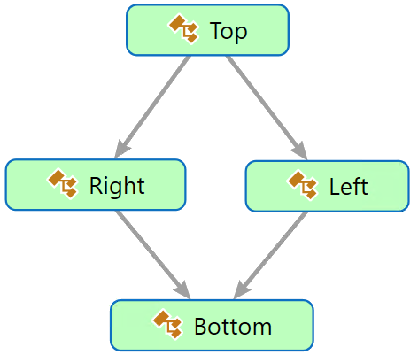

# Object-oriented programming

## Preface

In my opinion, a key to understanding the course is a good understanding of the object-oriented programming concept. Hence, I gonna spend a short amount of time recalling this concept. I will remind you of such object-oriented programming terms as class,  interface, inheritance, implementation, polymorphism, etc. I will pay special attention to the constructs that are characteristic of these terms for example abstract and virtual members. I want to stress that not all programming languages provide exactly the same constructs but we can find many similar ones, so my hope is that this discussion will also help to reuse the knowledge and port it to other languages if needed. We will come back to this topic many times throughout the course.

## What's the problem?

### Lesson Scope

- Custom structure of data
- Polymorphism
- Invisible Types

Usually, while learning of a new programming concept from a typical user guide, we may find an entry statement like this if you need object-oriented programming you may use class and interface constructs. I propose an opposite approach to learning the object-oriented programming concept. I will start defining real problems that can be solved using this programming concept. And based on this concept you will have an opportunity to better understand this concept without dip dive into the programming language details. My priority is to improve your understanding of this software engineering concept because I believe that it is a foundation for further deployment and portability of this concept to other development environments.

### Complex Data Custom Structure

The first problem we could encounter is how to process complex information composed using parts interconnected by associations according to a custom pattern. This way we must deal with a graph of entities where both the value of entities and the shape of the graph are meaningful in the context of the information processing process. For example, typical shapes we must deal with are streams, trees, stacks, and diamonds to name only a few. Usually, programming languages support selected complex types representing the typical relationships between parts, like arrays, and records. Thanks to that the relationship between these parts is well known in advance a default selector operation can be defined. To select and process a part (value) contained by the array an indexer can be used. In C#, the record concept is implemented as the class or structure types. In this case, it is possible to select the member of a complex value using dot operation and the identifier of the member that must be unique in the context of the type - in this case, we are using a qualified name. To deal with any custom pattern that is not directly supported by the programming language we may apply object-oriented programming to implement structural types. Structural type means that using object-oriented programming we can model any pattern we need to implement an algorithm in concern. I used the word "model" instead of "create" because at design time we may only define types that may be used to create a graph at run-time using this model. From the examples - I am going to discuss - we will see that the pattern is only a template, it is only a limitation, and may be recognized as a bit of advice for further processing. Because the structure is also subject to be designed there is no one generic selection operation, hence instead of selecting we are using a browsing operation.

### Polymorphism

The second typical problem we must deal with is the ability of an entity to have more than one form like a drawing that at the same time may be a circle, square, or rectangle to name only a few simple shapes. Depending on the form we have to consider different representations of the drawing. This multiformity should allow us to perform a single action in different ways, for example, the area calculation must be performed in different ways for mentioned shapes but always yields just a number. Commonly this heterogeneity we call polymorphism. Polymorphism is a Greek word that means multiformity or multi-form. I wanna stress that this way we are recognizing polymorphism as a feature of the algorithm to be implemented but not a goal to be achieved. To implement a polymorphic algorithm we need appropriate tools and technics. Again object-oriented programming concept is the best-suited proposal we know today that fulfills our needs in this respect. In other words, type, abstract and virtual members of a class are the foundation for polymorphism implementation. Based on the examples we have in the repository, I will try to explain this issue in more detail.

### Invisible types

Last but not least issue, which we may encounter while developing a computer program is a lack of the type definition that we should refer to. A typical scenario where we may face up this problem is working as a team. It allows us to spread the work between team members, and it could happen that the type is designed by one member and used by other ones. It causes that we must deal with two roles designer and user of a type. If the designer is late in time the user should not wait. Therefore we must look for solutions allowing us to postpone implementation while working in a multi-member team.  Again object-oriented programming concept is well suited to be a foundation for solving this issue. Again I will explain details using examples from the repository attached to this course.

## Structural Types

### Introduction

At the very beginning, I wanna recall object-oriented programming concept fundamentals. I assume that it is not your first touch with this concept and you have background knowledge or some experience related to object-oriented programming learned during the course on introduction to programming or programming fundamentals. Today most programming languages support this concept somehow. This concept is also addressed by a vast variety of independent courses. Therefore, we start our journey in the context of the first problem, namely how to apply object-oriented programming to finally make it possible to create a graph of objects according to a custom pattern.

### Object-oriented Programming Theory

Object-oriented programming is considered a paradigm according to which the information processing algorithm is implemented using a graph of objects. Since we have a graph, it means that the objects - parts of the graph - are interconnected by relations, so they may create a custom structure. Objects do not have unique names, hence the only way to select one of them is to use these relationships to perform selective access operations. The navigation of the graph using these relationships is called browsing. However, the lack of the need to use unique names allows you to create objects freely as needed and attach them to the graph. From the point of view of the implemented algorithm, the object is a representation of the information under processing and functionality that can be applied to process this information representation - it means data. The objects are created in compliance with selected types. It means that any object may be an active element, I mean, operations may be associated with it.

### Looking For Language Constructs

This is a theory that has evolved a lot over the past years, so please treat this lesson as a shortcut rather than an introduction to a serious discussion about object-oriented programming. This discussion is important here on how these principles of object-oriented programming were implemented in CSharp because some of them are crucial for further discussion. Here it should be noted that object-oriented programming talks about objects that are created in order to implement the algorithm. If we are talking about objects inevitably we are talking about the run-time phase of the program lifetime, not its design time for sure. So this is the result of the programming process, which in the previous lesson we defined as the process of creating text according to the rules of a programming language, so CSharp in our case and in these categories, you have to look for relationships. Well, this is the design phase of the program, not the execution phase. So the task is as follows. We are looking for language constructs that we will use in the design phase of the program, in order to obtain the effect during the run-time phase as described previously, i.e. the object-oriented programming paradigm.

### Objects Graph

Since in the execution phase we are going to obtain a structure of objects in which the objects are related to each other by associations, we have to talk about reference data. As we know from the previous lesson, data is formally described by types. The flagship representative of the reference type group is, of course, the class. Class definition, type declaration, and the `new` keyword allow you to create dynamically objects as needed and assign references to build practically any structure of objects at run-time. A reference is a one-way association that can be used to selectively access objects, I mean the components of the structure - components of the graph. Since a class is a type, it is a linguistic construct that allows you to define a set of allowable values ​​and operations on them. This fulfills the other requirements of the object-oriented programming paradigm outlined above. We'll discuss others in the context of CSharp to avoid any general and abstract discussion.

### Diamond Pattern

Using object-oriented programming we can create practically any structure of objects at run-time. Let's see how it works on a concrete example. In this example of classes, a diamond pattern has been implemented as a set of classes. This pattern is not very popular but I selected it because it is well defined. Suppose that the final graph is to contain four interconnected nodes, named top, left, right, and bottom. The nodes have been implemented using the classes with names resembling positions in the pattern. Finally, the shape like a diamond may be instantiated. Check out the unit tests to learn how the diamond graph of objects is instantiated at run time. Not always objects structure at the run time must be exactly the same as a structure of classes related to each other. Partially this issue may be overcome. In the examined example the constructor requires arguments pointing to the appropriate nodes depending on the planned position in the graph.

### Information Model versus Object Model

Classes related to each other, followed by the objects that are their instances, make it possible to build an information model. Because at run-time, it contains a graph of objects it may be called also an object model. Sometimes we can get an opinion that the object model is an information model expressed using the object-oriented concept. I propose to skip this academic discussion. Here we must only notice that in spite of the model name (I mean relationships) placeholders for references to create a demanded pattern are added to the types at design time. At run time we have to deal with an instance of the information model instantiated as a graph of objects. This information model instance may be modified dynamically - I mean on demand, at any point in time - by adding and removing objects to the graph using references. In other words, dynamically means that the graph could change in time according to the needs as a result of information processing at run-time but it cannot be called dynamic programming. My point is that dynamic programming refers to situations where we must deal with unknown types in advance at design type. In this approach, the information model that is formed at the design time may be used as the graph pattern at rub time. Let me now stress that an unknown type doesn't mean an invisible type. Unknown type means that we need to discover type at run-time. Invisible type means that the type definition exists somewhere in the program but it is inaccessible for some reason. This scenario will be discussed letter during this lesson.

## Polymorphism

### Polymorphism as a problem

Sometimes we must deal with the ability of an entity to have more than one form. For example, a drawing that at the same time may be a circle, square, or rectangle to name only a few simple shapes a person who at the same time can have different characteristics, like a man that at the same time is a father, a husband, and an employee. Depending on the form we have to consider different representations of it, I mean different data that is relevant for the processing in concern. It also has behavioral consequences. This multiformity should allow us to perform a single action in different ways. Commonly this heterogeneity we call polymorphism. Polymorphism is a Greek word that means multiformity. I wanna stress that this way we are recognizing polymorphism as a problem to be implemented. To implement polymorphism in the algorithm we need appropriate tools and technics offered by the programming language. Again object-oriented programming concept is the best proposal we know today, especially abstract and virtual members are the basis for polymorphism.

### Pillars of the Object-Oriented Programming

To promote a practical approach during this course, I will investigate details of the object-oriented programming concept and its features using examples you may find in the file `ObjectOrientedProgrammingFundamentals`. Inheritance, encapsulation, and abstraction are primary pillars of the object-oriented programming concept. Inheritance enables you to create new classes that reuse, extend, implement, and modify the behavior defined in other classes. The class whose members are inherited is called the base class, and the class that inherits those members is called the derived class. A derived class can have only one direct base class. Hence, polymorphism can be implemented by defining more than one derived class from a base one. As a result, polymorphism is often referred to as the next pillar of object-oriented programming although it is an effect of inheritance from the same base. Encapsulation refers to the ability of definitions to hide the visibility of the properties, methods, and other members that intentionally must not be referred to from outside of this definition. Last but not least is the abstraction which is a definition whose some members don't have an implementation part.

### Inheritance (Segment)

You may find an example where the inheritance is used in the file `Segment`. It contains a definition of a base class called Coordinates and a definition of the derived class called Segment. The Segment class reuses the x, and y fields defined in the base class and extends it by adding the NextSegment property. Next time I will provide examples of how to implement and modify the base type in the derived type. From this example, we can learn that the constructor is not inherited but the constructor of the base class must be called by the constructor of the derived class. Examples of how to use these types we can find in the unit tests project. Operator new creates an instance of the selected type and calls the constructor to set up the internal state of this instance. The instance is called an object and is stateful. Again the constructor is not called to create a new object but to set up it instead. The local variable `first` is responsible to hold the reference to the first object in the created sequence where each object knows which is the next one. For all reference types, we have a common constant `null` that can be assigned to a variable to point out that there is no associated object. Assigning a null value means that the variable is not pointing to any object. Exactly this case can be observed in line 24. In other words, if the object doesn't point to the next one it means that the object is the last in the stream. It is worth stressing that at design time we have only one single type, but at run time we can use this type to instantiate a stream with an unlimited number of objects interconnected to create a stream. Second observation refers to the possibility to process independently members of an object.  The class type is a kind of record and to select a member we can use the dot operator and the member name that must be unique in the class context. For example, this qualified name is used as the selector in lines 26 and 27. Because the objects have references instead of unique names hence to select an object member we must use browsing instead of qualified names. An example of browsing, we have in lines 35 and 36.  Take care that the browsing makes sense only if all values in the chain are not null.

### Abstraction (`ObjectOrientedProgrammingFundamentals`)

In the previous example, we used inheritance to extend a base type definition by adding new members. Having inheritance we can consider the next option that allows us to modify existing members defined by the base type. To make a member of the base class ready for modification by the derived class it should be preceded by the `virtual` keyword. This notification allows us to override it in a derived class. It is important for further discussion on object-oriented programming that apart from the mentioned one we can distinguish the next two special kinds of modifications of the existing definition, namely replacement and implementation. To replace a member we can use the `new` keyword as a declaration modifier. The new keyword explicitly hides a member that is inherited from a base class. The abstract modifier indicates that the base definition member doesn't have implementation at all. In CSharp, we have two constructs that allow abstractions to be declared, namely the abstract class and the interface. An example is located in the file `ObjectOrientedProgrammingFundamentals`. Concluding, abstract and virtual members are the basis for polymorphism.

### Abstract Class

An abstract class is a definition that intentionally doesn't provide all implementation details and must be extended or modified by derived classes. Abstract members can only be used in an abstract class. An example of the abstract definition is an abstract method that does not have a block. The block is provided by the derived class that is inherited from it. An abstract class can have both abstract and regular methods. There are many reasons why abstraction could be useful for program design. My point is that the most important thing for abstraction is that as a result, we can split usage of the definition and its implementation for example to allow polymorphism. In other words, based on the abstract definition the only operation we cannot do is object creation at design time. We will get back to this issue later. By polymorphism, I mean two or more implementations of the same abstract definition. In other words, the final behavior depends on the implementation provider. It could also allow postponing implementation while working in a multi-member team.  Let me stress that the impossibility to use the abstract definition to create objects is a result but not a goal of abstraction. Think about the abstract definition as it is something not finished yet. Anyway, it means that the abstract class definition is restricted and directly cannot be used to create objects during the program execution phase because the expected algorithm must be implemented to be executed. This can only be ensured by creating objects from concrete types, so only objects with all implementation details can be instantiated. In the considered example for this abstract class, it is necessary to declare a new type derived from it that provides the implementation. In the newly created concrete class, all abstract declarations must be refined in such a way that the missing implementation details are provided. In our case, the block is missing in the **...** method, which is added here to the signature of the inherited method from the abstract definition. Again, we call this process implementation of the abstraction. As a side note, a block is a sequence of instructions separated by a semicolon - sometimes it is also called body for some reason.

### Interface

By design, the interface is a language construct that allows us to define an abstract type. It contains declarations for a group of related members that a non-abstract class or a struct must implement. The interface members are by default abstract and public.  This concept was slightly expanded in the new language version but still, it should be recognized as an announcement of further implementation in the derived types.  Abstract class and interface both provide abstract declarations. By abstract declarations, I mean an incomplete definition of implementation details. The abstract class members can be modified and implemented by derived classes. Derived classes that aren't abstract themselves must provide the implementation for any abstract member from an abstract base class. On the other hand, the interface members can only be implemented by derived structures and classes. Therefore the interface is not only part of the object-oriented programming concept implementation using the reference types. It allows us to apply inheritance, and as a result, engage polymorphism also using value types. It could be used as a contract atop which value types have to be defined. It is worth noting that interfaces cannot be used to create objects but they can be used as a type of variable.  One of the reasons is that Interface methods do not have a block (body) - the block has to be provided by the classes that implement the interface. Implementing an interface you must fully define all of the members declared by the interface. An interface cannot contain a constructor as it cannot be used to create objects. Simplifying we may say that an Interface has only declarations - it is like an announcement of further implementation in the derived types.

### Polymorphism (AdditionalAssertions)

All mentioned object-oriented programming techniques, namely extension, modification, replacement, and implementation may be used separately or together to implement a polymorphic algorithm and work out a polymorphic program. An example of a polymorphic approach to design a common testing method you may find in the `AdditionalAssertions` static class. From this example, we can learn that our solution requires a polymorphic approach because all users of the `IDrawing.Area` could have different behavior of this method. It is worth stressing that all implementations use the same signature of the method. You may implement polymorphism using abstraction and inheritance. I used abstraction to define the type of the `drawing` argument of the method `AreEqual`, I mean value holder. Abstraction means that we are hiding implementation details. We know that the value referred to by this variable has the `Area` method, and the signature is defined by an interface `IDrawing`. Finally, we are calling a method but we are not aware of its implementation details. At run time when we are talking about concrete values but not language constructs, all implementation must be defined by this method caller, but the implementation could be different depending on the user's needs. The interface is abstract because doesn't provide any implementation details and can be recognized as a contract between the method `AdditionalAssertions.AreEqual` and any user of this method. According to this contract, there are two clear roles. First is the interface user. In this case, it is the AreEqual method in the class `AdditionalAssertions`. The second is the value provider, and in this case, it is all the method callers in spite of whether they are of reference or value types. All of them must refer to concrete types. Hence, to create a value a concrete class must be derived from the contract that is an interface `IDrawing` in this case.

### Calling Abstract Method (SC)

Here we can see that the `drawing` argument returns a value, but its type has been declared as an interface offering only the `Area` method. Here, however, we indicate that the object must perform the `Area` operation, but again we should not assume how this operation works. As I said the interface is just a kind of contract. We only specify a formal declaration containing formal arguments because we define only the header of the method called the method signature. As a result, the declaration is there, but it hides (or it rather doesn't provide) implementation details and that is why we call it an abstract declaration. This does not prevent you from using it and calling it, passing to it the current values ​​of its arguments in accordance with the declared signature.

## Invisible Types (SC AdditionalAssertions)

### Problem description

This part of the lesson addresses the problem of what to do in case a type definition is not visible in the location where we must refer to this definition. We can observe this issue in the method `AdditionalAssertions.AreEqual`. This method has been declared to allow uniformity of the testing instrumentation. Another typical scenario where we may face up this problem is while working as a team. It allows the team leader to spread the work between team members, and as a result, it could happen that the type is designed by one member and used by other ones. Therefore we must look for solutions allowing us to postpone the definition of the concrete type and avoid any impact on the usage of the type. This scenario I will discuss later together with the discussion on the dependency injection design pattern. Again object-oriented programming concept is well suited to be a foundation for solving this issue.

### Interface Users Roles

Anyway, based on this example we can distinguish two roles, namely value supplier and value user. In this example, the method that is to be involved as a uniform assertion mimics the user role. It is uniform because it is independent of the actual type of the value assigned to the argument named the `drawing` while it is called. All value providers calling this testing method are located in the same testing project. There we have a set of testing methods located in two files. Of course, the type used by the value providers and the type of the called method argument must have something in common. It is the interface `IDrawing`. Based on this definition the value user knows that the value must provide the `Area` method, and the value provider has to assign to this argument only values of a type derived from this interface. This interface may be recognized as an enabler for the value user and a limitation for the data provider. The interface definition we can find using the F12 key - shortcut of the "go to definition" menu entry. The interface is an abstraction that contains only the signature of one method definition. It is used by the called method that mimics the role of the value user. This interface must be inherited and implemented by a set of types we are using to create new values that are to be tested by this method. Because this interface is commonly used by the value provider and the value user is called a contract between them It means that both must agree upon it. Concluding we can develop the `AreEqual` method in advance not waiting for the final definition and visibility of the concrete type of the value in concern. It also allows using this method for testing purposes of an infinite number of types. The only requirement of these types is that all of them must inherit and implement the `IDrawing` interface.
