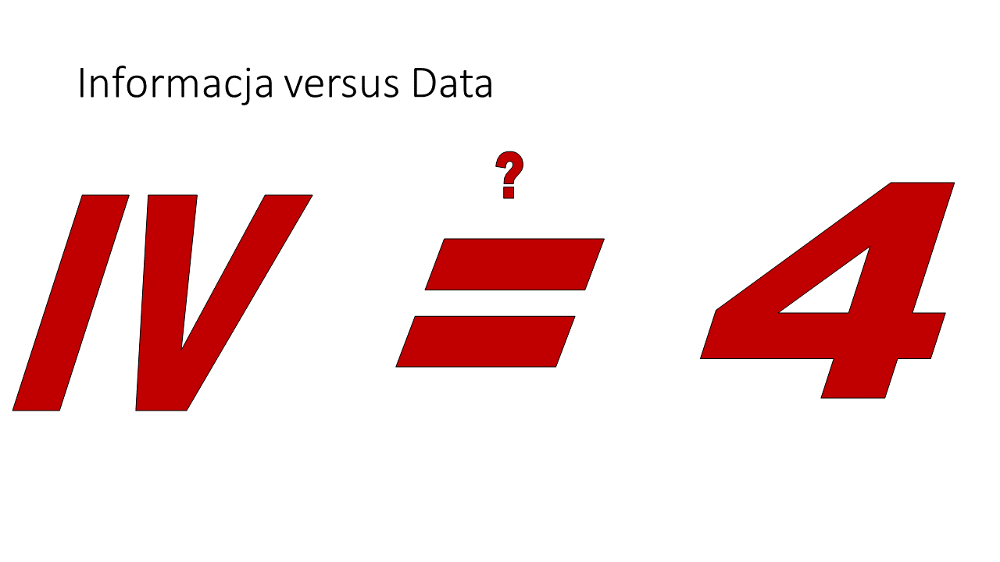
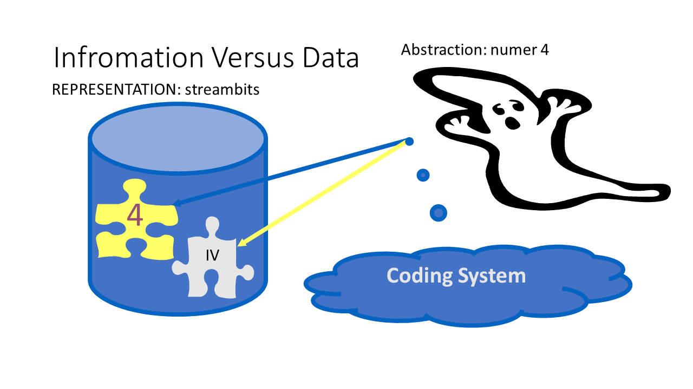

# Information versus data

## Preface

The main goal of this subsection is to explain the meaning of the course title to create a starting point to improve your further understanding.

## What's the problem?

To explain the meaning of the course title we must start by explaining the meaning of the keywords that are in the title of this course. So, the terms: information, and computation require clarification. The research must be conducted in the context of computer science and information technology. Of course, don't expect deep dive or a theoretical lecture because in general, I am going to present a part of the programming in practice story. Let me stress again that my goal is an improvement of your development skills but not a formal elaboration and definition of the meaning of the course title - in other words - I will try to avoid a complicated discussion related to the meaning of the title.

## Introduction to Title Explanation

Thanks to googling, it is easy to discover from the internet something like this "computer science uses technology to solve problems and prepare for the future". We can conclude from this statement that a computer may be recognized as a technology used to process information provided that information is knowledge about problems and the future. It looks like a common junction point with the information technology subject. In other words, we are talking about applying a technique and technology to problem-solving, or information processing to be more general. I must say that I have a few problems with this approach or rather this explanation.

## First Problem

The first problem I have is the term information processing itself. Let me ask you a question, do you think that medicine or journalism is not concerned with information processing? It is an important question for further discussion because we need to make a certain distinction between what doctors and journalists do and what you are going to do as an active member of the computer science ecosystem. Additionally, let me stress that doctors and journalists also use technology on a daily basis. This question is the easiest one to answer because we can say that computer science deals with the automation of information processing by applying programmable devices, I mean computers. Thanks to this, we can say that computer science embeds also an engineering domain aimed at providing solutions - information processing systems to be used in medicine for diagnostics or in journalism for the publication of a newspaper.

## First Conclusion

Concluding, our particular goal is to learn how to make information processing automatic using computers. In this context, information should be recognized as knowledge about the state or behavior of a set of interoperable real-time activities. The activities that we want to monitor or control, with the use of technology, or more precisely with the use of physical programmable devices, so as to achieve problem-solving automatically. It is our goal and responsibility as computer science active members of an ecosystem  - shortly developers.

## Fundamental Inconsistency

The automation of information computation requires the use of technology, simplifying a computer. Any computer is a device, so it is governed by the laws of physics. And here we come to our fundamental inconsistency, how it is possible to use a physical device (the computer) to operate against abstraction (information). To solve the problem, I mean to resolve this inconsistency, let's try to address this issue by answering another question, namely, whether the left side is equal to the right side.

## Syntax Analysis

The first answer may be based on the observation that what we see are characters. That is on the left side of the equal sign we have two characters, and on the right side of the equal sign, we have one character. From this fact, we can conclude, that the left side is not equal to the right side. Generally speaking, we use characters in the syntax layer analysis. In this discussion, the set of allowed characters that we can use, I mean concatenate to make a valid string is called an alphabet. If the alphabet is intended for a human, it contains alphanumeric characters - for example letters, digits, or symbols for the Latin alphabet. In the case of today's computers, which are governed by the laws of physics, we must consider only two discrete states. It makes a difference because in this case, the alphabet must contain exactly two signs. Following this rule, the alphabet is called a binary alphabet - no matter what signs it contains. In case the alphabet is intended for a human we are talking about characters, in case the alphabet is intended to be used by a computer we are talking about signs. In both cases, we are talking about the alphabet as a set of entities to be concatenated in streams. For the characters, we have a shape, in the case of signs we have measurable features.

## Semantics analysis

If we now move from a syntax analysis to a semantic analysis of what we see, we can claim that the left side may represent the number four. And the right side can also represent the number four. In that case, the numbers are equal to each other, so the equal sign is legitimate because both sides are equivalent. That could have the same meaning. Only one question remains to be answered: what conditions must be met for the left side to represent the number four, and the right side also represents the number four? In this case, we are comparing the meaning but not the streams of characters. Again, meaning is an abstraction so physical computers cannot be able to compare meanings, they always compare bitstreams, and they always work on a stream of signs.

## Data Definition

Continuing this discussion to resolve any doubts related to the meaning of the title, I will use a funny illustration in which the number four is presented as a ghost, something that does not exist in the real world. It is information, it is an abstraction, but it has two equivalent representations interconnected by arrows indicating a bidirectional relationship with the streams of characters associating a meaning to them. To stress the difference between information and information representation that is associated with streams of characters the representation we call data. I believe that now it is very easy for you to distinguish the terms information and data. The simplified rule is as follows: if something is a stream of signs and we are able to assign a meaning to this stream it is just data.

## Coding System

To build a meaningful relationship between something abstract, in our case a number, and something that has a physical nature - a sequence of characters - we first need to define the alphabet, I mean a set of characters that you are allowed to use in this sequence. Then we need to define a set of rules expressing how to concatenate these characters into valid sequences - called syntax. Finally, we must define the semantics, I mean rules we could apply to correct characters sequences to associate meaning to them. Finally, the alphabet, syntax, and semantics make up a coding system. It is a very important conclusion for subjects related to types, which I will cover.

## Possibility to Replace Information Term by Data

Returning once again to the discussion about the title of the course, we can observe that in reality, we are computing the data but not the information. Hence, someone could put forward a proposal that maybe it is enough to replace the term information with the term data, and as a result, we will be able to avoid this whole long introduction, which is relatively low-level and theoretical. Of course, the answer is that we can't do that because your duty, as a software developer, is to select or even create if necessary an appropriate coding system. The good news is that the creation of a new coding system is built upon the existing ones. In other words, typically new coding systems are derived from the existing ones. In any case, it is part of your responsibility, so you must know how to deal with it and acquire appropriate skills.

## Algorithm Implementation

Explaining the title of our course, we concluded that we are talking about the automation of the information computation process. To be more practical and talk in the context of problem-solving we may recognize the information as a piece of knowledge about the state and behavior of a selected real-time set of activities - part of the natural realm. But to solve any problem using a computer we need to know how to compute the information to fulfill an expectation of the activities owner or a manager. Again, additionally, we need knowledge, a piece of information on how to solve the selected problem. How to monitor and possibly control the behavior of the activities in concern. How to control the activities to achieve the chosen goal. This kind of knowledge we may call an algorithm. Let me stress it is also information that cannot be directly applied or used by any physical device including but not limited to computers.
