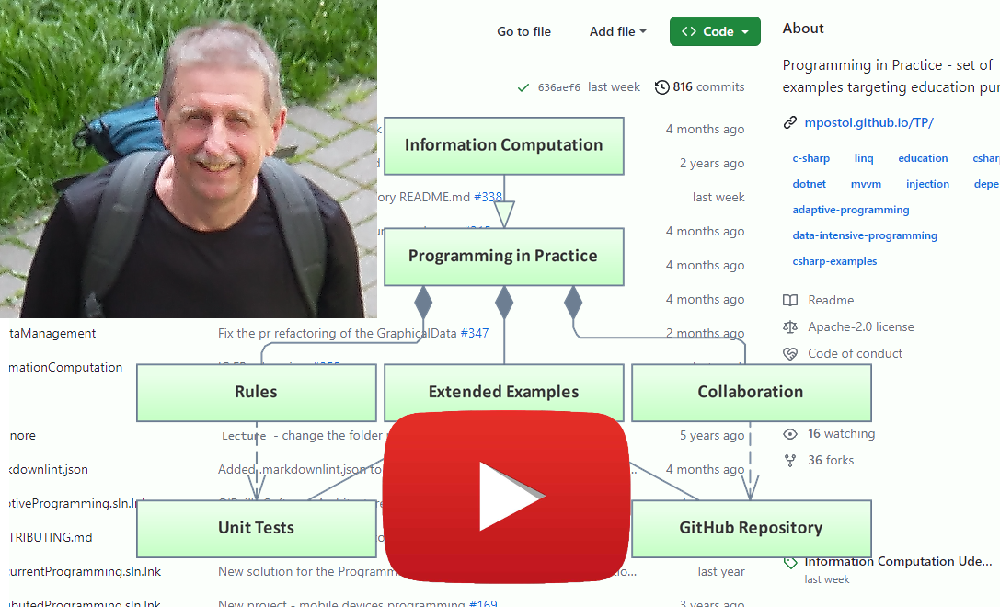

# Programming in Practice

## Key words

software engineering, sequential programming, adaptive programming, concurrent programming, rel-time programming, distributed programming, education, code examples, information computation, external data, information processing, data processing, dependency injection, inversion of control.

## Major Releases

|   Release    | Title                                                                 |          DOI           |       Date        |
| :----------: | --------------------------------------------------------------------- | :--------------------: | :---------------: |
| [5.2][REL52] | [External Data Added to the ebook][REL52]                             | [![DOI][BDG52]][DOI52] |   July 9, 2024    |
| [5.1][REL51] | [Information Computation Udemy Course Online Publication][udemyPiPIC] | [![DOI][BDG51]][DOI51] |  August 1, 2023   |
| [4.3][REL43] | TUL IT Classes 2023 Summer Semester                                   | [![DOI][BDG43]][DOI43] |   July 28, 2023   |
| [4.0][REL40] | Distributed Programming                                               | [![DOI][BDG40]][DOI40] |  October 5, 2020  |
| [3.0][REL30] | [ExDM VideoBook Helion v1.0.][vdpnt]                                  | [![DOI][BDG30]][DOI30] | February 26, 2019 |
|     2.0      | Adaptive Programming                                                  |           NA           |                   |

>[**DOI**](https://www.doi.org/hb.html): Digital Object Identifiers (DOI) are the backbone of the academic reference and metrics system. It is aimed at researchers who want to cite GitHub repositories in academic literature. Use the [DOI](https://www.doi.org/) System to resolve a DOI name.
>
> [**TUL IT**][TULIT]: stands for Institute of Information Technology, Lodz University of Technology

[REL52]: https://github.com/mpostol/TP/releases/tag/5.2
[DOI52]: https://doi.org/10.5281/zenodo.12701909
[BDG52]: https://zenodo.org/badge/DOI/10.5281/zenodo.12701909.svg

[REL51]: https://github.com/mpostol/TP/releases/tag/5.1
[DOI51]: https://doi.org/10.5281/zenodo.8206620
[BDG51]: https://zenodo.org/badge/DOI/10.5281/zenodo.8206620.svg

[REL43]: https://github.com/mpostol/TP/releases/tag/4.3
[DOI43]: https://doi.org/10.5281/zenodo.8192921
[BDG43]: https://zenodo.org/badge/DOI/10.5281/zenodo.8192921.svg

[REL40]: https://github.com/mpostol/TP/releases/tag/4.0
[DOI40]: https://doi.org/10.5281/zenodo.4066609
[BDG40]: https://zenodo.org/badge/DOI/10.5281/zenodo.4066609.svg

[REL30]: https://github.com/mpostol/TP/releases/tag/3.0
[DOI30]: https://doi.org/10.5281/zenodo.2578245
[BDG30]: https://zenodo.org/badge/DOI/10.5281/zenodo.2578245.svg

[TULIT]: https://it.p.lodz.pl/

## Executive Summary

In this short video, I present an executive summary (3 min) of the Programming in Practice educational path. To get more, consider enrolling in [Programming in Practice - Executive Summary; free Udemy course][udemyPiPES]; This free course explains the role of this repository as a collection of extended examples that is a foundation for the `Programming in Practice` paradigm. The course is for all serious about improving the software development skills education methodology including but not limited to teachers and lecturers wanting to improve the software development skills education methodology. It is all about engineering atop University knowledge and practical experience as a foundation. Press the play button to open the video on `YouTube`.

## Repository Content

### Preface

> **Programming in Practice** is a contribution to **Code Engineering**. Code Engineering, also known as programming, is the process of designing, developing, testing, and maintaining computer programs. It involves applying engineering principles and methodologies to writing the program text, also referred to as the code to ensure its reliability, efficiency, and scalability. Code engineering encompasses various stages, including requirements analysis, design, implementation, testing, deployment, and maintenance, all aimed at producing high-quality computer software that meets the needs of users or clients.
> The **main goal** of this repository is to turn today's students into tomorrow's advanced software developers and architects.
> The **main purpose** of this repository is to provide code extended examples for education purposes.

My point is that we could distinguish between two kinds of education:

1. **learning** - focused on knowledge (concepts, standards, best practices, etc) adoption
1. **training** - focused on product deployment

The extended examples gathered in this repository focus on learning - the improvement of your knowledge related to software engineering as a field of computer science covering topics like the systematic design, development, testing, maintenance, and evolution of software. My goal is that it will be beneficial for you in the long run. The extended examples have been selected and prepared considering that **simplification is not a mother of simplicity**

The code extended examples address the following application domains:

- [**Information Computation (IC)**](InformationComputation/README.md): internal data management - all about engaging a computer (a physical device) to process information as a series of actions or steps taken to achieve a particular result or help to fulfill a task.
- [**External Data Management (ExDM)**](ExDataManagement/README.md): external (streaming, structural, graphical) data management -  all about processing data managed using external resources, that is screen, DBMS (database management system), files.
- [**Adaptive Programming (AP)**](AdaptiveProgramming/README.md): language constructs, patterns, and frameworks used at the development and deployment stage to improve the future adaptability of the software.
- [**Concurrent Programming (CW)**](ConcurrentProgramming/README.md): all about the programming pattern formally describing a program to execute operations as a result of nondeterministic events at run time.
- [**Distributed Programming (DP)**](DistributedProgramming/README.md): all about developing inter-operable applications interconnected over the network.

The TP repository collects examples that can serve as a pattern with the broadest possible applicability addressing the applications in concern. All topics are illustrated using the C# language and the MS Visual Studio design environment to ensure the practical context and provide solid examples.

The source code is available under a very permissive open-source license to increase broad reach. Hopefully, the samples are easily portable to other development environments.

### Information Computation (IC)

Information Computation means a process engaging a computer (a physical device) to process information as a series of actions or steps taken to achieve a particular result or help to fulfill a task. The main challenge is that information is abstract. Precisely speaking, it is a kind of knowledge that cannot be processed directly by any physical device. The repository contains code that is to be used as a set of examples for an online video course and class lectures. The examples can also be used alone. Generally speaking, two main topics are covered. The first one refers to selected aspects of information modeling using types as descendants of a coding system.  The second one covers program architecture design patterns to improve the design and deployment of the computer behavior description using a program implementing an algorithm.

The [InformationComputation](InformationComputation/README.md) folder collects examples that can serve as a certain pattern with the broadest possible applicability addressing the mentioned above application domain.

> **Note**: to open the code samples in the Visual Studio double click the file `InformationComputation`.

### External Data Management (ExDM)

Computer science in general, and especially software development, is a field of knowledge that deals with the automation of information processing. Programs can be recognized as a recipe for that automated behavior. To achieve information processing goals programs have to manage external information engaged to control the graphical user interface (graphical data), stored by database management systems (structure data) and file systems (streaming data). This part of the gathered examples provides ready-to-use code snippets helpful for rendering the graphical data, querying the structural data, and serialization to employ streaming data, that is manage of the external data. The external data is recognized as a process information representation handled outside of the program realm.

The [ExDataManagement](ExDataManagement/README.md) folder collects examples that can serve as examples of managing external data.

> **Note**: to open the code samples in the Visual studio double click the file `ExDataManagement`.

### Adaptive Programming (AP)

The adaptive programming is presented as a catalog of language constructs, patterns, and frameworks used at the development and deployment stage to increase the adaptability of the program against changing production environment in which it is executed.

The [AdaptiveProgramming](AdaptiveProgramming/README.md) folder collects examples that can serve as a certain pattern with the broadest possible applicability addressing the adaptive programming.

> **Note**: to open the code samples in the Visual studio double click the file `AdaptiveProgramming`.

### Concurrent Programming (CW)

It is a programming paradigm that allows writing a program that formally describes the execution of instructions as a result of nondeterministic events. Concurrency is when multiple sequences of instructions are run in overlapping periods. In other words, the instructions sequence execution is undetermined in advance. Concurrency may be implemented explicitly using constructs like the Thread type, or implicitly using a concept like asynchronous programming. The gathered examples address selected concepts unique for concurrent programming, namely critical section, race condition, synchronization, communication, and deadlocks, to name only the most important.

The [ConcurrentProgramming](ConcurrentProgramming/README.md) folder collects examples that can serve as a certain pattern with the broadest possible applicability addressing the mentioned above application domain.

> **Note**: to open the code samples in the Visual studio double click the file `ConcurrentProgramming`.

### Distributed Programming (DP)

Information and Communication Technology has provided society with a vast diversity of distributed applications. By design, the deployment of this kind of application has to focus primarily on communication. Examples collected in this repository address the systematic approach to the designing of meaningful Machine to Machine (M2M) communication targeting distributed mobile applications in the context of new emerging disciplines, namely Industry 4.0 and Internet of Things (IoT) atop of the M2M communication and composed as multi-vendor cyber-physicals systems.

The [DistributedProgramming](DistributedProgramming/README.md) folder collects examples that can be reused in any case distributed processing of information is considered.

> **Note**: to open the code samples in the Visual studio double click the file `DistributedProgramming`.

## How to cite the software and associated documentation files

To be compliant with the license of the repository the below copyright notice shall be included in all copies or substantial portions of the software and associated documentation files (the "Software").

Copyright (c) 2024 Mariusz Postol

A DOI number, which stands for "Digital Object Identifier," is a unique alphanumeric identifier assigned to a digital object, such as an academic article, book, dataset, software, or other scholarly work. It provides a permanent link and a standardized way to identify and locate digital content on the internet. Because this repository has a DOI, use the DOI in your citation for the article or any derived work, like this:

- Mariusz Postol, Programming in Practice: \[Target Part Name\], `https://github.com/mpostol/TP`, \[year\] DOI: [10.5281/zenodo.2578244](http://doi.org/10.5281/zenodo.2578244)

or

- Mariusz Postol, Programming in Practice: \[Target Part Name\], `https://github.com/mpostol/TP`, \[year\] DOI: [http://doi.org/10.5281/zenodo.2578244](http://doi.org/10.5281/zenodo.2578244).

Replace `year` with the current year and `Target Part Name` with the name (or names) of the files you are referring to.

## How to follow up?

GitHub offers `Discussions` as a space to connect with other members of the community. I hope that using the `Discussion` space you:

- ask questions you’re wondering about
- share ideas
- engage with other community members
- welcome others and are open-minded; remember that this is a community we build together

I have activated the [Discussion][Discussion] space for this repository.

To follow any activity in the repository, switch on the `Watch` functionality. If you find the project interesting, please star the repository using the `Star` button. Starring a repository also shows appreciation to the repository maintainer for their work. You can star repositories and topics to keep track of projects you find interesting and discover related content in your news feed. Check out [Saving repositories with stars](https://docs.github.com/en/get-started/exploring-projects-on-github/saving-repositories-with-stars) to get more.

Consider also enrolling in the following courses:

- [Programming in Practice - Information Computation; Udemy course, 2023][udemyPiPIC] - Information Computation means a process engaging a computer (a physical device) to process information as a series of actions or steps taken to achieve a particular result or help to fulfill a task. The main challenge is that information is abstract. Precisely speaking, it is a kind of knowledge that cannot be processed directly by any physical device. Generally speaking, To resolve this inconsistency two main topics are covered. The first one refers to selected aspects of information modeling using types as descendants of a coding system. The second one covers program architecture design patterns to improve the design and deployment of the computer behavior description using a program implementing an algorithm.
- [Programming in Practice - Executive Summary; Udemy course; 2021][udemyPiPES]; The course explains the role of this repository as the extended examples storage that is a foundation for the Programming in Practice paradigm. The course is for all serious about the improvement of the software development skills education methodology.

## Contributing

I strongly encourage community participation and contribution to this project. First, please fork the repository and commit your changes there. Once happy with your changes you can generate a 'pull request'. You must agree to the contributor license agreement before I can accept your changes.

## How to reach me

To get more on my activity and projects currently I am working on:

- 📫 [join me on LinkedIn](https://pl.linkedin.com/in/mpostol)
- 👀 [follow me on YouTube](https://youtu.be/YPdL0bc0Xmo)
- :cloud_with_lightning: [visit the discussion][Discussion]
- 🔭 I’m currently working on: Programming in Practice education path
- 👯 I’m looking to collaborate on **External Data Management**
- 💬 ask me about sequential, concurrent, parallel, real-time, and distributed program engineering including but not limited to design patterns, agile management, and testing.

The following profiles on social media are also a good starting point:

- [Postół M, profile on GitHub][MPGitHub]
- [Postół M, profile on Udemy][MPUdemy]
- [Postół M, profile on LinkedIn](https://pl.linkedin.com/in/mpostol)
- [Postół M, profile on ResearchGate](https://www.researchgate.net/profile/Mariusz-Postol)
- [Postół M, profile on youtube](https://www.youtube.com/@mariuszpostol)
- [Postół M, profile on nuget](https://www.nuget.org/profiles/mpostol)
- [Postół M, profile on ORCID](https://orcid.org/0000-0002-9669-0565)
- [Postół M, profile on facebook](https://www.facebook.com/mariusz.postol/)
- [Postół M, profile on wordpress](http://mpostol.wordpress.com/)
- [Postół M, profile on CSharp Corner](https://www.c-sharpcorner.com/members/mariusz-postol)

## See also

- [Programming in Practice - Information Computation; Udemy course, 2023][udemyPiPIC] - Information Computation means a process engaging a computer (a physical device) to process information as a series of actions or steps taken to achieve a particular result or help to fulfill a task. The main challenge is that information is abstract. Precisely speaking, it is a kind of knowledge that cannot be processed directly by any physical device. Generally speaking, To resolve this inconsistency two main topics are covered. The first one refers to selected aspects of information modeling using types as descendants of a coding system. The second one covers program architecture design patterns to improve the design and deployment of the computer behavior description using a program implementing an algorithm.
- [Programming in Practice - Executive Summary; Udemy course; 2021][udemyPiPES]; The course explains the role of this repository as the extended examples storage that is a foundation for the Programming in Practice paradigm. The course is for all serious about the improvement of the software development skills education methodology.
- [Programming in Practice; GitBook eBook](https://mpostol.gitbook.io/pip/) - The content of this eBook is auto-generated using the Markdown files collected in this repository. It is distributed online upon the open access rules.
- [Discussion panel][Discussion]
- [Postół. M, Object-Oriented Internet](https://youtube.com/playlist?list=PLC7zPvgw-YbyWss-0j_waddacgroLFTzi) This playlist on YouTube addresses research results on the systematic approach to the design of the meaningful Machine to Machine (M2M) communication targeting distributed mobile applications in the context of new emerging disciplines, i.e. Industry 4.0 and Internet of Things.
You may check out the document [References](REFERENCES.md) to encounter other relevant in this context publications.

 - This DOI represents all versions, and will always resolve to the latest one.

[MPGitHub]:   https://github.com/mpostol
[MPUdemy]:    https://www.udemy.com/user/mariusz-postol/
[udemyPiPIC]: https://www.udemy.com/course/information-computation/?referralCode=9003E3EF42419C6E6B21
[udemyPiPES]: https://www.udemy.com/course/pipintroduction/?referralCode=E1B8E460A82ECB36A835
[Discussion]: https://github.com/mpostol/TP/discussions
[vdpnt]:      https://videopoint.pl/kurs/jezyk-c-w-praktyce-kurs-video-przetwarzanie-danych-zewnetrznych-mariusz-postol,vjcprv.htm#format/w

<!--
//____________________________________________________________________________________________________________________________________
//
//  Copyright (C) 2024, Mariusz Postol LODZ POLAND.
//
//  To be in touch join the community by pressing the `Watch` button and get started commenting using the discussion panel at
//
//  https://github.com/mpostol/TP/discussions/182
//
//  by introducing yourself and telling us what you do with this community.
//_____________________________________________________________________________________________________________________________________
 - Build Status
-->
